

   

# 
Informe del Trabajo Final

    

   
Universidad Peruana de Ciencias Aplicadas

    

   

    

   
<b>Ingeniería de software</b>

    

   
<b>1ACC0238 Aplicaciones para Dispositivos Móviles</b>

    

   
<b>Sección:</b> 1807

    

   
<b>Profesor:</b>Mayta Guillermo, Jorge Luis

    

   
<b>Nombre del StartUp:</b> PaxTech

    

   
<b>Nombre del Producto:</b> uTime

   

    

   

   <table style="margin-left: auto; margin-right: auto;">
   <tr>
   <th>Nombre</th>
   <th>Código</th>
   </tr>
   <tr>
   <td>Choquehuanca Nuñez, Luciana Carolina</td>
   <td>U202319431</td>
   </tr>
   <tr>
   <td>Qqueso Rodriguez, Britney Delhy</td>
   <td>U20211G671</td>
   </tr>
   <tr>
   <td>Rivera Sosa, Eduardo Gael</td>
   <td>U202312222</td>
   </tr>
   <tr>
   <td>Roman Cruz, Natalia Bertha</td>
   <td>U202310148</td>
   </tr>
   <tr>
   <td>Yum Gonzales, Jorge Suin</td>
   <td>U202210838</td>
   </tr>
   </table>
   

    

   
<b>Noviembre 2025</b>

    
   
<b>Ciclo 2025-20</b>

    

 
 
 

# Registro de Versiones del Informe

| Version | Fecha      | Autor                                    | Descripción de modificación                                                                                                            |
| ------- | ---------- | ---------------------------------------- | -------------------------------------------------------------------------------------------------------------------------------------- |
| 1.0     | 01/08/2025 | Choquehuanca, Qqueso, Rivera, Roman, Yum | Creación del documento de trabajo en formato markdown                                                                                  |
| 1.1     | 03/08/2025 | Choquehuanca, Qqueso, Rivera, Roman, Yum | Elaboración del Capitulo 1                                                                                                             |
| 1.2     | 05/08/2025 | Choquehuanca, Qqueso, Rivera, Roman, Yum | Elaboración de Competidores y Entrevistas                                                                                              |
| 1.3     | 07/08/2025 | Choquehuanca, Qqueso, Rivera, Roman, Yum | Elaboración del Needfinding                                                                                                            |
| 1.4     | 08/08/2025 | Choquehuanca, Qqueso, Rivera, Roman, Yum | Elaboración de los _Requirements specification_                                                                                        |
| 1.5     | 09/08/2025 | Choquehuanca, Qqueso, Rivera, Roman, Yum | Elaboración del _EventStorming_                                                                                                        |
| 1.6     | 11/08/2025 | Choquehuanca, Qqueso, Rivera, Roman, Yum | Elaboración del _Context Mapping_                                                                                                      |
| 1.7     | 13/08/2025 | Choquehuanca, Qqueso, Rivera, Roman, Yum | Elaboración del _Software Architecture_                                                                                                |
| 1.8     | 16/08/2025 | Choquehuanca, Qqueso, Rivera, Roman, Yum | Elaboración del _Tactical-Level Domain-Driven Design_                                                                                  |
| 1.9     | 17/08/2025 | Choquehuanca, Qqueso, Rivera, Roman, Yum | Elaboración de la estructura de los Bounded Context (IAM, Services, Profiles,)                                                         |
| 1.10    | 19/08/2025 | Choquehuanca, Qqueso, Rivera, Roman, Yum | Elaboración de la estructura de los Bounded Context (Shared, Reservations, Workers, Reviews)                                           |
| 2.1     | 22/08/2025 | Choquehuanca, Qqueso, Rivera, Roman, Yum | Elaboración del Product design, Style Guidelines y Information Architecture                                                            |
| 2.2     | 25/08/2025 | Choquehuanca, Qqueso, Rivera, Roman, Yum | Elaboración de la Landing Page Wireframes y Mock-up                                                                                    |
| 2.3     | 27/08/2025 | Choquehuanca, Qqueso, Rivera, Roman, Yum | Elaboración del Mobile Applications Wireframes y                                                                                       |
| 2.4     | 30/08/2025 | Choquehuanca, Qqueso, Rivera, Roman, Yum | Elaboración del Mobile Applications Mock-ups, User Flow Diagrams y Prototyping                                                         |
| 2.5     | 02/09/2025 | Choquehuanca, Qqueso, Rivera, Roman, Yum | Elaboración del Software Configuration Management, Source Code Management, Style Guide & Conventions y Deployment Configuration        |
| 2.6     | 04/09/2025 | Choquehuanca, Qqueso, Rivera, Roman, Yum | Elaboración del Sprint 1                                                                                                               |
| 2.7     | 05/09/2025 | Choquehuanca, Qqueso, Rivera, Roman, Yum | Elaboración del Sprint Planning 1, Sprint Backlog 1 y Development Evidence for Sprint Review                                           |
| 2.8     | 06/09/2025 | Choquehuanca, Qqueso, Rivera, Roman, Yum | Elaboración del Testing Suite, Execution, Services Documentation, Software Deployment y Team Collaboration Insights for Sprint Review. |
| 3.1     | 14/10/2025 | Choquehuanca, Qqueso, Rivera, Roman, Yum | Correción de los Avances del TP1                                                                                                       |
| 3.2     | 28/10/2025 | Choquehuanca, Qqueso, Rivera, Roman, Yum | Elaboración del Sprint Planning 1, Sprint Backlog 1 y Development Evidence for Sprint Review                                           |
| 3.3     | 5/11/2025  | Choquehuanca, Qqueso, Rivera, Roman, Yum | Elaboración del Testing Suite, Execution, Services Documentation, Software Deployment y Team Collaboration Insights for Sprint Review. |
| 3.4     | 1/11/2025  | Choquehuanca, Qqueso, Rivera, Roman, Yum | Elaboración del Testing Suite, Execution, Services Documentation, Software Deployment y Team Collaboration Insights for Sprint Review. |

 
 
 

# Project Report Collaboration Insights

URL del repositorio para el proyecto:

**TB1**

Para el desarrollo del informe perteneciente a la entrega del TB1, se dividió la implementación de secciones de la siguiente forma para cada integrante del equipo:

| Integrantes          | Tareas Asignadas                                                                                                                                                                     |
| -------------------- | ------------------------------------------------------------------------------------------------------------------------------------------------------------------------------------ |
| Luciana Choquehuanca | Lean ux canvas, lean ux process,hypothesis statements, Tactical-Level Domain-Driven Design-reviews and services, Bounded Context Canvases-all contexts, Event storming               |
| Britney Qqueso       | Competidores, análisis competitivo, diseño, registro y análisis de entrevistas, Context Mapping, Bounded Context Workers                                                             |
| Gael Rivera          | Entrevistas, User Stories, Technical Stories, Spike Stories, Impact Mapping, Product Backlog, Software Architecture Context, Container and Deployment Diagrams, Bounded Context IAM. |
| Natalia Roman        | Entrevistas, Eventstorming, Candidate Context Discovery, Bounded Context Reservations                                                                                                |
| Jorge Yum            | Entrevistas, Needfinding, Eventstorming, Domain Message Flow Modelling, Bounded context Profiles                                                                                     |

El proceso de colaboración en el informe se realizó mediante commits constantes al repositorio de la organización PaxTech.

**Github Collaboration Insights**

Github también presenta un timeline de las ramas principales y los procesos de merge a los que se han sometido. Todas las
ramas se crearon tomando en cuenta el diseño de GitFlow para una buena organización cuando se usa un software de control
de versiones.

Los integrantes son:

- Luciana Choquehuanca (lucianxaaa)
- Britney Qqueso (brit2801)
- Gael Rivera (gael-rs)
- Natalia Roman (natRC2005)
- Jorge Yum (jsyumg, myussu)

Se explican las ramas más prominentes:

**main:** Es representada por el color negro. Se trata de la rama principal del proyecto y se actualiza para cada entregable. 
**develop:** Es representada por el color azul. Se trata de la rama principal para el proceso del desarrollo del proyecto. 
**feature/feature-description-name:** Es una rama creada para trabajar en una nueva funcionalidad o tarea específica. Se basa en develop y, una vez terminada la tarea, se fusiona nuevamente con develop para integrar los cambios al proyecto principal.

**Capturas de la participación en el informe:**

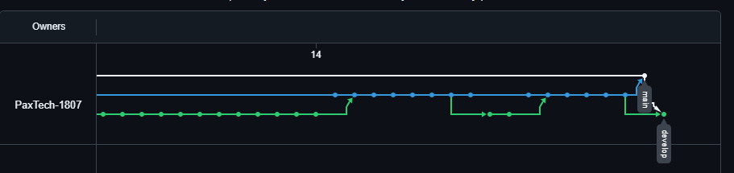
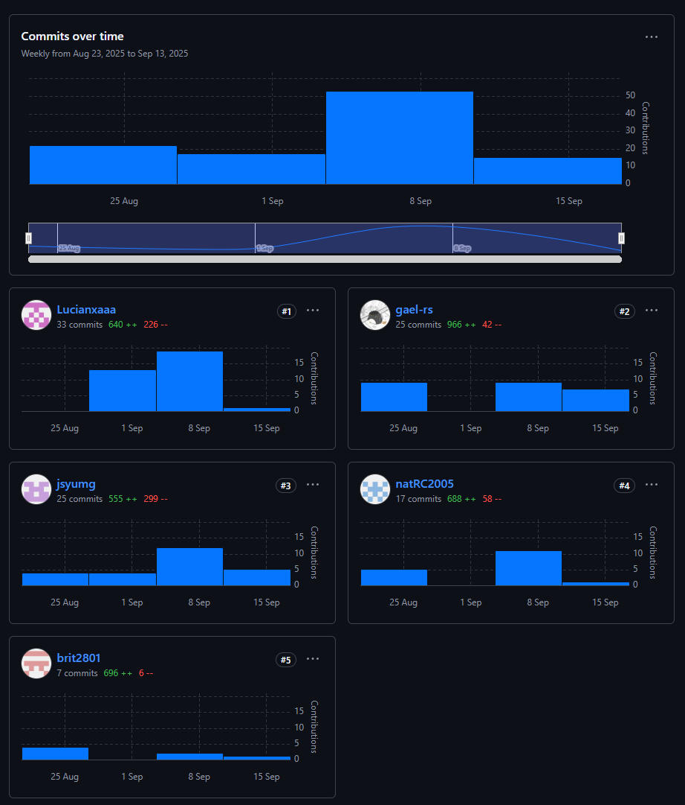

**TP**

Para el desarrollo del informe perteneciente a la entrega del TP, se dividió la implementación de secciones de la siguiente forma para cada integrante del equipo:

| Integrantes          | Tareas Asignadas                                                                                                                                                                                              |
| -------------------- | ------------------------------------------------------------------------------------------------------------------------------------------------------------------------------------------------------------- |
| Luciana Choquehuanca | Elaboración de la aplicacion movil fidelidad baja/wireframe, correción de bounded canvas, flujos de la aplicaciòn movil bassado en user goeals                                                                |
| Britney Qqueso       | Diseño de la app en Figma, Mobile Applications Mock-ups, Mobile Applications User Flow Diagrams, Mobile Applications Prototyping, Testing Suite Evidence for Sprint Review y desarrollo de profile de la app. |
| Gael Rivera          | Execution Evidence for Sprint Review de la Landing Page, Backend y Aplicación Mobil, Landing Page Wireframe y Landing Page Mock-up.                                                                           |
| Natalia Roman        | Diseño de la ventana de categorias y deb búsqueda de servicios, conexión con backend, Sprint Planning 1 y Software Configuration Management                                                                   |
| Jorge Yum            | Software deployment evidence for sprint review, desarrollo de client dashboard de aplicacion movil, Product Design                                                                                            |

El proceso de colaboración en el informe se realizó mediante commits constantes al repositorio de la organización PaxTech.

**Github Collaboration Insights**

Github también presenta un timeline de las ramas principales y los procesos de merge a los que se han sometido. Todas las
ramas se crearon tomando en cuenta el diseño de GitFlow para una buena organización cuando se usa un software de control
de versiones.

Los integrantes son:

- Luciana Choquehuanca (lucianxaaa)
- Britney Qqueso (brit2801)
- Gael Rivera (gael-rs)
- Natalia Roman (natRC2005)
- Jorge Yum (jsyumg, myussu)

**Capturas de la participación en el informe:**

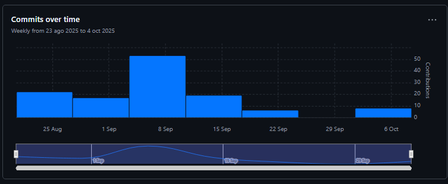
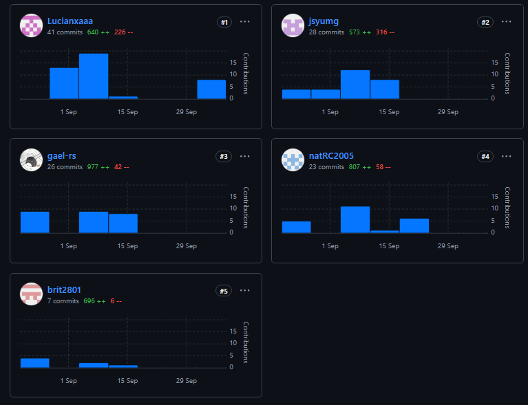

 

**TB2**

Para el desarrollo del informe perteneciente a la entrega del TB2, se dividió la implementación de secciones de la siguiente forma para cada integrante del equipo:

| Integrantes          | Tareas Asignadas                                                        |
| -------------------- | ----------------------------------------------------------------------- |
| Luciana Choquehuanca | Services Documentation Evidence for Sprint Review, Video About the team |
| Britney Qqueso       | Testing Suite Evidence for Sprint Review                                |
| Gael Rivera          | Execution Evidence for Sprint Review, Video App Validation              |
| Natalia Roman        | Revisión de user stories, Development Evidence for Sprint Review        |
| Jorge Yum            | Software Deployment Evidence for Sprint Review, Video About the product |

El proceso de colaboración en el informe se realizó mediante commits constantes al repositorio de la organización PaxTech.

**Github Collaboration Insights**

Github también presenta un timeline de las ramas principales y los procesos de merge a los que se han sometido. Todas las
ramas se crearon tomando en cuenta el diseño de GitFlow para una buena organización cuando se usa un software de control
de versiones.

Los integrantes son:

- Luciana Choquehuanca (lucianxaaa)
- Britney Qqueso (brit2801)
- Gael Rivera (gael-rs)
- Natalia Roman (natRC2005)
- Jorge Yum (jsyumg, myussu)

**Capturas de la participación en el informe:**

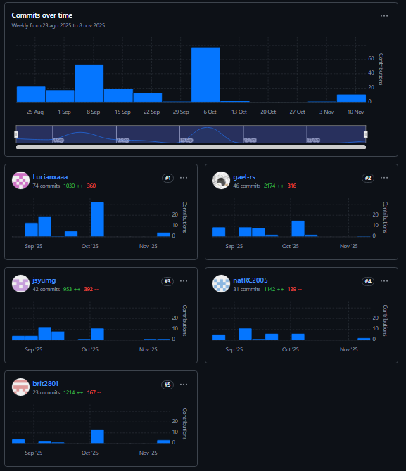

 

# Contenido

1. [Capítulo I: Presentación](#capítulo-i-presentación) 
   1.1. [Startup Profile](#11-startup-profile) 
   1.1.1. [Descripción de la Startup](#111-descripción-de-la-startup) 
   1.1.2. [Perfiles de integrantes del equipo](#112-perfiles-de-integrantes-del-equipo) 
   1.2. [Solution Profile](#12-solution-profile) 
   1.2.1. [Antecedentes y problemática](#121-antecedentes-y-problemática) 
   1.2.2. [Lean UX Process](#122-lean-ux-process) 
   1.2.2.1. [Lean UX Problem Statements](#1221-lean-ux-problem-statements) 
   1.2.2.2. [Lean UX Assumptions](#1222-lean-ux-assumptions) 
   1.2.2.3. [Lean UX Hypothesis Statements](#1222-lean-ux-assumptions) 
   1.2.2.4. [Lean UX Canvas](#1224-lean-ux-canvas) 
   1.3. [Segmentos objetivo](#13-segmentos-objetivo) 
2. [Capítulo II: Requirements Elicitation & Analysis](#capítulo-iii-requirements-specification) 
   2.1. [Competidores](#21-competidores) 
   2.1.1. [Análisis competitivo](#211-análisis-competitivo) 
   2.1.2. [Estrategias y tácticas frente a competidores](#212-estrategias-y-tácticas-frente-a-competidores) 
   2.2. [Entrevistas](#22-entrevistas) 
   2.2.1. [Diseño de entrevistas](#221-diseño-de-entrevistas) 
   2.2.2. [Registro de entrevistas](#222-registro-de-entrevistas) 
   2.2.3. [Análisis de entrevistas](#223-análisis-de-entrevistas) 
   2.3. [Needfinding](#23-needfinding) 
   2.3.1. [User Personas](#231-user-personas) 
   2.3.2. [User Task Matrix](#232-user-task-matrix) 
   2.3.3. [User Journey Mapping](#233-user-journey-mapping) 
   2.3.4. [Empathy Mapping](#234-empathy-mapping) 
   2.3.5. [Ubiquitous Language](#235-ubiquitous-language) 
   2.4. [Requirements specification](#24-requirements-specification) 
   2.4.1. [User Stories](#241-user-stories) 
   2.4.2. [Impact Mapping](#242-impact-mapping) 
   2.4.3. [Product Backlog](#243-product-backlog) 
   2.5. [Strategic-Level Domain-Driven Design](#25-strategic-level-domain-driven-design) 
   2.5.1. [EventStorming](#251-eventstorming) 
   2.5.1.1. [Candidate Context Discovery](#2511-candidate-context-discovery) 
   2.5.1.2. [Domain Message Flows Modeling](#2512-domain-message-flows-modeling) 
   2.5.1.3. [Bounded Context Canvases](#2513-bounded-context-canvases) 
   2.5.2. [Context Mapping](#252-context-mapping) 
   2.5.3. [Software Architecture](#253-software-architecture) 
   2.5.3.1. [Software Architecture Context Level Diagrams](#2531-software-architecture-context-level-diagrams) 
   2.5.3.2. [Software Architecture Container Level Diagrams](#2532-software-architecture-container-level-diagrams) 
   2.5.3.3. [Software Architecture Deployment Diagrams](#2533-software-architecture-deployment-diagrams) 
   2.6 [Tactical-Level Domain-Driven Design](#26-tactical-level-domain-driven-design) 
   2.6.1 [Bounded Context: Profiles](#261-bounded-context-profiles) 
   2.6.1.1. [Domain Layer]() 
   2.6.1.2. [Interface Layer]() 
   2.6.1.3. [Application Layer]() 
   2.6.1.4. [Infrastructure Layer]() 
   2.6.1.5. [Bounded Context Software Architecture Component Level Diagrams]() 
   2.6.1.6. [Bounded Context Software Architecture Code Level Diagrams]() 
   2.6.1.6.1. [Bounded Context Domain Layer Class Diagrams]() 
   2.6.1.6.2. [Bounded Context Database Design Diagram]() 
   2.6.2 [Bounded Context: Reservations](#262-bounded-context-reservations) 
   2.6.2.1. [Domain Layer](#2621-domain-layer) 
   2.6.2.2. [Interface Layer](#2622-interface-layer) 
   2.6.2.3. [Application Layer](#2623-application-layer) 
   2.6.2.4. [Infrastructure Layer](#2624-infrastructure-layer) 
   2.6.2.5. [Bounded Context Software Architecture Component Level Diagrams](#2625-bounded-context-software-architecture-component-level-diagrams) 
   2.6.2.6. [Bounded Context Software Architecture Code Level Diagrams](#2626-bounded-context-software-architecture-code-level-diagrams) 
   2.6.2.6.1. [Bounded Context Domain Layer Class Diagrams](#26261-bounded-context-domain-layer-class-diagrams) 
   2.6.2.6.2. [Bounded Context Database Design Diagram](#26262-bounded-context-database-design-diagram) 
   2.6.3 [Bounded Context: IAM](#263-bounded-context-iam) 
   2.6.3.1. [Domain Layer](#2631-domain) 
   2.6.3.2. [Interface Layer](#2632-interface-layer) 
   2.6.3.3. [Application Layer](#2633-application-layer) 
   2.6.3.4. [Infrastructure Layer](#2634-infrastructure-layer) 
   2.6.3.5. [Bounded Context Software Architecture Component Level Diagrams](#2635-bounded-context-software-architecture-component-level-diagrams) 
   2.6.3.6. [Bounded Context Software Architecture Code Level Diagrams](#2636-bounded-context-software-architecture-code-level-diagrams) 
   2.6.3.6.1. [Bounded Context Domain Layer Class Diagrams](#26361-bounded-context-domain-layer-class-diagrams) 
   2.6.3.6.2. [Bounded Context Database Design Diagram](#26362-bounded-context-database-design-diagram) 
   2.6.4 [Bounded Context: Workers](#264-bounded-context-workers) 
   2.6.4.1. [Domain Layer](#2641-domain-layer) 
   2.6.4.2. [Interface Layer](#2642-interface-layer) 
   2.6.4.3. [Application Layer](#2643-application-layer) 
   2.6.4.4. [Infrastructure Layer](#2644-infrastructure-layer) 
   2.6.4.5. [Bounded Context Software Architecture Component Level Diagrams](#2646-bounded-context-software-architecture-code-level-diagrams) 
   2.6.4.6. [Bounded Context Software Architecture Code Level Diagrams](#2646-bounded-context-software-architecture-code-level-diagrams) 
   2.6.4.6.1. [Bounded Context Domain Layer Class Diagrams](#26461-bounded-context-domain-layer-class-diagrams) 
   2.6.4.6.2. [Bounded Context Database Design Diagram](#26462-bounded-context-database-design-diagram) 
   2.6.5 [Bounded Context: Services](#265-bounded-context-services) 
   2.6.5.1. [Domain Layer](#2651-domain-layer) 
   2.6.5.2. [Interface Layer](#2652-interface-layer) 
   2.6.5.3. [Application Layer](#2653-application-layer) 
   2.6.5.4. [Infrastructure Layer](#2654-infrastructure-layer) 
   2.6.5.5. [Bounded Context Software Architecture Component Level Diagrams](#2655-bounded-context-software-architecture-component-level-diagrams) 
   2.6.5.6. [Bounded Context Software Architecture Code Level Diagrams](#2656-bounded-context-software-architecture-code-level-diagrams) 
   2.6.5.6.1. [Bounded Context Domain Layer Class Diagrams](#26561-bounded-context-domain-layer-class-diagrams) 
   2.6.5.6.2. [Bounded Context Database Design Diagram](#26562-bounded-context-database-design-diagram) 
   2.6.6 [Bounded Context: Reviews](#266-bounded-context-reviews) 
   2.6.6.1. [Domain Layer](#2661-domain-layer) 
   2.6.6.2. [Interface Layer](#2662-interface-layer) 
   2.6.6.3. [Application Layer](#2663-application-layer) 
   2.6.6.4. [Infrastructure Layer](#2664-infrastructure-layer) 
   2.6.6.5. [Bounded Context Software Architecture Component Level Diagrams](#2665-bounded-context-software-architecture-component-level-diagrams) 
   2.6.6.6. [Bounded Context Software Architecture Code Level Diagrams](#2666-bounded-context-software-architecture-code-level-diagrams) 
   2.6.6.6.1. [Bounded Context Domain Layer Class Diagrams](#26661-bounded-context-domain-layer-class-diagrams) 
   2.6.6.6.2. [Bounded Context Database Design Diagram](#26662-bounded-context-database-design-diagram) 
3. [Capítulo III: Solution UI/UX Design](#3-capítulo-iii-solution-uiux-design) 
   3.1. [Product design](#31-product-design) 
   3.1.1. [Style Guidelines](#311-style-guidelines) 
   3.1.1.1. [General Style Guidelines](#3111-general-style-guidelines) 
   3.1.2. [Information Architecture](#312-information-architecture) 
   3.1.2.1. [Organization Systems](#3121-organization-systems) 
   3.1.2.2. [Labelling Systems](#3122-labelling-systems) 
   3.1.2.3. [SEO Tags and Meta Tags](#3123-seo-tags-and-meta-tags) 
   3.1.2.4. [Searching Systems](#3124-searching-systems) 
   3.1.2.5. [Navigation Systems](#3125-navigation-systems) 
   3.1.3. [Landing Page UI Design](#313-landing-page-ui-design) 
   3.1.3.1. [Landing Page Wireframe](#3131-landing-page-wireframe) 
   3.1.3.2. [Landing Page Mock-up](#3132-landing-page-mock-up) 
   3.1.4. [Mobile Applications UX/UI Design](#314-mobile-applications-uxui-design) 
   3.1.4.1. [Mobile Applications Wireframes](#3141-mobile-applications-wireframes) 
   3.1.4.2. [Mobile Applications Wireflow Diagrams](#3142-mobile-applications-wireflow-diagrams) 
   3.1.4.3. [Mobile Applications Mock-ups](#3143-mobile-applications-mock-ups) 
   3.1.4.4. [Mobile Applications User Flow Diagrams](#3144-mobile-applications-user-flow-diagrams) 
   3.1.4.5. [Mobile Applications Prototyping](#3145-mobile-applications-prototyping) 
4. [Capítulo IV: Product Implementation, Validation](#4-capítulo-iv-product-implementation-validation) 
   4.1. [Software Configuration Management](#41-software-configuration-management) 
   4.1.1. [Software Development Environment Configuration](#411-software-development-environment-configuration) 
   4.1.2. [Source Code Management](#412-source-code-management) 
   4.1.3. [Source Code Style Guide & Conventions](#413-source-code-style-guide--conventions) 
   4.1.4. [Software Deployment Configuration](#414-software-deployment-configuration) 
   4.2. [Landing Page & Mobile Application Implementation](#42-landing-page--mobile-application-implementation) 
   4.2.1. [Sprint 1](#42x-sprint-1) 
   4.2.1.1. [Sprint Planning 1](#42x1-sprint-planning-1) 
   4.2.1.2. [Sprint Backlog 1](#42x2-sprint-backlog-n) 
   4.2.1.3. [Development Evidence for Sprint Review](#4213-development-evidence-for-sprint-review) 
   4.2.1.4. [Testing Suite Evidence for Sprint Review](#4214-testing-suite-evidence-for-sprint-review) 
   4.2.1.5. [Execution Evidence for Sprint Review](#42x5-execution-evidence-for-sprint-review) 
   4.2.1.6. [Services Documentation Evidence for Sprint Review](#4216-services-documentation-evidence-for-sprint-review) 
   4.2.1.7. [Software Deployment Evidence for Sprint Review](#4217-software-deployment-evidence-for-sprint-review) 
   4.2.1.8. [Team Collaboration Insights during Sprint](#4218-team-collaboration-insights-during-sprint) 
   4.2.2. [Sprint 2](#422-sprint-2) 
   4.2.2.1. [Sprint Planning 2](#4221-sprint-planning-2) 
   4.2.2.2. [Sprint Backlog 2](#4222-sprint-backlog-2) 
   4.2.2.3. [Development Evidence for Sprint Review](#4223-development-evidence-for-sprint-review) 
   4.2.2.4. [Testing Suite Evidence for Sprint Review](#4224-testing-suite-evidence-for-sprint-review) 
   4.2.2.5. [Execution Evidence for Sprint Review](#4225-execution-evidence-for-sprint-review) 
   4.2.2.6. [Services Documentation Evidence for Sprint Review](#4226-services-documentation-evidence-for-sprint-review) 
   4.2.2.7. [Software Deployment Evidence for Sprint Review](#4227-software-deployment-evidence-for-sprint-review) 
   4.2.2.8. [Team Collaboration Insights during Sprint](#4228-team-collaboration-insights-during-sprint) 
   4.2.3. [Sprint 3](#423-sprint-3) 
   4.2.3.1. [Sprint Planning 3](#4231-sprint-planning-3) 
   4.2.3.2. [Sprint Backlog 3](#4232-sprint-backlog-3) 
   4.2.3.3. [Development Evidence for Sprint Review](#4233-development-evidence-for-sprint-review) 
   4.2.3.4. [Testing Suite Evidence for Sprint Review](#4234-testing-suite-evidence-for-sprint-review) 
   4.2.3.5. [Execution Evidence for Sprint Review](#4235-execution-evidence-for-sprint-review) 
   4.2.3.6. [Services Documentation Evidence for Sprint Review](#4236-services-documentation-evidence-for-sprint-review) 
   4.2.3.7. [Software Deployment Evidence for Sprint Review](#4237-software-deployment-evidence-for-sprint-review) 
   4.2.3.8. [Team Collaboration Insights during Sprint](#4238-team-collaboration-insights-during-sprint) 
   4.3. [Validation Interviews](#43-validation-interviews) 
   4.3.1. [Diseño de Entrevistas](#431-diseño-de-entrevistas) 
   4.3.2. [Registro de Entrevistas](#432-registro-de-entrevistas) 
   4.3.3. [Evaluaciones según heurísticas](#433-evaluaciones-según-heurísticas) 
5. [Conclusiones](#conclusiones) 
   5.1 [Conclusiones y recomendaciones](#conclusiones-y-recomendaciones) 
   5.2 [Video App Validation](#52-video-app-validation) 
   5.3 [Video About the Product](#53-video-about-the-product) 
   5.4 [Video About the Team](#54-video-about-the-team) 
6. [Glosario](#glosario) 
7. [Bibliografía](#bibliografía) 
8. [Anexos](#anexos) 

 

# Student Outcomes

**Student Outcome ABET 7**

<table>
  <thead>
    <tr>
      <th>Criterio específico</th>
      <th>Acciones realizadas</th>
      <th>Conclusiones</th>
    </tr>
  </thead>
  <tbody>
    <tr>
      <td rowspan="5">7.c1. Actualiza conceptos y conocimientos necesarios para su desarrollo profesional y en especial para su proyecto en soluciones de ingeniería de software</td>
      <td>
         <strong>Eduardo Gael Rivera Sosa</strong>    
         <b>TB1:</b> Durante el proyecto uTime, actualicé mis conocimientos en Domain-Driven Design (DDD), arquitectura de software con modelo C4, y patrones de integración. Profundicé en el diseño del Bounded Context IAM con conceptos de autenticación y autorización, y en la creación de diagramas de arquitectura (Context, Container y Deployment). También actualicé mis habilidades en especificación de requisitos mediante User Stories, Technical Stories y Spike Stories, y en técnicas ágiles como Impact Mapping y Product Backlog.   
         <b>TP1:</b> Durante esta entrega, actualicé mis conocimientos en documentación técnica y presentación de evidencias de ejecución. Trabajé en la elaboración de la sección "Execution Evidence for Sprint Review" que incluye la documentación completa de la Landing Page, Backend y Aplicación Móvil, así como en el desarrollo de Landing Page Wireframes y Mock-ups. Esta experiencia me permitió consolidar habilidades en documentación de proyectos de software y presentación de resultados técnicos de manera profesional y estructurada.  
         <b>TB2:</b> Durante esta entrega, avancé en la corrección de la Landing Page colocando imágenes del nuevo producto para mejorar la presentación visual y la comunicación de las características del servicio. Trabajé en la elaboración de la sección "Execution Evidence for Sprint Review" documentando los avances y mejoras implementadas. Además, realicé el cambio completo de UI de toda la aplicación móvil, mejorando la experiencia de usuario y la consistencia visual del producto. Esta experiencia me permitió consolidar habilidades en diseño de interfaces, actualización de documentación técnica y mejora continua de productos de software.
      </td>
      <td rowspan="5">
         <b>TB1:</b> El desarrollo completo de los capítulos 1 y 2 del proyecto uTime permitió al equipo consolidar conocimientos fundamentales en ingeniería de software. A través del análisis competitivo, entrevistas con usuarios y técnicas de needfinding, el equipo desarrolló competencias en investigación de mercado y análisis de requisitos. La implementación de metodologías Lean UX y Domain-Driven Design proporcionó una base sólida en diseño de software centrado en el usuario y arquitecturas escalables. La elaboración de diagramas C4, EventStorming y Context Mapping permitió al equipo dominar técnicas avanzadas de modelado de sistemas complejos, mientras que la especificación de requisitos mediante User Stories y Product Backlog consolidó las habilidades del equipo en metodologías ágiles. 
          <b>TP1:</b> El desarrollo de los capítulos 3 y 4 del proyecto uTime permitió al equipo consolidar conocimientos avanzados en diseño de interfaces de usuario y implementación de software. A través del Capítulo 3 (Solution UI/UX Design), el equipo desarrolló competencias en Style Guidelines, Information Architecture, Landing Page UI Design y Mobile Applications Design, aplicando principios de usabilidad, accesibilidad y experiencia de usuario. El Capítulo 4 (Product Implementation, Validation) consolidó las habilidades del equipo en Software Configuration Management, implementación de Sprints con metodología Scrum, desarrollo de evidencia de ejecución, testing y deployment. La integración de wireframes, mockups, prototipos y la documentación técnica completa permitió al equipo dominar el ciclo completo de desarrollo de software, desde el diseño conceptual hasta la implementación y validación del producto final.
          <b>TB2:</b> El desarrollo del Sprint 3 completo del proyecto uTime permitió al equipo consolidar conocimientos en implementación y migración de tecnologías móviles. Durante esta entrega, el equipo concluyó completamente el desarrollo de la aplicación móvil en Android, finalizando todas las funcionalidades y mejoras pendientes. Posteriormente, se inició la migración y desarrollo de la aplicación utilizando Flutter, lo que permitió al equipo adquirir competencias en frameworks multiplataforma y técnicas de migración de código. Esta experiencia consolidó las habilidades del equipo en desarrollo móvil nativo y multiplataforma, así como en la gestión de transiciones tecnológicas en proyectos de software en curso.
      </td>
    </tr>
    <tr>
      <td>
         <strong>Natalia Bertha Roman Cruz</strong>    
         <b>TB1:</b> Durante el desarrollo del proyecto, pude recordar los conceptos aprendidos en cursos anteriores, los cuales incluyen patrones de softwares, modelamiento siguiendo Domain Driven Design y aplicación de Lean UX para identificación de requisitos. Al investigar más sobre las técnicas mencionadas y consultar en cuanto a conceptos en clase, pude expandir mis concomientos y comprender mejor lo que implica cada caso, de forma que ahora puedo aplicar estos conceptos de forma más eficiente.
          <b>TP1:</b> Para el desarrollo de la segunda parte del proyecto, se recordaron los conocimientos adquiridos desde la primera semana del curso para comenzar a trabajar en la implementación de nuestra primera aplicación móvil. En ese sentido, buscamos más información en cuanto Android Studio para ampliar nuestros conocimientos y conseguir un mejor resultado. De la misma manera, acudimos a lectura y ejemplos de arquitectura limpia para mantener el orden en el front a desarrollar, pero también al modificar nuestro backend.
          <b>TB2:</b> Al desarrollar la tercera entega de este proyecto, nos basamos principalmente en las diapositivas vistas en clase así como en el proyecto que estamos trabajando progresivamente bajo la guía del profesor. De la misma forma, acudimos a material adicional, videos en plataformas y a la documentación oficial de flutter para mejorar nuestra entrega. Esto nos ayuda no solo a aprender nuevas técnicas que nos pueden servir en otros proyectos, sino también a comparar fuentes y apoyarnos en conjunto durante el apredizaje.
      </td>
    </tr>
    <tr>
      <td>
         <strong>Luciana Carolina Choquehuanca Nuñez</strong>    
         <b>TB1:</b> Durante el desarrollo del proyecto uTime, actualicé mis conocimientos en metodologías de diseño UX/UI centradas en el usuario, profundizando en técnicas de research como análisis competitivo y entrevistas con usuarios objetivo del sector belleza. Consolidé conceptos de arquitectura de información y wireframing, aplicando principios de usabilidad y accesibilidad web. También actualicé mis habilidades en herramientas de prototipado y testing de aplicaciones móviles, integrando conceptos de psicología del usuario y design thinking para crear experiencias digitales optimizadas que complementen la arquitectura técnica desarrollada por el equipo.  
         <b>TP1:</b> Durante esta entrega, actualicé mis conocimientos en documentación técnica y diseño de interfaces móviles. Elaboré el diseño base de la aplicación, incluyendo wireframes y la pantalla de reserva de servicios. Además, realicé mejoras en el Bounded Context Canvas, fortaleciendo la definición de límites del sistema. Esta experiencia me permitió consolidar conocimientos en usabilidad, accesibilidad, testing y presentación estructurada de evidencias técnicas, reforzando mis competencias en el desarrollo de soluciones centradas en el usuario.  
         <b>TB2:</b> Durante esta entrega, trabajé en la documentación de servicios y evidencia de colaboración del equipo. Elaboré la sección de Services Documentation Evidence for Sprint Review, documentando los avances en el desarrollo del módulo de reservas y la integración con el backend. Además, participé en la creación del video sobre el equipo, contribuyendo a la presentación del trabajo colaborativo realizado durante el Sprint 2. Esta experiencia me permitió consolidar habilidades en documentación técnica de servicios y comunicación efectiva del trabajo en equipo.
      </td>
    </tr>
    <tr>
      <td>
        <strong>Britney Delhy Qqueso Rodriguez</strong>    
         <b>TB1:</b> En esta entrega actualicé y apliqué conocimientos clave para el proyecto, realicé la identificación de competidores y el análisis competitivo, diseñé, registré y analicé entrevistas con usuarios, y trasladé esos hallazgos a artefactos de Domain-Driven Design como el Context Mapping y el Bounded Context Workers. Con estas actividades, pude usar lo que aprendí en el curso para tomar decisiones sobre la arquitectura del proyecto.  
         <b>TP1:</b> En esta entrega actualicé y apliqué conocimientos relacionados con el diseño y desarrollo de aplicaciones móviles. Elaboré el diseño de la app en Figma, incluyendo los Mobile Applications Mock-ups, User Flow Diagrams y el prototipado interactivo, aplicando principios de usabilidad y experiencia de usuario (UX/UI). Además, integré prácticas de testing y validación mediante la sección Testing Suite Evidence for Sprint Review. Finalmente, desarrollé el módulo de perfil (Profile) de la aplicación. 
         <b>TB2:</b> En esta entrega me encargué de completar las secciones Development Evidence for Sprint Review y Testing Suite Evidence for Sprint Review, conectando los ítems del Sprint Backlog con sus commits y pruebas de aceptación. Además, reforcé conceptos de arquitectura y diseño de interfaces al desarrollar las vistas de perfil para ambos segmentos objetivo en Android y Flutter (iOS), asegurando consistencia entre plataformas y alineando las decisiones técnicas con los lineamientos del curso y del proyecto uTime.
      </td>
    </tr>
    <tr>
      <td>
         <strong>Jorge Suin Yum Gonzales</strong>   
         <b>TB1:</b> Durante este primer avance, actualicé y profundicé en conceptos clave como Needfinding, Ubiquitous Language y Domain Message Flow Modeling. Además, realicé entrevistas y trabajé el EventStorming para identificar eventos, comandos y políticas del dominio. Diseñé la estructura del Bounded Context Profiles y definí su rol e interacciones dentro de los distintos procesos de la aplicación móvil a desarrollar.  
         <b>TP1:</b> Durante el desarrollo del proyecto uTime, actualicé y profundicé mis conocimientos en diseño de interfaces y despliegue de software, abordando tareas relacionadas con el Dashboard, las vistas de detalle de salones y la preparación del Sprint Review. En el ámbito de UI/UX Design, apliqué principios de arquitectura de información, navegación y sistemas de etiquetado, asegurando la coherencia visual y funcional entre las distintas pantallas. Asimismo, reforcé mis habilidades en integración continua y despliegue mediante entornos controlados, lo que me permitió validar funcionalidades de forma iterativa. Este proceso fortaleció mi comprensión del ciclo de vida del software y la importancia de la comunicación entre diseño y desarrollo para lograr productos usables, escalables y centrados en el usuario.  
         <b>TB2:</b> Durante esta entrega, actualicé mis conocimientos en desarrollo móvil con Flutter, implementando la lógica del calendario de reservaciones para el segmento de providers en la aplicación iOS. Asimismo, aprendí sobre gestión de releases y distribución de aplicaciones mediante Firebase App Distribution, configurando y generando releases para testing. Además, documenté las evidencias de deployment para el Sprint Review 2, reforzando habilidades en presentación técnica de resultados.
      </td>
    </tr>
    <tr>
      <td rowspan="5">7.c2. Reconoce la necesidad del aprendizaje permanente para el desempeño profesional y el desarrollo de proyectos en soluciones de tecnologías de ingeniería de software</td>
      <td>
         <strong>Eduardo Gael Rivera Sosa</strong>    
         <b>TB1:</b> Durante el proyecto uTime, reconocí la importancia del aprendizaje continuo al enfrentar desafíos técnicos como el diseño de arquitecturas y la implementación de patrones DDD. La necesidad de mantenerme actualizado se evidenció al plantear como se trabajará con tecnologías emergentes en desarrollo móvil y al adaptarlas a las metodologías ágiles.  
         <b>TP1:</b> Durante esta entrega, reconocí la necesidad del aprendizaje permanente al trabajar en la documentación técnica y presentación de evidencias de ejecución. Al desarrollar la sección "Execution Evidence for Sprint Review" que incluye Landing Page, Backend y Aplicación Móvil, así como Landing Page Wireframes y Mock-ups, identifiqué la importancia de mantenerme actualizado en técnicas de documentación de software y presentación de resultados técnicos para comunicar efectivamente el progreso del proyecto.  
         <b>TB2:</b> Durante esta entrega, reconocí la necesidad del aprendizaje permanente al trabajar en la corrección de la Landing Page con imágenes del nuevo producto y en el cambio completo de UI de toda la aplicación móvil. Al desarrollar la sección "Execution Evidence for Sprint Review" y actualizar la documentación técnica, identifiqué la importancia de mantenerme actualizado en diseño de interfaces, principios de UX/UI modernos y técnicas de mejora continua de productos de software. Esta experiencia me demostró que el aprendizaje permanente es esencial para adaptarse a las necesidades cambiantes de los usuarios y mantener la calidad visual y funcional del producto en constante evolución.
      </td>
      <td rowspan="5">
         <b>TB1:</b> La experiencia del TB1 demostró al equipo que el aprendizaje permanente es esencial en la ingeniería de software. Al trabajar con metodologías emergentes como Lean UX, Domain-Driven Design y arquitecturas, el equipo comprendió que las tecnologías evolucionan constantemente y requieren actualización continua. La investigación de competidores, el análisis de usuarios mediante entrevistas y la implementación de patrones de integración entre bounded contexts enseñaron al equipo la importancia de mantenerse al día con las mejores prácticas de la industria. Además, la colaboración en equipo y la retroalimentación de usuarios mostraron que el aprendizaje no se limita solo a aspectos técnicos, sino también al desarrollo de habilidades de comunicación, análisis de mercado y gestión de proyectos, fundamentales para el crecimiento profesional en el desarrollo de software.
          <b>TP1:</b> La experiencia del TP1 reforzó la importancia del aprendizaje permanente en el desarrollo de software, especialmente en las áreas de diseño de interfaces y implementación de productos. Al trabajar en los capítulos 3 y 4, el equipo comprendió que el diseño de software requiere actualización constante en herramientas de prototipado, principios de UX/UI, metodologías ágiles como Scrum, y tecnologías de deployment. La implementación de wireframes, mockups, y la documentación técnica completa enseñaron al equipo que el aprendizaje continuo es crucial para mantenerse actualizado con las mejores prácticas de la industria en diseño centrado en el usuario, testing de software y gestión de configuración. Además, la colaboración en la implementación de Sprints y la validación de productos demostraron que el aprendizaje permanente abarca tanto aspectos técnicos como habilidades de documentación, presentación de evidencias y comunicación efectiva de resultados técnicos.
          <b>TB2:</b> La experiencia del Sprint 3 completo demostró al equipo la importancia crítica del aprendizaje permanente en la adaptación a nuevas tecnologías y frameworks. Al concluir completamente el desarrollo de la aplicación móvil en Android y posteriormente iniciar la migración a Flutter, el equipo comprendió que el aprendizaje permanente es fundamental para mantenerse actualizado con las tecnologías emergentes en desarrollo móvil. La transición de desarrollo nativo a frameworks multiplataforma enseñó al equipo que las tecnologías evolucionan rápidamente y que la capacidad de aprender y adaptarse es esencial para el crecimiento profesional. Además, la gestión de migraciones tecnológicas y el trabajo con diferentes paradigmas de desarrollo demostraron que el aprendizaje permanente abarca tanto la adquisición de nuevos conocimientos técnicos como el desarrollo de habilidades para evaluar, comparar y adoptar nuevas tecnologías de manera efectiva en proyectos de software en curso.
      </td>
    </tr>
    <tr>
      <td>
         <strong>Natalia Bertha Roman Cruz</strong>    
         <b>TB1:</b> Al desarrollar la primera entrega del presente proyecto, pude notar la importancia de continuar con el aprendizaje contínuo tanto dentro de las sesiones de clases y con el material adjunto, como de forma autónoma de forma que el enfrentar nuevos retos o plasmar ideas innovadoras se vuelva más sencillo con la práctica y la base adecuada.
          <b>TP1:</b> Al concluir con el segundo avance del proyecto se puede notar que es necesario continuar investigando en cuanto a las nuevas herramientas a utilizar para poder hacer un desarrollo más rápido y dinámico. Asimismo, se deben revisar las metodologías a aplicar, de forma que estás no sean un retraso en la implementación, sino un apoyo para mantener el código limpio, ordenado y comprensible para cualquier miembre del equipo.
          <b>TB2:</b> Al haber terminado la tercera entrega del proyecto nos dimos de que era importante complementar los conocimientos aprendidos en clase con más información obtenido mediante la investigación personal o grupal, así como su repaso y acoplo. A su vez, debemos tomar en cuenta cmoo respetar los criterios planteados desde el inicio y la cultura del código limpio al utilizar flutter.
      </td>
    </tr>
    <tr>
      <td>
         <strong>Luciana Carolina Choquehuanca Nuñez</strong>    
         <b>TB1:</b> A lo largo de este avance reconocí la necesidad del aprendizaje permanente al enfrentar el desafío de crear experiencias de usuario que evolucionen con las tendencias del mercado de belleza y las expectativas cambiantes de los usuarios. La investigación continua sobre nuevas metodologías de UX research, herramientas de prototipado emergentes y técnicas de testing de usabilidad me demostró que el campo del diseño digital requiere actualización constante. Me comprometí a mantenerme al día con las mejores prácticas de diseño móvil, accesibilidad y métricas de experiencia de usuario para garantizar que las interfaces que diseñe cumplan con los más altos estándares de calidad y satisfacción del usuario final.  
         <b>TP1:</b> Durante esta entrega reafirmé la importancia del aprendizaje permanente al enfrentar retos en documentación técnica, diseño móvil y testing de interfaces. Este proceso me impulsó a investigar continuamente sobre buenas prácticas de presentación de evidencias, accesibilidad, integración de herramientas y validación de la experiencia de usuario. Reconocí que el aprendizaje continuo es clave para adaptarme a nuevas tecnologías y mantener un enfoque profesional en el desarrollo de soluciones de software efectivas y actualizadas.  
         <b>TB2:</b> Durante esta entrega, reconocí la necesidad del aprendizaje permanente al trabajar en la documentación técnica de servicios y en la comunicación del trabajo colaborativo del equipo. Al elaborar la documentación de servicios y participar en la creación del video del equipo, identifiqué la importancia de mantenerme actualizada en técnicas de documentación técnica, comunicación efectiva y presentación de resultados. Esta experiencia me demostró que el aprendizaje permanente es esencial para mejorar continuamente mis habilidades en documentación y comunicación, aspectos fundamentales para el éxito de proyectos de software colaborativos.
      </td>
    </tr>
    <tr>
      <td>
         <strong>Britney Delhy Qqueso Rodriguez</strong>    
         <b>TB1:</b> En este avance reconocí la necesidad del aprendizaje continuo para continuar con el ritmo del proyecto. Al completar los puntos de competidores, entrevistas, context mapping y el modelado del Bounded Context Workers, identifiqué brechas (priorización de insights y patrones de integración) que estoy cerrando mediante estudio autónomo, revisión de referencias y retroalimentación del equipo. Me comprometo a mantenerme actualizada en DDD, investigación de la experiencia de usuarios y desarrollo móvil para elevar la calidad en las siguientes entregas.  
         <b>TP1:</b> Durante esta entrega reafirmé la importancia del aprendizaje continuo al enfrentar nuevos retos en diseño de interfaces, prototipado funcional y desarrollo en Android Studio con Kotlin. Investigué sobre buenas prácticas en diseño responsivo, navegación con Jetpack Compose y pruebas de usabilidad, complementando el trabajo del equipo con soluciones actualizadas. Este proceso me permitió fortalecer mis competencias en desarrollo móvil y diseño centrado en el usuario, comprometiéndome a seguir perfeccionando mis habilidades técnicas y de diseño para lograr productos más completos e intuitivos. 
         <b>TB2:</b> En este avance reconocí la necesidad del aprendizaje permanente para mejorar mi desempeño en proyectos de ingeniería de software. Al documentar la evidencia de desarrollo y de pruebas, identifiqué la importancia de dominar mejores prácticas de   revisión de código, por lo que revisé materiales adicionales. Asimismo, al implementar las vistas de perfil para Android y Flutter (iOS) tuve que investigar patrones de diseño multi-plataforma y guidelines de UI/UX actualizados, lo que reforzó mi compromiso de seguir aprendiendo de forma continua para entregar soluciones más mantenibles, consistentes y centradas en el usuario.
      </td>
    </tr>
    <tr>
      <td>
         <strong>Jorge Suin Yum Gonzales</strong>   
         <b>TB1:</b> A lo largo de este avance reconocí la necesidad del aprendizaje permanente para sostener el ritmo del proyecto. Al abordar retos como modelar flujos de dominio, definir un Lenguaje Ubicuo compartido y diseñar el Bounded Context Profiles, identifiqué brechas que estoy cerrando mediante estudio autónomo, revisión de referencias y retroalimentación del equipo. Asimismo, me comprometí a mantenerme actualizado en prácticas de ingeniería de software y desarrollo móvil para aportar con mayor calidad en las siguientes iteraciones.  
         <b>TP1:</b> Durante esta etapa reconocí la necesidad de mantener un aprendizaje constante para afrontar los retos del desarrollo móvil y del diseño de experiencias digitales. Al implementar las evidencias de despliegue y las vistas del Dashboard y Salon Details, identifiqué la importancia de seguir explorando buenas prácticas en integración de UI con backend, testing de interfaces y optimización de la experiencia del usuario. Además, comprendí que las herramientas y metodologías evolucionan rápidamente, por lo que resulta esencial actualizarse en frameworks, librerías y patrones de diseño. Este proceso reforzó mi compromiso con la mejora continua, entendiendo que el aprendizaje permanente es clave para adaptarse a las exigencias técnicas y de calidad que demanda la ingeniería de software moderna.  
         <b>TB2:</b> Durante esta entrega reconocí la necesidad del aprendizaje permanente al enfrentar nuevos desafíos en desarrollo móvil multiplataforma y gestión de releases. La implementación del calendario de reservaciones en Flutter iOS y la configuración de releases en Firebase me demostraron que las tecnologías y herramientas evolucionan constantemente, requiriendo actualización continua en patrones de desarrollo móvil, gestión de versiones y prácticas de DevOps. Este proceso reforzó mi compromiso con el aprendizaje continuo para adaptarme a las demandas del desarrollo de software moderno.
      </td>
    </tr>
  </tbody>
</table>

 

# Objetivos SMART

<Table>
   <thead>
      <tr>
         <th>Nombre del estudiante</th>
         <th>Descripcion del objetivo</th>
         <th>Fecha de inicio</th>
         <th>Fecha de cumplimiento esperada</th>
         <th>¿Qué se va a lograr?</th>
         <th>¿Tiene KPI o métrica clara?</th>
         <th>¿Es retador y va más allá de sus funciones?</th>
         <th>¿Está alineado a la estrategia?</th>
         <th>¿Cuándo se cumplirá?</th>
      </tr>
   </thead>
   <tbody>
   <tr>
      <td> Jorge Suin Yum Gonzales </td>
      <td> Investigar y mejorar mis habilidades en la programacion de aplicaciones en android, asimismo mejores practicas de desarrollo de software, para asi poder aportar al proyecto y a mi desarrollo profesional. </td>
      <td> 10/09/2025 </td>
      <td> 20/12/2025 </td>
      <td> Mejorar mis habilidades en la programacion de aplicaciones en android usando android studio, diseñar el frontend para el proyecto PaxTech, asimismo iñnvestigar mejores practicas de desarrollo de software. </td>
      <td> La metrica estara definido por la opinions de los entrevistados durante las entrevista de validacion del producto y tambien de la opinion de mis colegas.</td>
      <td> Si, ya que el objetivo va mas allá de mis funciones, ya que me ayudara a mejorar mis habilidades y conocimientos en la programacion de aplicaciones en android y mejores practicas de desarrollo de software. </td>
      <td> Si, ya que el objetivo esta alineado a la estrategia del proyecto PaxTech. </td>
      <td> El objetivo se cumplirá al terminar de desarrollar la aplicación móvil </td>
   </tr>
   <tr>
      <td> Natalia Bertha Roman Cruz </td>
      <td> Aprender y mejorar mis habilidades de programación tanto para aplicaciones web como móviles en distintos lenguajes, así como poder identificar la herramienta adecuada para trabajar en cada caso. Además, practicar la parte de planteamiento y arquitectura del proyecto para lograr optimizar el flujo de su implementación. </td>
      <td> 10/09/2025 </td>
      <td> 20/12/2025 </td>
      <td> Aprender a crear aplicaciones móviles en distintos programas desde el planteamiento hasta su implementación final para el usuario asegurando un uso adecuado de las herramientas y un diseño amigable y comprensible para nuestro público objetivo. </td>
      <td> Los resultados obtenidos en base a si se logró el cometido de las aplicaciones a trabajar se medirán en cuanto a la opinión de nuestros usuarios finales, su nivel de satisfacción y sugerencias para futuras versiones. </td>
      <td> Si, dado que aún poseo un bajo nivel de conocimiento en cuanto al desarrollo de aplicaciones móviles, mas no considero que vaya más allá de mis capacidades o funciones, por lo que la implementación de las aplicaciones propuestas en un objetivo lograble en el futuro cercano. </td>
      <td> Si, dado que las aplicaciones a implementar en PaxTech van de mano con la idea de partida y contribuye a la solución del problema identificado inicialmente. </td>
      <td> El objetivo se cumplirá una vez terminadas nuestras aplicaciones y teniendo a nuestros primeros usuarios satisfechos. </td>
   </tr>
   <tr>
      <td> Eduardo Gael Rivera Sosa </td>
      <td> Desarrollar y perfeccionar mis competencias en arquitectura de software y diseño de sistemas escalables, enfocándome en la implementación de patrones de Domain-Driven Design y metodologías ágiles para crear una aplicación móvil robusta y de alta calidad que supere las expectativas de nuestros usuarios objetivo. </td>
      <td> 10/09/2025 </td>
      <td> 20/12/2025 </td>
      <td> Implementar una arquitectura de software sólida y escalable, desarrollar aplicaciones móviles con una interfaz de usuario intuitiva y atractiva, aplicar métodos de seguridad robustos para proteger la información de los usuarios, y utilizar metodologías ágiles para garantizar que uTime sea una aplicación móvil innovadora y funcional que revolucione la gestión de citas en el sector belleza. </td>
      <td> La métrica estará definida por la evaluación técnica de la arquitectura implementada, la funcionalidad del sistema de autenticación, la opinión de los usuarios durante las entrevistas de validación del producto y la retroalimentación positiva del equipo de desarrollo. </td>
      <td> Si, ya que el objetivo va más allá de mis funciones básicas, ya que me ayudará a desarrollar habilidades avanzadas en arquitectura de software, patrones de diseño complejos y liderazgo técnico en proyectos de gran escala, contribuyendo significativamente a mi crecimiento profesional. </td>
      <td> Si, ya que el objetivo está completamente alineado a la estrategia del proyecto PaxTech, donde la arquitectura robusta y el diseño centrado en el usuario son fundamentales para el éxito de uTime en el mercado. </td>
      <td> El objetivo se cumplirá al finalizar el desarrollo completo de la aplicación móvil con una arquitectura sólida y funcionalidades implementadas exitosamente. </td>
   </tr>
   <tr>
      <td> Luciana Carolina Choquehuanca Nuñez </td>
      <td> Desarrollar y especializar mis competencias en diseño UX/UI y testing de aplicaciones móviles, enfocándome en crear experiencias de usuario excepcionales e implementar estrategias de calidad integral que garanticen la usabilidad, accesibilidad y satisfacción del usuario final en el ecosistema PaxTech. </td>
      <td> 10/09/2025 </td>
      <td> 20/12/2025 </td>
      <td> Diseñar interfaces intuitivas y atractivas para las aplicaciones móviles del proyecto, implementar prototipos interactivos de alta fidelidad, desarrollar un plan integral de testing (unitario, integración y usabilidad), crear guidelines de UX para el equipo, y establecer métricas de experiencia de usuario que aseguren la calidad y aceptación del producto final. </td>
      <td> La métrica estará definida por la opinión de los usuarios durante las entrevistas de validación del producto, la facilidad de uso reportada por los usuarios finales, y la evaluación positiva del equipo de desarrollo sobre la calidad e implementabilidad de los diseños creados. </td>
      <td> Sí, ya que el objetivo trasciende funciones básicas al combinar diseño, investigación de usuarios, psicología aplicada y testing avanzado. Me permitirá desarrollar habilidades en research, design thinking, accesibilidad web, y liderazgo de experiencia de usuario, posicionándome como especialista en UX/UI para proyectos tecnológicos complejos. </td>
      <td> Sí, está completamente alineado con la estrategia de PaxTech, donde la experiencia de usuario diferencial y la calidad del producto son elementos clave para el éxito comercial y la adopción masiva de nuestras soluciones en el sector belleza y citas. </td>
      <td> El objetivo se cumplirá al entregar las interfaces finales implementadas, documentación UX completa, plan de testing ejecutado exitosamente, y métricas de usuario que demuestren la excelencia en experiencia de usuario de las aplicaciones PaxTech. </td>
   </tr>
   <tr>
      <td> Britney Delhy Qqueso Rodriguez </td>
      <td> Fortalecer mis competencias en gestión de proyectos móviles y comunicación efectiva dentro del equipo, aplicando metodologías ágiles y herramientas de colaboración para garantizar un avance ordenado, eficiente y con entregables de calidad en nuestro proyecto. </td>
      <td> 10/09/2025 </td>
      <td> 20/12/2025 </td>
      <td> Desarrollar habilidades de gestión aplicando Scrum, organizar sprints y retrospectivas efectivas, coordinar al equipo para cumplir con los hitos establecidos, y documentar adecuadamente los avances del proyecto para lograr que PaxTech llegue a una versión beta lista para pruebas con usuarios finales. </td>
      <td> La métrica estará definida por el cumplimiento del cronograma de sprints, la entrega oportuna de funcionalidades planificadas, la retroalimentación positiva del equipo en retrospectivas, y el nivel de organización percibido en el flujo de trabajo del proyecto. </td>
      <td> Sí, ya que no solo implica el desarrollo técnico, sino también asumir un rol de liderazgo organizativo y de comunicación, lo que va más allá de mis funciones iniciales y contribuirá a mi crecimiento como profesional integral en proyectos tecnológicos. </td>
      <td> Sí, porque la estrategia de PaxTech requiere un desarrollo ágil, ordenado y con comunicación clara, asegurando que la aplicación avance de manera eficiente y logre un producto competitivo en el mercado. </td>
      <td> El objetivo se cumplirá al finalizar el ciclo de desarrollo con todos los entregables planificados en la versión beta del proyecto, cumpliendo hitos establecidos y con un equipo cohesionado y satisfecho con la dinámica de trabajo. </td>
   </tr>
   </tbody>
</Table>

# Capítulo I: Presentación

## 1.1. Startup Profile

### 1.1.1. Descripción de la Startup

PaxTech es una startup tecnológica fundada por estudiantes de la Universidad Peruana de Ciencias Aplicadas, dedicada al desarrollo de soluciones digitales innovadoras para el sector de la belleza y el bienestar. Nos especializamos en crear herramientas que ayuden a estilistas, barberos, maquilladores y otros profesionales independientes a mejorar la eficiencia de sus servicios y optimizar la experiencia del cliente mediante tecnología accesible y escalable.

Como empresa, buscamos aportar valor al rubro mediante aplicaciones móviles modernas que automaticen tareas cotidianas, mejoren la organización y fortalezcan la relación con los clientes. Nuestro portafolio de soluciones incluye productos diseñados específicamente para las necesidades del sector, como la gestión de citas en tiempo real, control de servicios, fidelización de clientes y más.

Misión: Desarrollar y ofrecer soluciones tecnológicas de calidad que resuelvan los desafíos operativos del sector de la belleza y el bienestar, potenciando el crecimiento de profesionales independientes, salones de belleza, barberías y otros negocios del sector mediante innovación, automatización y accesibilidad digital.

Visión: Consolidarnos como la startup tecnológica de referencia en Latinoamérica para el sector de la belleza, siendo reconocidos por ofrecer productos digitales innovadores que transforman la manera en que se gestionan los servicios, se atiende a los clientes y se impulsa el desarrollo profesional.

### 1.1.2. Perfiles de integrantes del equipo

| **Perfil**                                                                                                                                                                                                                                                                                                                                                                                                                             | **Foto**                                                         |
| -------------------------------------------------------------------------------------------------------------------------------------------------------------------------------------------------------------------------------------------------------------------------------------------------------------------------------------------------------------------------------------------------------------------------------------- | ---------------------------------------------------------------- |
| **Natalia Bertha Roman Cruz** Mi nombre es Natalia Roman. Soy estudiante de la carrera Ingeniería de Software y tengo 19 años. Me considero una persona dedicada y organizada, que se esfuerza por alcanzar sus logros. Dentro de este proyecto, me interesa poder aportar en gran parte en la codificación de las ideas planteadas. Espero que el equipo logre su objetivo y aprendamos lo más posible en el proceso               |  |
| **Britney Delhy Qqueso Rodriguez**  Soy estudiante de la carrera de Ingeniería de Software en la Universidad Peruana de Ciencias Aplicadas (UPC). Me considero una persona autodidacta, dedicada, creativa y responsable. Me comprometo a contribuir al equipo con mis conocimientos y habilidades, apoyar en lo que sea necesario y aprender en el proceso.                                                                        |          |
| **Jorge Suin Yum Gonzales**  Soy estudiante del 6° ciclo con 20 años. Tengo experiencia con diferentes lenguajes de programación y desarrollo de aplicaciones web en diversos frameworks ambos en frontend y backend. Soy una persona responsable y puntual, cualidades que aplico al trabajar de manera colaborativa con los integrantes de nuestro equipo.                                                                        |      |
| **Eduardo Gael Rivera Sosa**  Mi nombre es Gael Rivera, soy estudiante de Ingeniería de Software. Me considero una persona responsable, competitiva y dedicada, con habilidades que me permiten comunicarme y trabajar en equipo de manera efectiva. Siempre estoy dispuesto a asumir nuevos desafíos y encontrar soluciones colaborativas.                                                                                         |        |
| **Luciana Carolina Choquehuanca Núñez**  Mi nombre es Luciana Carolina, estudiante de la carrera de Ingeniería de Software, actualmente cursando el sexto ciclo. Me considero una persona proactiva, que busca mejorar día a día sus habilidades en el campo de la programación. Me gusta arriesgarme a probar nuevas cosas y valoro el trabajo colaborativo como una herramienta clave para el crecimiento personal y profesional. |   |

## 1.2. Solution Profile

uTime es una solución integral diseñada para optimizar la gestión de citas en el sector de la belleza mediante una plataforma digital conectada en tiempo real con clientes y profesionales. Esta innovadora herramienta permite a los estilistas gestionar su disponibilidad de manera eficiente, reducir cancelaciones y olvidos, y atraer nuevos clientes sin depender exclusivamente del boca a boca o la comunicación manual y desde su dispositivo móvil.

### 1.2.1. Antecedentes y problemática

Según Lean Construction México, la técnica de las 5W's y 2H's facilita la creación y desarrollo de un plan de acción o estrategia detallada (Alvarez, 2020). A raíz de esto, resultará útil para nuestro contexto dado que nos permitirá entender y analizar a mayor profundidad las necesidades de los usuarios. Por ende, se recopiló información mediante esta técnica, la cual se presentará a continuación.

**What (Qué)**

##### ¿Cuál es el problema?

El problema principal es la falta de una herramienta eficiente para gestionar citas en tiempo real para estilistas y otros profesionales de la belleza desde un dispositivo móvil. La mayoría de ellos aún dependen de WhatsApp, redes sociales o llamadas telefónicas, lo que genera desorden en la agenda, cancelaciones inesperadas y pérdida de tiempo administrativo. Según un informe de Araya et al. (2025), el 70% de las pymes en América Latina maneja el uso de datos y analítica en un nivel básico. Es decir, los profesionales independientes en América Latina prefieren gestionar sus citas manualmente, lo que puede derivar en errores, pérdidas económicas y dificultades para expandir su clientela. Esta dependencia de métodos informales es un síntoma claro de la brecha digital que afecta a los pequeños emprendedores, quienes a menudo carecen de las habilidades o la confianza para adoptar soluciones digitales más complejas (Verhoef et al., 2023).

##### ¿Cuál es la relación con la persona en cuestión?

uTime busca resolver este problema proporcionando aplicaciones móviles que permitan a los estilistas gestionar su disponibilidad, recibir pagos y fidelizar clientes. Al facilitar la organización y automatizar procesos clave, se mejora la eficiencia operativa y la experiencia del cliente. Según un estudio de Telefónica (2022), las pequeñas empresas que implementan soluciones digitales para la gestión de clientes aumentan su productividad hasta en un 25%.

**Who (Quién)**

##### ¿Quiénes están involucrados?

Los principales involucrados son los estilistas y profesionales de la belleza, ya sea barberos, maquilladores, manicuristas, etc., que están en búsqueda de una aplicación móvil que les permite automatizar y digitalizar la gestión de citas. Asimismo, están los clientes, que son las personas que buscan servicios de belleza y bienestar.

##### ¿A quiénes le sucede el problema?

El problema afecta a todos los usuarios involucrados. En América Latina, se estima que más del 60% de los profesionales de este sector son trabajadores autónomos (Expo Belleza Fest, 2016). Por ende, los profesionales independientes del sector de la belleza trabajan sin el respaldo de un sistema de gestión digital, por lo que, se ven perjudicados al no poder separar sus agendas de manera eficaz y simplificada. Esto también afecta a los clientes, ya que, la desorganización o la demora para verificar la disponibilidad de los estilistas puede ser un aspecto desalentador. La frustración del cliente surge de la falta de transparencia y conveniencia en los sistemas de reserva tradicionales, factores críticos que la investigación ha identificado como determinantes para la satisfacción (Li et al., 2023).

**Where (Dónde)**

##### ¿En dónde ocurre el problema?

El problema ocurre en áreas urbanas del Perú donde estilistas y barberos aun gestionan su tiempo de manera informal como de manera física, mensajes de texto o redes sociales generando una desorden y posibles errores debido a la cantidad de entradas.

##### ¿En dónde nos enfocaremos?

Nos enfocaremos en zonas urbanas del Perú con alta concentración de estilistas y barberos, especialmente en aquellas ciudades donde existe un acceso razonable a tecnología digital y conectividad, y donde los usuarios potenciales cuentan con los conocimientos básicos y los dispositivos móviles necesarios para utilizar una aplicación web. El enfoque en la tecnología móvil es clave, ya que puede actuar como un catalizador para reducir la brecha digital y fomentar la inclusión entre los pequeños emprendedores (Sey & Hafkin, 2023).

**When (Cuándo)**

##### ¿Cuándo sucede el problema?

Actualmente, esto ocurre cada vez que un cliente de nuestro segmento requiere de una cita, y la hora y datos de la misma son guardados de forma manual o informalmente.

##### ¿Cuándo utiliza el cliente el producto?

Nuestros segmentos utilizarían el producto en el caso de la recepción de un deseo de cita, con la cual, en primer lugar, se revisará si el tiempo en el que se desea la cita y el estilista que se desea contratar están disponibles. En el caso de que así sea, se registra en el calendario digital.

**Why (Por qué)**

##### ¿Cuál es la causa del problema?

Existen varias causas al problema. En primer lugar las personas, que optan registrar de manera manual o informal las citas que reciben, sería debido a la baja alfabetización digital, confianza a sus métodos actuales o la falta de una opción que encaje con sus necesidades.
El problema también está en la falta de opciones de calendario digital en tiempo real para nuestro segmento. En el presente aplicaciones como google calendar o zoho ofrecen un servicio parecido, sin embargo, debido a su complejidad que es causado por ambos, falta y exceso de características que no se centran a estilistas y barberos, no las hacen opciones atractivas, lo que causa que el usuario opte por escribir manualmente solamente la información necesaria. Este es un claro caso de desajuste entre la tarea y la tecnología (Task-Technology Fit); las herramientas genéricas no se adaptan a los flujos de trabajo y necesidades específicas de los profesionales de la belleza (Tarafdar et al., 2023).

**How (Cómo)**

##### ¿En qué condiciones los clientes usan nuestro producto?

A través de cualquier dispositivo móvil con conexión a internet y con la tecnología suficiente, nuestras aplicaciones proporcionarán de manera simple y concisa las herramientas necesarias para la gestion de las citas de los clientes y activación de las notificaciones.

**How much (Cuánto)**

##### Estadísticas que sustentan la problemática.

Según Ochoa (2021), en una encuesta realizada en un salón de belleza llamado “Mónica Garcés”, el 80% de encuestados argumenta que no recibe una atención adecuada respecto a la reservación de citas a un salón de belleza. Asimismo, el 20% desconoce dicho proceso. Por lo general, se suelen comunicar mediante vía telefónica con la dueña del local, y no se logra llevar un control o manejo adecuado de horarios.

_Figura 1: Eficacia del proceso de agendamiento de turnos_

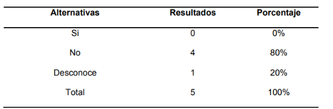

De acuerdo a los salones de belleza que operan en Tegucigalpa, el 53,3% de las mujeres esperan ser atendidas por orden de llegada en salones de belleza. Sin embargo, en su mayoría estos servicios no cuentan con un servicio via web que les permita administrar sus servicios de forma eficiente.

_Figura 2: Reservación de citas_

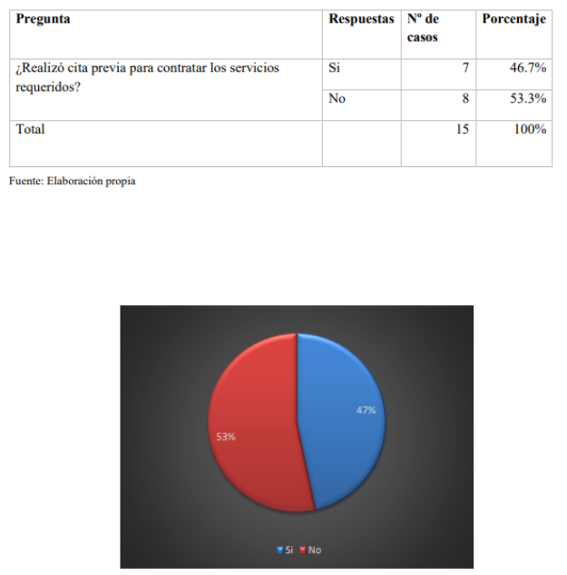

Según el salón de belleza "Giselle Spa" de La Molina (2021), se realizo una encuesta a 205 cliente respecto a la calidad de servicio que ofrece el salon de belleza se identifico que el 53,4% admiten que dicha calidad se manifiesta de forma regular, debido al poco interés que se percibe respecto a los cronogramas, comunicación activa y organización laboral.

_Figura 3: Análisis descriptivo de la variable calidad de servicio_

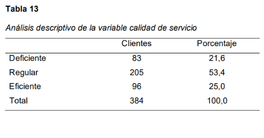

_Figura 4: Análisis porcentual de la variable calidad de servicio_

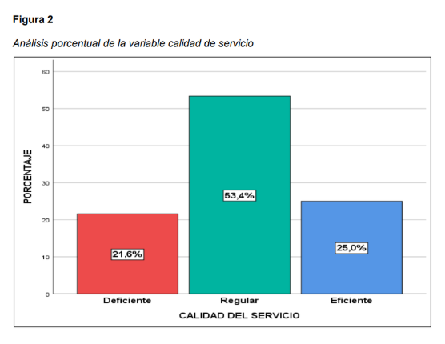

### 1.2.2. Lean UX Process

El enfoque de Lean UX se basa en la colaboración para crear productos de alta calidad, priorizando la optimización de la experiencia del usuario y la satisfacción del cliente sobre la perfección del diseño. Esta metodología permite obtener mejores resultados al integrar una comprensión profunda de la visión del negocio, lo que brinda flexibilidad en la combinación de ideas y eficiencia en la entrega de soluciones (Lean UX y Lean Startup: potencia experiencia y diseño de producto, 2023).

#### 1.2.2.1. Lean UX Problem Statements

Nuestra aplicación móvil, uTime, está diseñada para optimizar la gestión de citas en el sector de la belleza, permitiendo a los profesionales independientes y negocios administrar su disponibilidad, atraer nuevos clientes y mejorar la experiencia del usuario a través de la digitalización de sus servicios. Hemos detectado que, los profesionales de la belleza enfrentan dificultades para gestionar sus citas de manera eficiente, ya que dependen de llamadas, mensajes de WhatsApp y redes sociales, lo que genera desorden, pérdida de tiempo y cancelaciones de última hora. Además, la falta de una aplicación centralizada limita su crecimiento, ya que dependen principalmente del boca a boca para atraer nuevos clientes. Por otro lado, los clientes que buscan servicios de belleza suelen experimentar frustración al coordinar citas manualmente, ya que muchas veces enfrentan tiempos de espera prolongados, falta de información clara sobre la disponibilidad de los estilistas y dificultad para realizar pagos digitales o acceder a promociones personalizadas. ¿Cómo podemos ofrecer una solución digital integral que permita a los profesionales de la belleza gestionar su agenda de manera eficiente, atraer nuevos clientes y mejorar la experiencia de reserva para los usuarios finales?

#### 1.2.2.2. Lean UX Assumptions

##### 1.2.2.2.1. Features

Gestión de citas en línea (reservas, cancelaciones y reprogramaciones).

- Recordatorios automáticos por notificaciones y mensajes.
- Perfil profesional para estilistas y salones, con portafolio de trabajos.
- Sistema de reseñas y valoraciones.
- Integración con pagos digitales.
- Sistema de promociones y fidelización (descuentos, membresías, paquetes de servicios).
- Agenda inteligente con gestión de horarios y disponibilidad en tiempo real.

##### 1.2.2.2.2. Business Outcomes

- Aumento en la adopción de la aplicación móvil por parte de estilistas y salones de belleza. Esperamos que un número creciente de profesionales del sector adopte uTime como su herramienta principal para la gestión de citas y la promoción de sus servicios.
- Mayor retención de clientes gracias a la automatización de citas y promociones personalizadas. uTime incrementará la recurrencia de las reservas de los clientes y la lealtad de estos mismos hacia los profesionales dentro de la aplicación móvil.
- Incremento de ingresos a través de suscripciones premium y comisiones por transacciones. Con el crecimiento de la base de usuarios, uTime espera un aumento en los ingresos recurrentes por planes premium, así como un mayor volumen de transacciones procesadas, fortaleciendo la rentabilidad del negocio.
- Crecimiento de la comunidad activa. A través de alianzas estratégicas con academias de belleza, influencers del sector y marcas de productos cosméticos, construiremos una comunidad sólida y lograremos posicionar a uTime como la solución tecnológica más confiable y utilizada por estilistas y clientes.

##### 1.2.2.2.3. User Benefits

Para los profesionales de la belleza:

- Ahorro de tiempo al automatizar la gestión de citas.
- Mayor exposición y captación de clientes a través de la aplicación.
- Reducción de cancelaciones gracias a los recordatorios automáticos.
- Mayor seguridad en los pagos con integración de billeteras digitales o pasarela de pago.
- Crecimiento profesional con la acumulación de reseñas y un perfil atractivo. Para los clientes:
- Facilidad para encontrar y reservar servicios de belleza sin llamadas o esperas
- Mayor confianza al ver reseñas y valoraciones antes de reservar.
- Seguridad en pagos digitales y opción de pagar en el momento.
- Acceso a promociones exclusivas y recompensas por lealtad.
- Creemos que los salones de belleza y barberías necesitan una herramienta digital para gestionar citas y atraer más clientes sin depender de redes sociales o el boca a boca.
- Pensamos que los clientes buscan una manera más confiable y sencilla de encontrar servicios de belleza sin llamar o visitar múltiples lugares.
- Asumimos que la automatización de citas y pagos reducirá la tasa de cancelaciones.
- Estimamos que los estilistas estarían dispuestos a pagar por una suscripción premium si el servicio mejora su visibilidad y rentabilidad.
- Creemos que la seguridad en los pagos es un factor clave para la adopción del producto.
- Pensamos que las alianzas con marcas de belleza y salones ayudará a escalar el negocio.
- Esperamos que la integración con redes sociales aumente la captación de clientes y la visibilidad de los estilistas.

1. ¿Quién es el usuario?

   - Los usuarios de uTime son salones de belleza que deseen integrar nuestro producto. Asimismo, aquellos clientes que buscan servicios de peluquería, maquillaje y cuidado personal.

2. ¿Dónde encaja nuestro producto en su trabajo o vida?

   - Nuestro producto, uTime, se integra en la vida diaria de los usuarios al proporcionarles un medio de gestión de citas, procurando simplificar el proceso y optimizar el manejo de la disponibilidad de los salones de belleza.

3. ¿Qué problemas tiene nuestro producto y cómo se puede resolver?

   - uTime enfrenta desafíos como la baja adopción por falta de confianza en la tecnología, dificultades en la personalización del sistema y preocupaciones sobre la seguridad de los pagos realizados en línea. Para resolver estos problemas, se podrían implementar tutoriales y soporte técnico personalizado, así como pruebas exhaustivas y actualizaciones constantes para corroborar la eficacia del producto. Asimismo, ofrecer opciones de pago flexible y garantía de seguridad en las transacciones. Estas acciones ayudarán a mejorar la experiencia del usuario y a aumentar la confianza en la plataforma.

4. ¿Cuándo y cómo es usado nuestro producto?

   - uTime es utilizado por los usuarios en diversos momentos del día, dentro de la jornada laboral de los estilistas, dado que en cualquier momento del día los clientes pueden explorar opciones y agendar servicios. Los usuarios podrán acceder a uTime a través de la aplicación móvil, permitiendo a los estilistas administrar su negocio en cualquier lugar y a los clientes agendar sus citas cuando deseen.

5. ¿Qué características son importantes?

   - Las características importantes son:
     - **Gestión de citas en tiempo real:** Permite a los estilistas administrar sus horarios de manera eficiente, evitando sobrecargas y asegurando disponibilidad precisa para los clientes. La interfaz intuitiva facilita la reserva y modificación de citas en pocos taps.
     - **Sistema de pagos integrados y seguros:** Los clientes pueden pagar sus citas dentro de la aplicación móvil con tarjeta de crédito, débito o billeteras digitales, asegurando una óptima experiencia.
     - **Perfiles detallados de estilistas:** Cada salón cuenta con un perfil detallado que muestra la experiencia, especialidad, precios y disponibilidad de los estilistas. Los clientes pueden ver fotos de trabajos anteriores, leer reseñas y comparar opciones antes de reservar.
     - **Reseñas y calificaciones verificadas:** Para promover la confianza entre los usuarios, los clientes solo pueden dejar reseñas después de haber completado una cita. Esto permitirá garantizar la autenticidad de las opiniones y permite que los estilistas con buen desempeño destaquen.
     - **Herramientas de marketing digital:** Los estilistas pueden conectar sus perfiles de Instagram y TikTok para mostrar su trabajo y atraer más clientes. También se incluyen opciones para compartir reseñas y promociones en redes sociales directamente desde la aplicación móvil.
     - **Notificaciones y recordatorios automáticos:** Los usuarios reciben alertas de sus citas para reducir cancelaciones y olvidos. Además, los estilistas pueden enviar recordatorios personalizados y mensajes promocionales para fidelizar a sus clientes.

6. ¿Cómo debe verse nuestro producto y cómo debe comportarse?

   - El producto uTime debe cumplir ciertos aspectos de diseño y funcionalidad para convertirse en un proyecto exitoso, de una manera que refleje su enfoque en el sector de la belleza, optimización del tiempo, y la innovación tecnológica. En cuanto a su apariencia se señala lo siguiente:
     - **Interfaz visualmente atractiva:** uTime debe contar con un diseño limpio y minimalista que facilite la navegación tanto para clientes como para estilistas. La combinación de colores debe transmitir confianza y elegancia, con una paleta que refleje profesionalismo y bienestar.
     - **Diseño adaptable y responsivo:** Debe garantizar una experiencia consistente en cualquier smartphone o tableta. La interfaz debe ser clara y optimizada para facilitar la reserva de citas con pocos taps.
   - En cuanto al comportamiento, uTime debe ser rápido, receptivo y confiable. Debido a esto, debe cumplir con los siguientes requisitos:
     - **<u>Interacción fluida y rápida:</u>** uTime debe ser altamente responsiva, garantizando tiempos de carga mínimos y transiciones suaves entre secciones. Esto evitará la disconformidad y frustraciones del cliente, mejorando así su experiencia en la plataforma.
     - **<u>Exploración intuitiva y eficiente:</u>** Los clientes deben poder encontrar estilistas fácilmente mediante filtros avanzados como ubicación, especialidad, precios y reseñas. La interfaz debe permitir búsquedas rápidas y precisas.
     - **<u>Seguridad y confianza en transacciones:</u>** Los pagos dentro de la aplicación móvil deben ser seguros y confiables, con múltiples opciones de pago. Además, la política de cancelación y reembolso debe estar clara para evitar inconvenientes.
     - **<u>Sistema de notificaciones inteligentes:</u>** Debe enviar recordatorios automáticos de citas, confirmaciones de pago, mensajes promocionales y alertas sobre cambios en la disponibilidad de los estilistas. Las notificaciones deben ser relevantes y evitar el spam.

#### 1.2.2.3. Lean UX Hypothesis Statements

- Creemos que, al ofrecer una plataforma de gestión de citas fácil de usar y accesible desde cualquier smartphone o tableta, los estilistas podrán optimizar la organización de sus agendas y minimizar cancelaciones o sobrecargas de trabajo. Sabremos que hemos tenido éxito cuando al menos el 80% de los estilistas activos utilicen el sistema de reservas en línea regularmente.
- Creemos que, al implementar recordatorios automáticos para clientes y estilistas, reduciremos significativamente la cantidad de citas canceladas o reprogramadas en el último minuto. Sabremos que hemos tenido éxito cuando la tasa de cancelaciones tardías disminuya en al menos un 40% dentro de los primeros tres meses de uso.
- Creemos que, al permitir a los clientes seleccionar su estilista preferido, ver disponibilidad en tiempo real y reservar con facilidad, aumentaremos la satisfacción y fidelización. Sabremos que hemos tenido éxito cuando al menos el 70% de los clientes regresen a agendar una nueva cita dentro de los primeros dos meses después de su primera reserva.
- Creemos que, al integrar un sistema de reseñas y calificaciones para estilistas, se generará confianza en nuevos clientes y aumentará la retención de clientes recurrentes. Sabremos que hemos tenido éxito cuando al menos el 75% de los clientes califiquen su experiencia después de una cita.
- Creemos que, al permitir la personalización de servicios y precios dentro de la aplicación móvil, los estilistas podrán ofrecer paquetes más atractivos y competitivos. Sabremos que hemos tenido éxito cuando al menos el 50% de los estilistas utilicen funciones de personalización dentro del primer mes de uso.
- Creemos que, al incluir un módulo de promociones y descuentos, los estilistas podrán aumentar la captación de nuevos clientes y fidelizar a los actuales. Sabremos que hemos tenido éxito cuando el número de reservas aumente en un 30% en comparación con el período previo a la implementación de esta funcionalidad.

#### 1.2.2.4. Lean UX Canvas

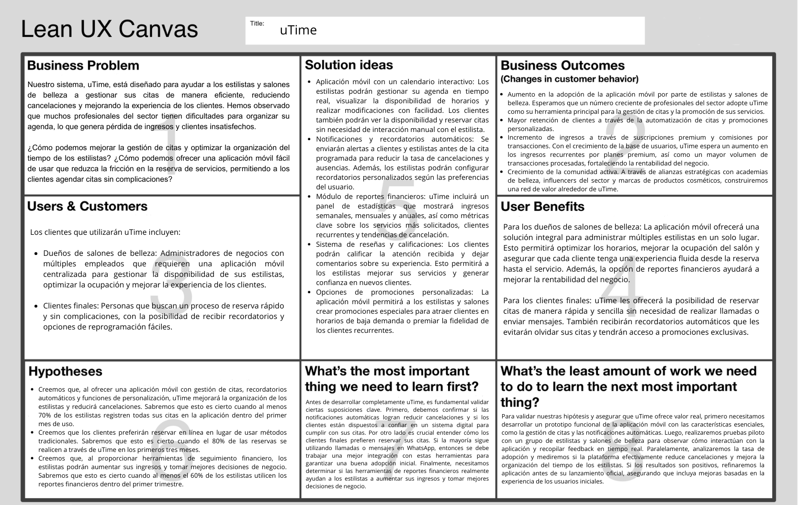

## 1.3. Segmentos objetivo

Los segmentos objetivos son las personas o entidades a las cuales está destinada nuestra solución. A continuación se nombraran los que abarca nuestra propuesta.

## Segmento objetivo #1: Salones de belleza y barberías

### Aspectos Demográficos

- Rango de edad: Mayores de 20 años
- Sexo: Masculino y femenino
- Nivel socioeconómico: clases A, B (alta y media-alta)

### Aspectos geográficos:

- Nacionalidad: Peruana o extranjera
- Zona geográfica de residencia: urbana
- Departamento: Lima Metropolitana

### Aspectos psicográficos:

- Uso frecuente de medios de comunicación, tales como WhatsApp y llamadas telefónicas, para interactuar con los clientes.
- Un día a día con la agenda apretada por las reservas de los clientes y poca flexibilidad.

## Segmento objetivo #2: Clientes de servicios de belleza

### Aspectos Demográficos

- Rango de edad: Mayores de 18 años
- Sexo: Masculino y femenino
- Nivel socioeconómico: clases A, B y C (alta, media-alta y media)

### Aspectos geográficos:

- Nacionalidad: Peruana o extranjera
- Zona geográfica de residencia: urbana
- Departamento: Lima Metropolitana

### Aspectos psicográficos:

- Van frecuentemente a salones de belleza para estar a la moda o estar presentable para un evento importante.
- Tienden a preferir tratarse con el mismo estilista o barbero debido a experiencias anteriores o por la técnica del especialista.

# Capítulo II: Requirements Elicitation & Analysis

## 2.1. Competidores

### 2.1.1. Análisis competitivo

El análisis competitivo es una herramienta clave para la toma de decisiones estratégicas, ya que permite identificar oportunidades, amenazas y desarrollar ventajas competitivas sostenibles en el mercado. Su importancia radica en ayudar a las empresas a adaptarse a un entorno dinámico y a tomar decisiones fundamentadas. A continuación, se presenta la aplicación de esta herramienta en el desarrollo del proyecto y el análisis de los competidores:

<table>
  <tr>
    <th colspan="6">Competitive Analysis Landscape</th>
  </tr>
  <tr>
    <td colspan="1" align="center" rowspan="2">¿Por qué llevar a cabo este análisis?</td>
    <td colspan="5" align="center">¿Cómo identificar a nuestros principales competidores?</td>
  </tr>
  <tr>
    <td colspan="5"  align="center">Gracias al análisis de la competencia en el mercado, es posible entender el entorno en el que nuestro producto operará. Esto permite identificar a los competidores directos e indirectos y desarrollar estrategias basadas en la información obtenida sobre su posicionamiento actual.</td>
  </tr>
  <tr>
    <th colspan="2" align="center">Nombre y logo</th>
    <td colspan="1" align="center">
    
<b>uTime</b>

    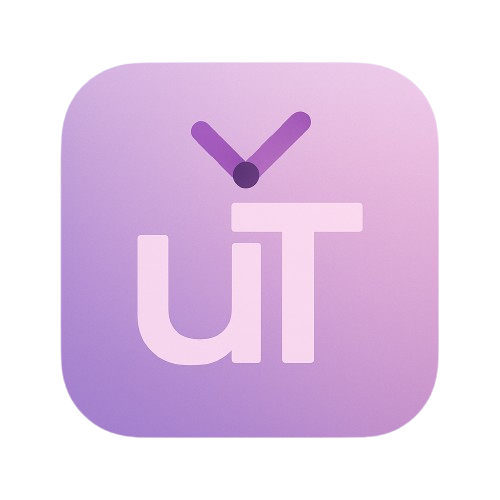
    </td>
    <td colspan="1" align="center">
    
<b>Salon Pro</b>

    
    </td>
    <td colspan="1" align="center">
    
<b>Beauty Salon</b>

    
    </td>
    <td colspan="1" align="center">
    
<b>Calendly</b>

    
    </td>
  </tr>
  <tr>
    <th colspan="1" rowspan="2" align="center">Perfil</th>
    <td colspan="1" align="center" >Overview</td>
    <td colspan="1">Plataforma de gestión de citas en tiempo real, altamente personalizable, con marketplace y pagos en línea.</td>
    <td colspan="1">Software para gestión de citas en salones con recordatorios y pagos integrados.</td>
    <td colspan="1">Aplicación móvil para reservas en salones de belleza con sistema de recomendaciones.</td>
    <td colspan="1">Plataforma de programación de reuniones con integración a calendarios digitales.</td>
  </tr>
  <tr>
    <td colspan="1" align="center">Ventaja competitiva ¿Qué valor ofrece a los clientes?</td>
    <td colspan="1">
    <ul>
    <li>Alta personalización en precios, tiempos y servicios.</li>
    <li>Marketplace para generar ingresos adicionales.</li>
    <li>Asesoramiento exclusivo en el plan premium.</li>
    <li>Calendario en tiempo real, optimizado para equipos con múltiples trabajadores.</li>
    </ul>
    </td>
    <td colspan="1">
    <ul>
    <li>Automatización de citas con recordatorios.</li>
    <li>Integración con pagos para facilitar transacciones.</li>
    <li>Interfaz sencilla y amigable para salones de belleza.</li>
    </ul>
    </td>
    <td colspan="1">
    <ul>
    <li>Sistema de recomendaciones basado en preferencias del usuario.</li>
    <li>Experiencia optimizada en móvil.</li>
    <li>Ofertas y promociones exclusivas dentro de la app.</li>
    </ul>
    </td>
    <td colspan="1">
    <ul>
    <li>Integración con herramientas empresariales (Google Calendar, Outlook, Zoom).</li>
    <li>Automatización de programación para equipos y clientes.</li>
    <li>Fácil uso y amplia adopción en el mercado corporativo.</li>
    </ul>
    </td>
  </tr>
  <tr>
    <th colspan="1" align="center" rowspan="2">Perfil de marketing</th>
    <td colspan="1" align="center">Mercado objetivo</td>
    <td colspan="1">
    <ul>
    <li>Peluquerías y barberías.</li>
    <li>Clientes que buscan reservar servicios de belleza.</li>
    </ul>
    </td>
    <td colspan="1">
    <ul>
    <li>Salones de belleza y spas.</li>
    <li>Negocios que quieren digitalizar sus citas.</li>
    </ul>
    </td>
    <td colspan="1">
    <ul>
    <li>Clientes que buscan servicios de belleza.</li>
    <li>Salones de belleza y spas.</li>
    </ul>
    </td>
    <td colspan="1">
    <ul>
    <li>Empresas y freelancers que necesitan agendar reuniones.</li>
    </ul>
    </td>
  </tr>
  <tr>
    <td colspan="1" align="center">Estrategias de marketing</td>
    <td colspan="1">
    <ul>
    <li>Modelo freemium con 10 reservas mensuales gratis.</li>
    <li>Marketplace para generar ingresos extra.</li>
    <li>Publicidad en redes sociales.</li>
    </ul>
    </td>
    <td colspan="1">
    <ul>
    <li>Publicidad dirigida en redes sociales.</li>
    <li>Ofertas promocionales y descuentos.</li>
    <li>Integración con herramientas de gestión empresarial.</li>
    </ul>
    </td>
    <td colspan="1">
    <ul>
    <li>Fuerte presencia en App Store y Google Play.</li>
    <li>Alianzas con salones para promociones.</li>
    </ul>
    </td>
    <td colspan="1">
    <ul>
    <li>SEO y marketing de contenido.</li>
    <li>Integración con múltiples herramientas de productividad.</li>
    </ul>
    </td>
  </tr>
  <tr>
    <th colspan="1" align="center" rowspan="3">Perfil del producto</th>
    <td colspan="1" align="center">Productos & Servicios</td>
    <td colspan="1">
    <ul>
    <li>Gestión de citas en tiempo real.</li>
    <li>Marketplace.</li>
    <li>Pagos en línea.</li>
    <li>Asesoramiento en plan premium.</li>
    </ul>
    </td>
    <td colspan="1">
    <ul>
    <li>Software de gestión para salones.</li>
    <li>Recordatorios automáticos.</li>
    <li>Pagos integrados.</li>
    </ul>
    </td>
    <td colspan="1">
    <ul>
    <li>Aplicación para reservas.</li>
    <li>Sistema de recomendaciones.</li>
    <li>Promociones para usuarios.</li>
    </ul>
    </td>
    <td colspan="1">
    <ul>
    <li>Programación de reuniones.</li>
    <li>Integraciones con calendarios.</li>
    <li>Automatización de agendas.</li>
    </ul>
    </td>
  </tr>
  <tr>
    <td colspan="1" align="center">Precios y Costos</td>
    <td colspan="1">
    <ul>
    <li>Plan gratuito con 10 reservas/mes.</li>
    <li>Plan intermedio con más personalización.</li>
    <li>Plan premium con marketplace ilimitado y asesoramiento.</li>
    </ul>
    </td>
    <td colspan="1">
    <ul>
    <li>Suscripción mensual según el tamaño del negocio.</li>
    </ul>
    </td>
    <td colspan="1">
    <ul>
    <li>Comisiones por reservas.</li>
    <li>Posible suscripción premium.</li>
    </ul>
    </td>
    <td colspan="1">
    <ul>
    <li>Modelo freemium con suscripción mensual.</li>
    <li>Costos según el tamaño del equipo.</li>
    </ul>
    </td>
  </tr>
  <tr>
    <td colspan="1" align="center">Canales de distribución (Web y/o Móvil)</td>
    <td colspan="1">El servicio, de forma momentánea, se brindará en plataforma web</td>
    <td colspan="1">Dispone de plataforma web y aplicación móvil</td>
    <td colspan="1">Solo aplicación móvil</td>
    <td colspan="1">Plataforma web y aplicación móvil</td>
  </tr>
  <tr>
    <th colspan="1" align="center" rowspan="4">Análisis SWOT</th>
    <td colspan="1" align="center">Fortalezas</td>
    <td colspan="1">
    <ul>
    <li>Personalización avanzada.</li>
    <li>Diferenciación con marketplace.</li>
    <li>Modelo accesible y flexible.</li>
    </ul>
    </td>
    <td colspan="1">
    <ul>
    <li>Automatización de citas.</li>
    <li>Fácil de usar.</li>
    </ul>
    </td>
    <td colspan="1">
    <ul>
    <li>Interfaz atractiva.</li>
    <li>Buen enfoque en clientes finales.</li>
    </ul>
    </td>
    <td colspan="1">
    <ul>
    <li>Gran cantidad de integraciones.</li>
    <li>Posicionamiento sólido en el mercado.</li>
    </ul>
    </td>
  </tr>
  <tr>
    <td colspan="1" align="center">Debilidades</td>
    <td colspan="1">
    <ul>
    <li>Necesidad de atraer clientes masivos.</li>
    <li>Puede ser complejo para algunos usuarios.</li>
    </ul>
    </td>
    <td colspan="1">
    <ul>
    <li>Alta competencia.</li>
    <li>Funcionalidades limitadas.</li>
    </ul>
    </td>
    <td colspan="1">
    <li>Dependencia de afiliaciones con salones.</li>
    <li>Competencia con otras apps.</li>
    </td>
    <td colspan="1">
    <ul>
    <li>Costos elevados para algunas funciones.</li>
    </ul>
    </td>
  </tr>
  <tr>
    <td colspan="1" align="center">Oportunidades</td>
    <td colspan="1">
    <ul>
    <li>Expansión en Latinoamérica.</li>
    <li>Alianzas con marcas de belleza.</li>
    <li>Expansión del marketplace.</li>
    </ul>
    </td>
    <td colspan="1">
    <ul>
    <li>Crecimiento del sector digital.</li>
    <li>Mayor uso de pagos en línea.</li>
    </ul>
    </td>
    <td colspan="1">
    <ul>
    <li>Aumento de reservas digitales en belleza.</li>
    <li>Integración con plataformas de bienestar.</li>
    </ul>
    </td>
    <td colspan="1">
    <ul>
    <li>Crecimiento del trabajo remoto.</li>
    <li>Expansión en herramientas digitales.</li>
    </ul>
    </td>
  </tr>
  <tr>
    <td colspan="1" align="center">Amenazas</td>
    <td colspan="1">
    <ul>
    <li>Competencia con plataformas consolidadas.</li>
    <li>Costos de adquisición de clientes.</li>
    </ul>
    </td>
    <td colspan="1">
    <ul>
    <li>Opciones más económicas en el mercado.</li>
    <li>Cambios en tendencias de consumo.</li>
    </ul>
    </td>
    <td colspan="1">
    <ul>
    <li>Nuevos competidores en el sector.</li>
    <li>Alternativas con más funcionalidades.</li>
    </ul>
    </td>
    <td colspan="1">
    <ul>
    <li>Empresas más grandes en el sector.</li>
    <li>Alternativas gratuitas en crecimiento.</li>
    </ul>
    </td>
  </tr>
</table>

### 2.1.2. Estrategias y tácticas frente a competidores

A partir del análisis competitivo previamente realizado, se logró determinar con precisión las principales fortalezas, oportunidades, debilidades y amenazas de los competidores. Esta información es fundamental para diseñar estrategias y tácticas que permitan posicionarse de manera efectiva frente a la competencia, especialmente durante el ingreso del servicio al mercado. A continuación, se presentan las estrategias y tácticas definidas con el objetivo de lograr un lanzamiento exitoso y rentable.

#### Afrontando las fortalezas de nuestros competidores:

- Salon Pro cuenta con una interfaz sencilla y automatización de citas, lo que facilita la experiencia del usuario.
- Beauty Salon posee una fuerte presencia en dispositivos móviles y un sistema de recomendaciones personalizado.
- Calendly domina el mercado con su integración con herramientas empresariales y automatización avanzada.

#### Comprendemos que nuestras fortalezas son:

- Personalización avanzada de precios, tiempos y servicios para cada trabajador.
- Integración de un marketplace para generar ingresos adicionales.
- Asesoramiento premium para ayudar a los negocios a optimizar su uso de la plataforma.
- Plan gratuito accesible con 10 reservas mensuales

Entonces, podemos aplicar las siguientes estrategias y tácticas:

#### Estrategias

- Destacar la personalización de uTime como una ventaja clave en nuestra comunicación y campañas de marketing.
- Enfatizar el valor del marketplace como una fuente de ingresos adicional para las peluquerías.
- Promover el plan de asesoramiento como un servicio exclusivo que nuestros competidores no ofrecen.

#### Tácticas

- Campañas en redes sociales mostrando cómo se personaliza la plataforma para distintos negocios.
- Casos de éxito de pequeñas peluquerías que optimizaron sus citas y ventas con uTime.
- Videos explicativos sobre el uso del calendario por trabajador.

#### Afrontando las debilidades de nuestros competidores:

- Salon Pro tiene funcionalidades limitadas y enfrenta alta competencia.
- Beauty Salon depende de afiliaciones con salones y tiene competencia en el sector.
- Calendly tiene costos elevados para funciones avanzadas.

Requieren configuraciones técnicas complicadas en algunos casos

#### Comprendemos que nuestras debilidades son:

- Necesidad de atraer clientes masivos rápidamente.
- Puede ser complejo para usuarios sin experiencia en plataformas digitales.

Entonces, podemos aplicar las siguientes estrategias y tácticas:

#### Estrategias

- Implementar una estrategia de adquisición de clientes con modelos freemium y pruebas gratuitas.
- Diseñar una interfaz intuitiva con tutoriales y soporte personalizado.

#### Tácticas

- Ofrecer un plan gratuito con funcionalidades limitadas para atraer usuarios y generar confianza en el producto.
- Incluir asesoría personalizada en el plan completo para ayudar a negocios grandes a configurar y personalizar la plataforma según sus necesidades, especialmente si no están familiarizados con herramientas tecnológicas.

#### Afrontando las oportunidades de nuestros competidores:

- Salon Pro y Beauty Salon se benefician del crecimiento del sector digital en el ámbito de la belleza.
- Calendly aprovecha el aumento del trabajo remoto y la digitalización de agendas.

#### Comprendemos que nuestras oportunidades son:

- Expansión del mercado digital en Latinoamérica.
- Alianzas estratégicas con marcas de belleza y distribuidores.

Entonces, podemos aplicar las siguientes estrategias y tácticas:

#### Estrategias

- Expandir la presencia de uTime en mercados emergentes y ofrecer soporte en múltiples idiomas.
- Establecer alianzas con proveedores de productos de belleza y herramientas de gestión empresarial.

#### Tácticas

- Lanzar campañas de publicidad específicas para nuevos mercados.
- Contactar con marcas y distribuidores para ofrecer descuentos exclusivos a usuarios de uTime.
- Desarrollar una función de recomendaciones de productos dentro del marketplace.

#### Afrontando las amenazas de nuestros competidores:

- Existen plataformas consolidadas con una base de clientes establecida.
- La adquisición de clientes puede ser costosa debido a la alta competencia.

#### Comprendemos que nuestras amenazas son:

- Posicionamiento de grandes marcas en el sector.
- Costos de adquisición de usuarios y retención de clientes.

Entonces, podemos aplicar las siguientes estrategias y tácticas:

#### Estrategias

- Diferenciar uTime con características únicas y servicios adicionales.
- Fidelizar clientes con programas de recompensas y beneficios exclusivos.

#### Tácticas

- Implementar un sistema de referidos con descuentos para clientes actuales y nuevos usuarios.
- Crear un programa de fidelización con beneficios progresivos según el tiempo de uso de la plataforma.

## 2.2. Entrevistas

### 2.2.1. Diseño de entrevistas

Preguntas para el segmento objetivo 01

- ¿Cuánto tiempo lleva en el rubro de la belleza/barbería y qué lo motivó a dedicarse a este negocio?
- ¿Cómo suelen agendar las citas sus clientes y qué método prefieren ellos? (WhatsApp, llamadas, redes sociales, otros).
- ¿Cuán flexible es su agenda diaria y qué tan difícil es manejar cambios de última hora en las reservas?
- ¿Usan algún sistema o aplicación para gestionar reservas y pagos? Si no, ¿cómo lo hacen actualmente?
- ¿Cuáles son los principales canales de comunicación que usan para confirmar o recordar citas?
- ¿Cuáles son los principales desafíos que enfrenta al gestionar las reservas y la relación con los clientes?
- ¿Con qué frecuencia enfrentan cancelaciones o clientes que no se presentan? ¿Cómo manejan estas situaciones?
- ¿Qué estrategias usan para que los clientes regresen a su negocio y qué tan efectivas han sido?
- ¿Qué tan abiertos están a implementar nuevas herramientas digitales que les ayuden a organizar mejor su negocio?
- ¿Qué mejoras le gustaría implementar en su negocio en el corto y mediano plazo?
- ¿Qué tan importante es para usted tener un control visual de la disponibilidad y ocupación de su equipo de trabajo?
- ¿Cómo maneja las situaciones de insatisfacción de los clientes y qué acciones toma para evitar que se repitan?

Preguntas para el segmento objetivo 02

- ¿Con qué frecuencia visitas un salón de belleza o barbería y qué servicios sueles solicitar?
- ¿Qué factores consideras más importantes al elegir un salón de belleza o barbería? (Ubicación, precio, reputación, servicio, etc.)
- ¿Sueles atenderte con el mismo estilista/barbero? ¿Por qué?
- ¿Cómo prefieres agendar tus citas? (WhatsApp, llamadas, página web, aplicación, presencialmente).
- ¿Qué tan importante es para ti que te atiendan a la hora exacta de tu cita? ¿Has tenido experiencias negativas con largas esperas?
- Si necesitas cancelar o reprogramar tu cita, ¿qué tan fácil o difícil suele ser el proceso?
- ¿Qué métodos de pago prefieres al momento de pagar por el servicio? (Efectivo, tarjeta, transferencias, apps de pago).
- ¿Cómo te gusta recibir recordatorios de tu cita o promociones? (Mensajes de WhatsApp, correos, redes sociales, llamadas).
- ¿Has utilizado alguna aplicación o plataforma para reservar citas en salones de belleza/barberías? ¿Cómo fue tu experiencia?
- ¿Qué aspecto te gustaría que mejoraran los salones de belleza/barberías para una mejor experiencia como cliente?
- ¿Qué tan importante es para ti que el salón o barbería tenga una presencia activa en redes sociales o en línea?
- ¿Cuánto valoras la opción de poder hacer pagos anticipados o de forma digital para evitar el manejo de efectivo?

### 2.2.2. Registro de entrevistas

### Segmento Objetivo 1 (Salones de Belleza y Barberías)

##### Datos del Entrevistado #1

- **Nombre completo:** Luis Fernando Farfán
- **Segmento Objetivo:** Barbero
- **Edad:** 29 años
- **Distrito:** Chiclayo
- **Inicio de la entrevista:** 0:15 minutos
- **Duración:** 20:43 minutos
- **Screenshot del cuadro de video:** 

- **URL del video (Microsoft Stream):**

`https://upcedupe-my.sharepoint.com/:v:/g/personal/u20211g671_upc_edu_pe/ESFQacfmqZ5Nn2Bv1Xf07vUB0OTOAw-maSZzLjNobLiKMQ`

**Resumen:**
Luis Fernando Farfán es un barbero de Chiclayo que tiene 8 años de experiencia. Utiliza las redes sociales y WhatsApp para ambos el marketing de su negocio y la recepción de citas. Utiliza la agenda Fresha para registrar las citas y gestionar los horarios. Se enfrenta a desafíos como la comunicación sobre información del horario y especialmente se enfrenta a clientes que cancelan al último minuto, llegan tarde o no llegan en absoluto lo cual le causa una perdida de tiempo y clientes posibles. Le resulta de gran importancia saber en qué horarios se encuentran disponibles sus barberos para asignar a los clientes. Se enfoca que sus barberos y el mismo sean empáticos y carismáticos para que los clientes se sientan comodos y vuelvan a la barbería.

##### Datos del Entrevistado #2

- **Nombre completo:** Maria Ysabel Sosa Rodriguez
- **Segmento Objetivo:** Dueña de un Salón de belleza
- **Edad:** 45 años
- **Distrito:** San Juan de Lurigancho
- **Inicio de la entrevista:** 7:53 minutos
- **Duración:** 20:43 minutos
- **Screenshot del cuadro de video:** 

- **URL del video (Microsoft Stream):**

`https://upcedupe-my.sharepoint.com/:v:/g/personal/u20211g671_upc_edu_pe/ESFQacfmqZ5Nn2Bv1Xf07vUB0OTOAw-maSZzLjNobLiKMQ`

**Resumen:**
María Ysabel Sosa Rodríguez, de 45 años, es dueña de un salón de belleza y actualmente enfrenta retos en la gestión de sus citas. Durante la entrevista, expresó su interés en implementar un sistema automatizado para agendar citas, ya que considera que las cancelaciones de último momento resultan frustrantes y afectan su negocio. Además, destacó que los métodos tradicionales como llamadas o mensajes son poco prácticos, ya que demandan tiempo y a menudo generan incomodidad tanto para ella como para sus clientas. María Ysabel ve en la tecnología una oportunidad para optimizar este proceso y mejorar la eficiencia en la atención al cliente.

### Segmento Objetivo 2 (Clientes de servicios de belleza)

#### Datos del Entrevistado #1

- **Nombre completo:** Anedyib Villar Bisso
- **Segmento Objetivo:** Clientes de servicio de belleza
- **Edad:** 20 años
- **Distrito:** San Isidro
- **Screenshot del cuadro de video:** _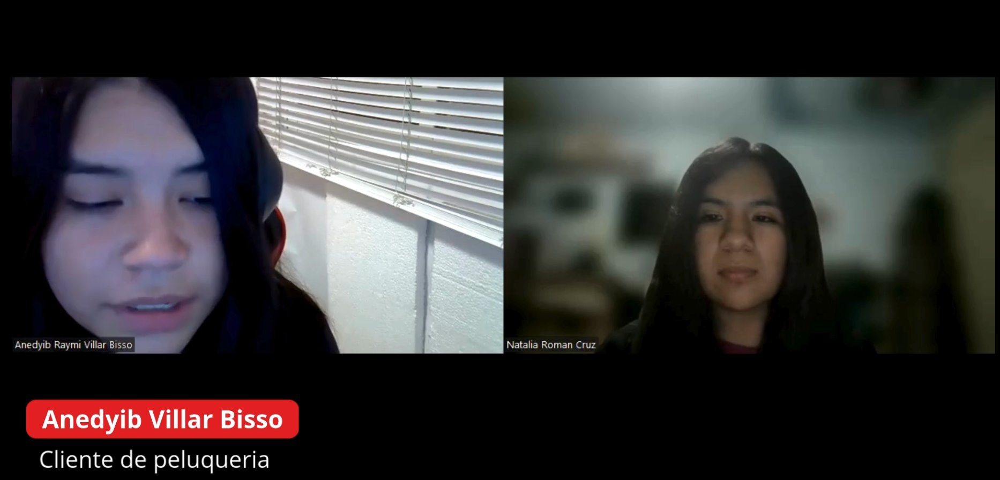_
- **Inicio de la entrevista:** 12:20 minutos
- **Duración:** 20:43 minutos

- **URL del video (Microsoft Stream):**

`https://upcedupe-my.sharepoint.com/:v:/g/personal/u20211g671_upc_edu_pe/ESFQacfmqZ5Nn2Bv1Xf07vUB0OTOAw-maSZzLjNobLiKMQ`

**Resumen:** En esta entrevista con Anedyib, comentó que visita el salón dos veces al mes (manicure al inicio y recorte de puntas a fin de mes). Valora especialmente el buen trato con su estilista y la facilidad para agendar por WhatsApp, y suele atenderse siempre con la misma persona por la confianza construida. La puntualidad es crítica; relató una mala experiencia que le arruinó planes. Cancelar le resulta fácil, pero reprogramar es complicado por choques de horarios. Prefiere pagos digitales (tarjeta o Yape) y recordatorios tipo calendario. Ha intentado reservar en webs pero no pudo y terminó llamando, algo que le disgustó. Sugiere mejorar la comunicación proactiva desde la reserva hasta la llegada y ofrecer pagos anticipados y digitales.

#### Datos del Entrevistado #2

- **Nombre completo:** Emily Arroyo Gonzales
- **Segmento Objetivo:** Clientes de servicio de belleza
- **Edad:** 20
- **Distrito:** Chorrillos
- **Screenshot del cuadro de video:** _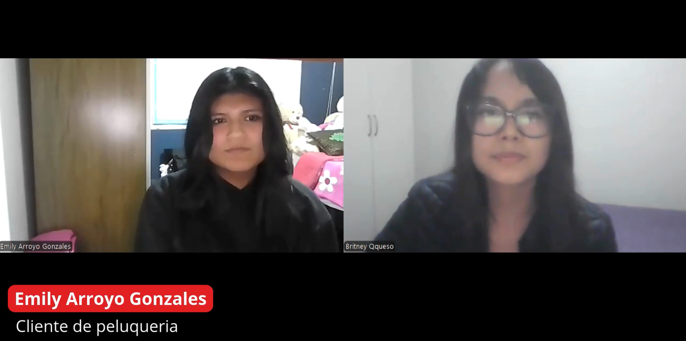_
- **Inicio de la entrevista:** 16:53 minutos
- **Duración:** 20:43 minutos
- **URL del video (Microsoft Stream):**

`https://upcedupe-my.sharepoint.com/:v:/g/personal/u20211g671_upc_edu_pe/ESFQacfmqZ5Nn2Bv1Xf07vUB0OTOAw-maSZzLjNobLiKMQ`

**Resumen:** En esta entrevista con Emily, indicó que acude por corte de cabello, a veces limpieza facial y manicure. Sus criterios clave son ubicación cercana, reputación, comentarios y calidad; está dispuesta a pagar más por un buen servicio. Generalmente se atiende con el mismo estilista porque conoce sus gustos. Prefiere agendar por WhatsApp por mayor comodidad; la puntualidad es muy importante, aunque tolera una breve espera. Cancelar y reprogramar le resulta fácil vía WhatsApp. Paga con Yape o tarjeta y prefiere recordatorios por WhatsApp. Propone mejorar la atención (amabilidad y escuchar lo solicitado). Considera importante la presencia en redes para ver trabajos, opiniones y promociones, y valora los pagos digitales por seguridad, comodidad y ahorro de tiempo.

### 2.2.3. Análisis de entrevistas

**Análisis del Segmento Objetivo 01**

- Características Objetivas:

  - Demografía y Experiencia:
    - Jóvenes emprendedores (24-28 años).
    - Con experiencia en el rubro (3-5 años).
    - Propietarios de salones de belleza en áreas urbanas (Chorrillos, Barranco, Surco).
  - Gestión del Negocio:
    - Agenda de citas gestionada manualmente (cuaderno).
    - Pagos en efectivo, transferencias y QR.
    - Comunicación con clientes vía llamadas y WhatsApp.
    - Sufren de cancelaciones de citas que afectan sus ingresos.
  - Estrategias de Fidelización:
    - Ofrecen promociones y obsequios.
    - Ofrecen promociones para primeras visitas.

- Características Subjetivas:

  - Motivación y Pasión:
    - Pasión por el estilismo desde jóvenes.
    - Deseo de brindar una experiencia de calidad a sus clientes.
    - Búsqueda de la personalización en el servicio al cliente.
  - Desafíos y Necesidades:
    - Dificultad para gestionar citas, especialmente fuera de línea.
    - Problemas con cambios de citas de última hora.
    - Necesidad de optimizar la comunicación con los clientes.
    - Búsqueda de la gestión eficiente de sus negocios.
  - Visión a Futuro:
    - Deseo de aumentar la rentabilidad del negocio.
    - Planes de expansión (apertura de nuevas sucursales).
    - Crear historial de clientes.
    - Desarrollar campañas de fidelización.

- **Análisis del Segmento Objetivo 02**

  - Características Objetivas:

    - Demografía:
      - Jóvenes universitarias de 20 a 60 años.
      - Residentes en áreas urbanas (Cercado de Lima). (50% de las entrevistadas)
    - Comportamiento de Consumo:
      - Visitan salones de belleza aproximadamente una vez al mes. (100% de los entrevistados)
      - Servicios más frecuentes: manicura, corte de cabello, tratamientos capilares, depilación de cejas y mascarillas faciales.
    - Preferencias de Comunicación y Pago:
      - Prefieren agendar citas y recibir recordatorios/promociones vía WhatsApp y redes sociales. (100% de las entrevistadas)
      - Prefieren pagos con transferencias bancarias o aplicaciones de pago, evitando el efectivo. (100% de las entrevistadas)

  - Características Subjetivas:

    - Valores y Prioridades:
      - Priorizan la calidad del servicio y la reputación del salón. (100% de las entrevistadas)
      - La puntualidad es un factor crítico. (100% de las entrevistadas)
      - Confianza en el estilista: prefieren atenderse siempre con el mismo profesional. (100% de las entrevistadas)
      - La comodidad y la buena atención son puntos muy importantes para ellas. (100% de las entrevistadas)
    - Actitudes y Expectativas:
      - Actitud práctica y confiada.
      - Buscan procesos de reprogramación de citas sencillos. (100% de las entrevistadas)
      - Abiertas a utilizar aplicaciones o plataformas de reservas si mejoran la rapidez de respuesta. (50% de las entrevistadas)
    - Necesidades y Deseos:
      - Respuestas rápidas al agendar citas vía WhatsApp.
      - Mejora en la puntualidad y la atención al cliente.
      - Facilitar el uso de herramientas digitales.

## 2.3. Needfinding

### 2.3.1. User Personas

**Segmento objetivo #1: Salones de belleza y barberías**

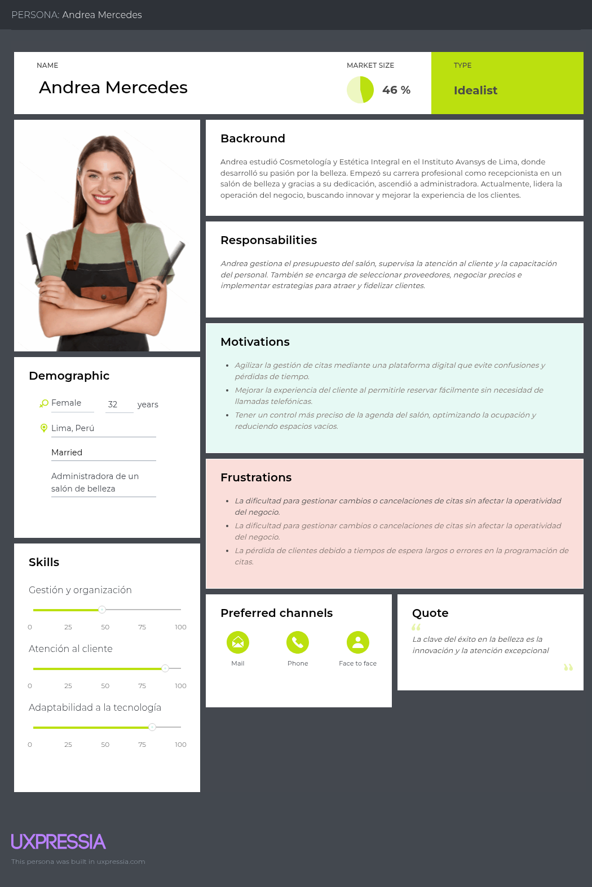

**Segmento objetivo #2: Clientes de servicios de belleza**

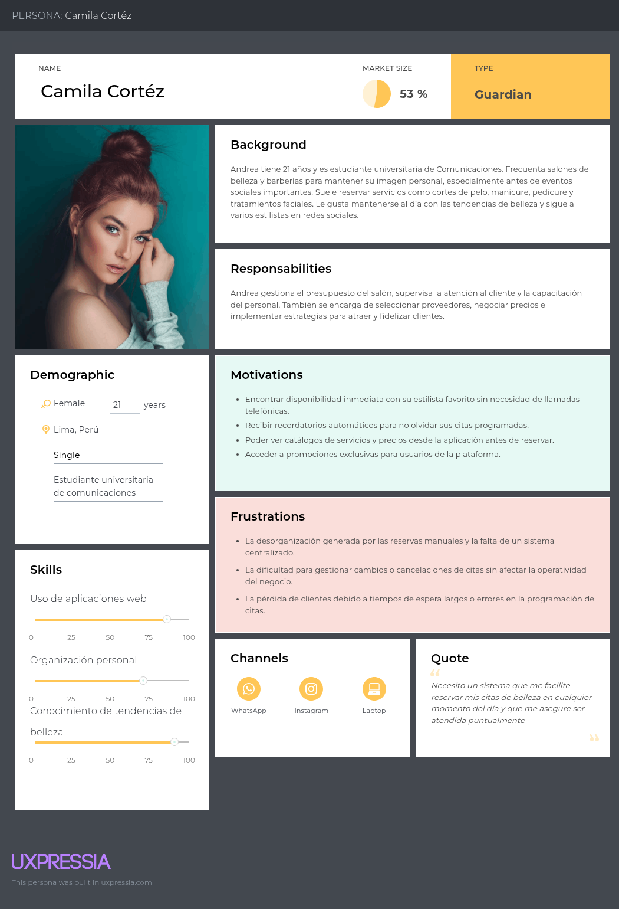

### 2.3.2. User Task Matrix

| \*Tarea\*\*                                     | **Frecuencia (Andrea)** | **Importancia (Andrea)** | **Frecuencia (Camila)** | **Importancia (Camila)** |
| ----------------------------------------------- | ----------------------- | ------------------------ | ----------------------- | ------------------------ |
| Revisar la disponibilidad de la agenda          | Alta                    | Alta                     | Alta                    | Alta                     |
| Agendar citas                                   | Alta                    | Alta                     | Media                   | Alta                     |
| Escoger tratamiento                             | Nunca                   | Baja                     | Alta                    | Alta                     |
| Responder llamadas de los clientes              | Alta                    | Alta                     | Nunca                   | Baja                     |
| Ajustarse al tiempo que dura el tratamiento     | Media                   | Alta                     | Media                   | Media                    |
| Alistar los utensilios de belleza de antemano   | Media                   | Media                    | Baja                    | Baja                     |
| Ajustar agenda en fechas de alta demanda        | Baja                    | Alta                     | Baja                    | Media                    |
| Gestionar cancelaciones                         | Alta                    | Alta                     | Baja                    | Baja                     |
| Revisar cambios en la agenda                    | Alta                    | Alta                     | Alta                    | Alta                     |
| Priorizar citas según fidelidad                 | Media                   | Alta                     | Nunca                   | Baja                     |
| Escoger un estilista en específico para la cita | Media                   | Baja                     | Media                   | Media                    |
| Colocar precio a los tratamientos               | Baja                    | Media                    | Baja                    | Media                    |
| Planificar citas por WhatsApp                   | Alta                    | Alta                     | Alta                    | Alta                     |
| Gestionar horarios de los estilistas            | Alta                    | Alta                     | Nunca                   | Baja                     |
| Recordar a los clientes de sus citas            | Alta                    | Alta                     | Nunca                   | Media                    |
| Llegar temprano al salón                        | Baja                    | Media                    | Alta                    | Alta                     |
| Realizar el pago por el servicio                | Alta                    | Alta                     | Alta                    | Alta                     |
| Pagar por medios electrónicos                   | Baja                    | Baja                     | Alta                    | Alta                     |

### 2.3.3. User Journey Mapping

Para el segmento de los salones estilistas o barberos se consideró el momento desde que el cliente se contacta con la recepcionista hasta que el cliente haya terminado su cita y haya salido de salón. En la otra mano, para el segmento de los clientes de los salones se consideró desde que descubren el salón de manera online o por otra persona hasta que haya atendido la cita deseada.

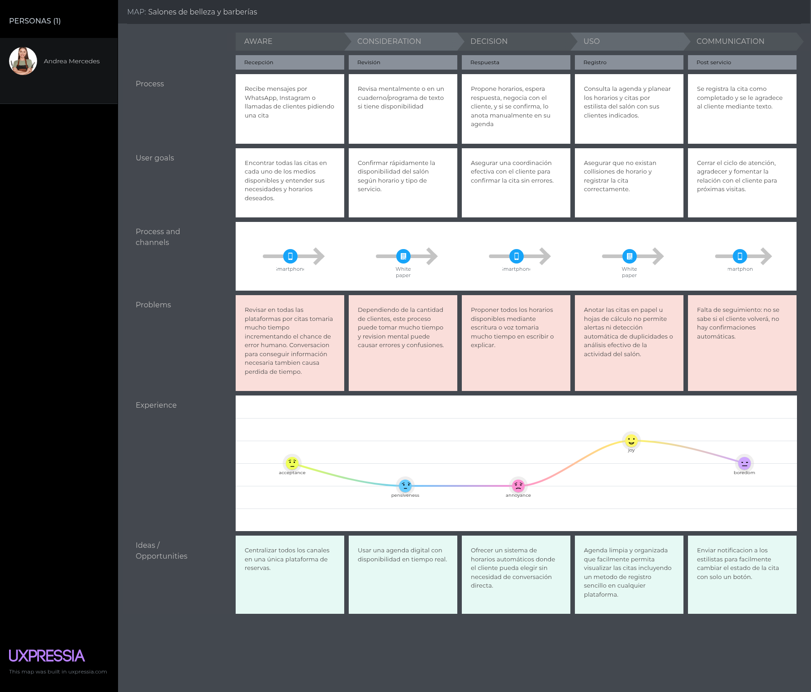

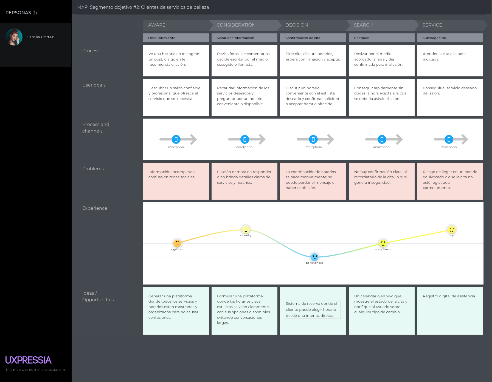

### 2.3.4. Empathy Mapping

**Segmento objetivo #1: Salones de belleza y barberías**

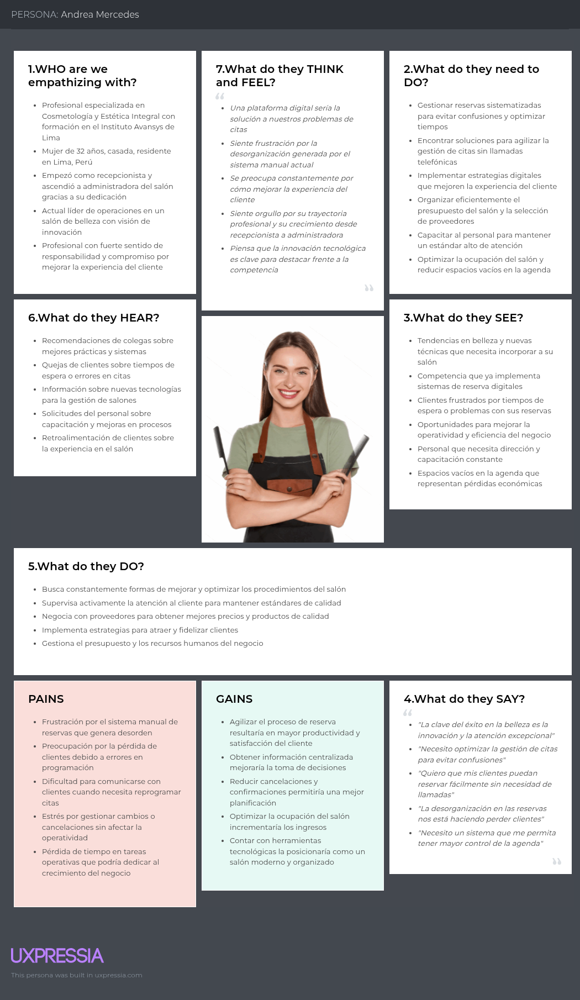

**Segmento objetivo #2: Clientes de servicios de belleza**

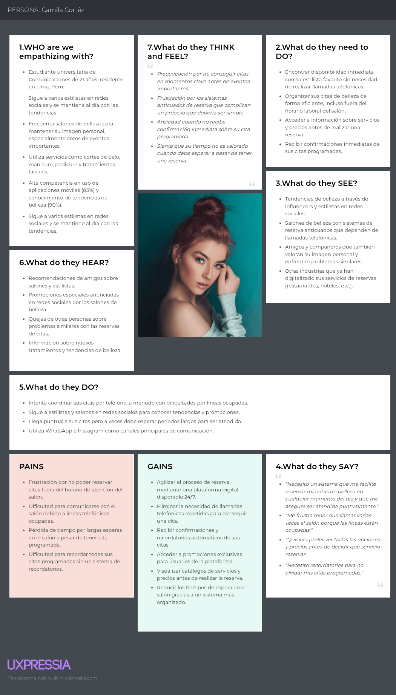

### 2.3.5. Ubiquitous Language

| **Término del Lenguaje Ubicuo**    | **Clase**                                    | **Bounded Context** | **Definición**                                                                            |
| ---------------------------------- | -------------------------------------------- | ------------------- | ----------------------------------------------------------------------------------------- |
| **Reserva Agendada**               | `Reservations`                               | Reservations        | Una reserva confirmada vinculada a un `ClientId`, `TimeSlotId`, `ServiceId` y `WorkerId`. |
| **Horario Disponible**             | `TimeSlotId`                                 | Reservations        | Identificador de un bloque de tiempo libre, no asignado a ninguna `Reservation`.          |
| **Bloque de Tiempo**               | `TimeSlotId`                                 | Reservations        | Unidad estándar de tiempo usada para agendar reservas.                                    |
| **Cancelación de Reserva**         | `UpdateReservationCommand` (con cancelación) | Reservations        | Acción de actualizar o eliminar una reserva, liberando su `TimeSlotId`.                   |
| **Reprogramación de Reserva**      | `UpdateReservationCommand`                   | Reservations        | Comando para cambiar el `TimeSlotId` de una reserva ya existente.                         |
| **Servicio Seleccionado**          | `ServiceId`                                  | Reservations        | Identificador de servicio incluido en una reserva.                                        |
| **Cambio en la Agenda**            | `UpdateReservationCommand`                   | Reservations        | Cualquier alteración en los datos de una reserva existente.                               |
| **Trabajador**                     | `Workers`                                    | Workers             | Agregado que representa al profesional que realiza un servicio.                           |
| **Especialización del Trabajador** | `WorkerSpecialization`                       | Workers             | Valor que describe la especialidad del trabajador (ej. barbería, uñas).                   |
| **Servicio**                       | `Services`                                   | Services            | Agregado que representa un tratamiento o actividad ofrecida por un `Provider`.            |
| **Duración del Servicio**          | `Duration`                                   | Services            | Valor que indica el tiempo necesario para completar el servicio.                          |
| **Precio del Servicio**            | `Money` (compartido)                         | Services / Shared   | Valor objeto que representa el costo del servicio.                                        |
| **Proveedor**                      | `ProviderId`                                 | Profiles / Services | Identificador del prestador del servicio.                                                 |
| **Cliente**                        | `ClientId`                                   | Profiles            | Identificador del usuario que agenda y recibe el servicio.                                |
| **Reseña**                         | `Reviews`                                    | Reviews             | Agregado que contiene la valoración textual y numérica hecha por un `Client`.             |
| **Puntaje de Reseña**              | `Review.rating`                              | Reviews             | Valor numérico asociado a una reseña de servicio.                                         |

 

## 2.4 Requirements specification

### 2.4.1 User Stories

| **Epic/User Story ID** | **Título**                                                 | **Descripción**                                                                                                                                                            | **Criterios de Aceptación**                                                                                                                                                                                                                                                                                                                                                                                                                                                                                                                | **Epic relacionada** |
| ---------------------- | ---------------------------------------------------------- | -------------------------------------------------------------------------------------------------------------------------------------------------------------------------- | ------------------------------------------------------------------------------------------------------------------------------------------------------------------------------------------------------------------------------------------------------------------------------------------------------------------------------------------------------------------------------------------------------------------------------------------------------------------------------------------------------------------------------------------ | -------------------- |
| EP01                   | **Gestión y visualización de citas**                       | **Como** cliente, **quiero** poder agendar, modificar y ver mis citas, **para** organizarme mejor y aprovechar los servicios ofrecidos.                                    | No Corresponde                                                                                                                                                                                                                                                                                                                                                                                                                                                                                                                             | No Corresponde       |
| US17                   | Selección de salón                                         | **Como** cliente, **quiero** buscar y seleccionar un salón de belleza/barbería, **para** elegir dónde agendar mi cita.                                                     | **Escenario 1: Búsqueda de salón disponible** **Dado** el cliente desea agendar una cita** **Cuando** realiza la búsqueda de salones **Entonces** el sistema muestra los disponibles.  **Escenario 2: Selección exitosa del salón deseado** **Dado** el cliente elige un salón **Cuando** realiza la selección **Entonces\*\* el sistema asocia ese salón a la futura cita.                                                                                                                                        | EP09                 |
| US18                   | Creación de citas                                          | **Como** cliente, **quiero** poder agendar una cita según disponibilidad, **para** recibir el servicio deseado.                                                            | **Escenario 1: Registro correcto de cita nueva** **Dado** el cliente desea un servicio **Cuando** agenda una cita **Entonces** el sistema la registra correctamente.  **Escenario 2: Verificación de disponibilidad antes de agendar** **Dado** el cliente selecciona una hora **Cuando** el sistema valida la disponibilidad **Entonces** la cita es agendada si está libre.                                                                                                                                      | EP09                 |
| US19                   | Visualización de citas agendadas                           | **Como** cliente, **quiero** ver mis citas agendadas, **para** saber cuánto y dónde tengo una reserva.                                                                     | **Escenario 1: Consulta de citas futuras** **Dado** el cliente tiene citas registradas **Cuando** accede a su historial **Entonces** el sistema muestra las próximas citas.  **Escenario 2: Revisión de detalles de cita** **Dado** una cita está programada **Cuando** el cliente la consulta **Entonces** el sistema muestra fecha, hora y lugar.                                                                                                                                                                | EP09                 |
| US20                   | Gestión de modificaciones y cancelaciones de citas         | **Como** cliente, **quiero** modificar o cancelar citas con anticipación, **para** reorganizar mis tiempos.                                                                | **Escenario 1: Modificación de cita antes de la fecha** **Dado** el cliente necesita cambiar una cita **Cuando** solicita el cambio **Entonces** el sistema permite editar la cita.  **Escenario 2: Cancelación anticipada de una cita** **Dado** el cliente desea cancelar **Cuando** solicita la cancelación **Entonces** el sistema elimina la cita correctamente.                                                                                                                                              | EP09                 |
| US21                   | Historial de modificaciones de citas                       | **Como** cliente, **quiero** ver los cambios realizados a mis citas, **para** tener un seguimiento completo de mis actividades.                                            | **Escenario 1: Registro de cambios en una cita** **Dado** el cliente modifica una cita **Cuando** el cambio es confirmado **Entonces** el sistema guarda el cambio en el historial.  **Escenario 2: Consulta de historial de cambios** **Dado** existen modificaciones previas **Cuando** el cliente revisa el historial **Entonces** el sistema muestra las ediciones realizadas.                                                                                                                                 | EP09                 |
| EP02                   | **Gestión de negocio**                                     | **Como** dueño/administrador, **quiero** gestionar mis servicios, personal y cuentas, **para** optimizar la operación de mi negocio.                                       | No Corresponde                                                                                                                                                                                                                                                                                                                                                                                                                                                                                                                             | No Corresponde       |
| US22                   | Administración de servicios ofrecidos                      | **Como** dueño/administrador, **quiero** agregar, editar o eliminar servicios, **para** mantener mi catálogo actualizado.                                                  | **Escenario 1: Registro de nuevo servicio** **Dado** el administrador desea añadir un servicio **Cuando** completa los datos necesarios **Entonces** el sistema guarda el nuevo servicio.  **Escenario 2: Eliminación de servicio registrado** **Dado** un servicio ya no está disponible **Cuando** el administrador lo elimina **Entonces** el sistema lo retira del catálogo.                                                                                                                                   | EP10                 |
| US23                   | Gestión de trabajadores                                    | **Como** dueño/administrador, **quiero** añadir o quitar trabajadores, **para** organizar quién ofrece cada servicio.                                                      | **Escenario 1: Asignación de nuevo trabajador** **Dado** el administrador incorpora personal **Cuando** añade a un trabajador **Entonces** el sistema lo registra correctamente.  **Escenario 2: Eliminación de trabajador inactivo** **Dado** un trabajador ya no colabora **Cuando** el administrador lo elimina **Entonces** el sistema lo retira de la plantilla.                                                                                                                                              | EP10                 |
| US24                   | Gestión de cuentas bancarias                               | **Como** dueño/administrador, **quiero** registrar, modificar o eliminar cuentas bancarias, **para** administrar correctamente los pagos recibidos.                        | **Escenario 1: Registro de cuenta bancaria válida** **Dado** el administrador desea registrar una cuenta **Cuando** completa los datos **Entonces** el sistema guarda la cuenta exitosamente.  **Escenario 2: Modificación de cuenta existente** **Dado** hay una cuenta registrada** **Cuando** el administrador la edita **Entonces\*\* el sistema actualiza la información.                                                                                                                                     | EP10                 |
| EP03                   | **Gestión de horarios**                                    | **Como** dueño/administrador, **quiero** gestionar el horario de mis trabajadores, **para** organizar si pueden o no realizar el servicio.                                 | No Corresponde                                                                                                                                                                                                                                                                                                                                                                                                                                                                                                                             | No Corresponde       |
| US09                   | Visualización de los horarios                              | **Como** dueño/administrador, **quiero** visualizar los horarios disponibles , **para** saber cuándo mis trabajadores puede aceptar citas.                                 | **Escenario 1: Visualización correcta de horarios disponibles** **Dado** el administrador tiene horarios definidos **Cuando** accede a la consulta de disponibilidad **Entonces** el sistema muestra los horarios de atención establecidos.  **Escenario 2: Visualización vacía sin horarios definidos** **Dado** no se ha configurado ningún horario **Cuando** el administrador consulta los horarios **Entonces** el sistema informa que no hay disponibilidad registrada.                                      | EP05                 |
| US10                   | Configuración de los horarios                              | **Como** dueño/administrador, **quiero** configurar los horarios de atención de mis trabajadores, **para** definir sus días y horas disponibles.                           | **Escenario 1: Configuración exitosa de horarios** **Dado** el administrador ingresa intervalos válidos **Cuando** define el horario de atención **Entonces** el sistema registra los nuevos horarios correctamente.  **Escenario 2: Fallo en la configuración por conflictos de horario** **Dado** el administrador ingresa horarios que se superponen o son inválidos **Cuando** intenta configurar la disponibilidad **Entonces** el sistema impide el registro e informa el conflicto.                         | EP05                 |
| EP04                   | **Gestión de subscripciones**                              | **Como** dueño/administrador, **quiero** conocer y contratar planes de suscripción, **para** acceder a beneficios adicionales de la plataforma.                            | No Corresponde                                                                                                                                                                                                                                                                                                                                                                                                                                                                                                                             | No Corresponde       |
| US11                   | Visualización de beneficios de suscripción                 | **Como** dueño/administrador, **quiero** ver qué beneficios incluye cada plan, **para** elegir el más adecuado para mí.                                                    | **Escenario 1: Consulta exitosa de beneficios** **Dado** el administrador tiene una cuenta activa **Cuando** consulta los beneficios de los planes **Entonces** el sistema muestra los beneficios disponibles en cada plan.  **Escenario 2: Validación de beneficios según plan** **Dado** el administrador accede al sistema **Cuando** verifica un plan específico **Entonces** el sistema muestra solo los beneficios que corresponden a ese plan.                                                              | EP07                 |
| US12                   | Visualización de precios                                   | **Como** dueño/administrador, **quiero** ver los precios de cada plan, **para** tomar decisiones según mi presupuesto.                                                     | **Escenario 1: Visualización de precios de todos los planes** **Dado** el administrador desea conocer los planes **Cuando** accede a la información de precios **Entonces** el sistema muestra los costos de cada plan disponible.  **Escenario 2: Consulta de precio por plan específico** **Dado** el administrador selecciona un plan **Cuando** consulta su precio **Entonces** el sistema muestra el precio correspondiente a ese plan.                                                                       | EP07                 |
| US13                   | Estado y nivel de suscripción                              | **Como** dueño/administrador, **quiero** ver el estado de mi suscripción actual, **para** saber su está activa y cuándo expira.                                            | **Escenario 1: Verificación de suscripción activa** **Dado** el administrador posee una suscripción **Cuando** accede a su estado actual **Entonces** el sistema muestra si está activa y su nivel.  **Escenario 2: Visualización de fecha de expiración** **Dado** la suscripción del administrador está activa **Cuando** consulta la expiración **Entonces** el sistema muestra la fecha de vencimiento.                                                                                                        | EP07                 |
| US14                   | Contratación de plan de suscripción                        | **Como** dueño/administrador, **quiero** contratar un plan, **para** activar sus beneficios en mi cuenta.                                                                  | **Escenario 1: Activación de plan exitosamente** **Dado** el administrador elige un plan **Cuando** realiza la contratación **Entonces** el sistema activa la suscripción correctamente.  **Escenario 2: Asociación de beneficios al contratar** **Dado** el plan es contratado **Cuando** se confirma la contratación **Entonces** el sistema habilita los beneficios del plan.                                                                                                                                   | EP07                 |
| EP05                   | **Gestión de Pagos y Facturación**                         | **Como** usuario, **quiero** pagar y recibir facturas de manera clara y segura, **para** tener control sobre mis transacciones.                                            | No Corresponde                                                                                                                                                                                                                                                                                                                                                                                                                                                                                                                             | No Corresponde       |
| US15                   | Confirmación de pago                                       | **Como** usuario, **quiero** recibir una confirmación inmediata al completar un pago, **para** asegurarme de que la transacción fue exitosa.                               | **Escenario 1: Confirmación inmediata tras pago válido** **Dado** el usuario realiza un pago **Cuando** completa la transacción **Entonces** el sistema confirma que fue exitosa.  .**Escenario 2: Validación del estado del pago** **Dado** el usuario ha pagado **Cuando** consulta el estado **Entonces** el sistema indica que el pago fue procesado correctamente.                                                                                                                                            | EP08                 |
| US16                   | Renovación automática de suscripción                       | **Como** dueño/administrador, **quiero** que mi plan se renueve automáticamente, **para** no tener que pagar manualmente cada vez.                                         | **Escenario 1: Renovación automática sin errores** **Dado** el administrador tiene renovación automática activa **Cuando** llega la fecha programada **Entonces** el sistema renueva la suscripción automáticamente.  **Escenario 2: Confirmación de renovación exitosa** **Dado** se ejecuta la renovación automática **Cuando** el sistema la procesa **Entonces** se confirma al administrador que fue exitosa.                                                                                                 | EP08                 |
| EP06                   | **Registro de usuario**                                    | **Como** nuevo usuario, **quiero** registrarme fácilmente en la plataforma, **para** poder acceder a sus funcionalidades.                                                  | No Corresponde                                                                                                                                                                                                                                                                                                                                                                                                                                                                                                                             | No Corresponde       |
| US01                   | Registro de un cliente                                     | **Como** cliente, **quiero** registrarme proporcionando mis datos personales, **para** crear una cuenta.                                                                   | **Escenario 1: Registro exitoso de un cliente** **Dado** el cliente proporciona datos personales válidos **Cuando** solicita crear una cuenta **Entonces** el sistema crea una cuenta y confirma el registro.  **Escenario 2: Registro fallido por datos incompletos** **Dado** el cliente no proporciona todos los datos requeridos **Cuando** intenta registrarse **Entonces** el sistema impide el registro e informa la omisión.                                                                               | EP01                 |
| US02                   | Registro de un salón de belleza/barbería                   | **Como** dueño/administrador, **quiero** poder registrar mi negocio, **para** gestionar mis servicios en la plataforma.                                                    | **Escenario 1: Registro exitoso de un negocio** **Dado** el administrador proporciona información válida del negocio **Cuando** solicita registrar su salón o barbería **Entonces** el sistema almacena los datos y confirma el registro del negocio.  **Escenario 2: Registro fallido por datos inválidos del negocio** **Dado** el administrador ingresa información inválida o incompleta **Cuando** intenta registrar el negocio **Entonces** el sistema rechaza el registro e informa el problema.            | EP01                 |
| EP07                   | **Inicio de sesión**                                       | **Como** usuario registrado, **quiero** iniciar sesión con mis credenciales, **para** acceder a mi cuenta de forma segura.                                                 | No Corresponde                                                                                                                                                                                                                                                                                                                                                                                                                                                                                                                             | No Corresponde       |
| US03                   | Inicio de sesión del usuario                               | **Como** usuario, **quiero** iniciar sesión con mi correo y contraseña, **para** acceder a mi cuenta.                                                                      | **Escenario 1: Inicio de sesión exitoso** **Dado** el usuario tiene una cuenta registrada **Cuando** proporciona credenciales correctas **Entonces** el sistema permite el acceso a la cuenta.  **Escenario 2: Fallo en inicio de sesión por credenciales incorrectas** **Dado** el usuario proporciona credenciales inválidas **Cuando** intenta iniciar sesión **Entonces** el sistema rechaza el acceso e informa el error.                                                                                     | EP02                 |
| US04                   | Recuperación de contraseña                                 | **Como** usuario, **quiero** recuperar el acceso a mi cuenta si olvido la contraseña, **para** poder usar la plataforma nuevamente.                                        | **Escenario 1: Solicitud exitosa de recuperación de contraseña** **Dado** el usuario indica su información asociada a la cuenta **Cuando** solicita recuperar su contraseña **Entonces** el sistema genera instrucciones de recuperación.  **Escenario 2: Solicitud fallida por información inválida** **Dado** el usuario proporciona información no registrada **Cuando** solicita recuperar su contraseña **Entonces** el sistema informa que no puede completar la solicitud.                                  | EP02                 |
| EP08                   | **Cierre de sesión y eliminación de la cuenta**            | **Como** usuario, **quiero** cerrar sesión o eliminar mi cuenta, **para** tener control sobre mi acceso y privacidad.                                                      | No Corresponde                                                                                                                                                                                                                                                                                                                                                                                                                                                                                                                             | No Corresponde       |
| US07                   | Cierre de sesión                                           | **Como** usuario, **quiero** poder cerrar sesión de forma segura, **para** proteger mis datos cuando no uso la app.                                                        | **Escenario 1: Cierre de sesión exitoso** **Dado** el usuario tiene una sesión activa **Cuando** solicita cerrar la sesión **Entonces** el sistema finaliza la sesión y revoca el acceso.  **Escenario 2: Cierre de sesión sin sesión activa** **Dado** no hay una sesión iniciada **Cuando** el usuario intenta cerrar sesión **Entonces** el sistema no realiza ninguna acción.                                                                                                                                  | EP04                 |
| US08                   | Eliminación de cuenta                                      | **Como** usuario, **quiero** eliminar mi cuenta y datos personales, **para** dejar de utilizar la plataforma si así lo deseo.                                              | **Escenario 1: Eliminación exitosa de cuenta** **Dado** el usuario está autenticado **Cuando** solicita eliminar su cuenta **Entonces** el sistema elimina la cuenta y los datos asociados.  **Escenario 2: Fallo en la eliminación de cuenta por falta de autenticación** **Dado** el usuario no está autenticado **Cuando** intenta eliminar su cuenta **Entonces** el sistema impide la eliminación e informa la necesidad de autenticarse.                                                                     | EP04                 |
| EP09                   | **Edición de perfil de usuario**                           | **Como** usuario, **quiero** editar los datos de mi perfil, **para** mantener mi información actualizada y personalizada según mi rol.                                     | No Corresponde                                                                                                                                                                                                                                                                                                                                                                                                                                                                                                                             | No Corresponde       |
| US05                   | Edición del perfil del cliente                             | **Como** cliente, **quiero** actualizar mi información personal, **para** mantener mis datos actualizados.                                                                 | **Escenario 1: Edición exitosa del perfil** **Dado** el cliente accede a su información personal **Cuando** actualiza sus datos correctamente **Entonces** el sistema guarda los cambios y confirma la actualización.  **Escenario 2: Fallo en edición por datos inválidos** **Dado** el cliente proporciona datos incorrectos **Cuando** intenta actualizar su perfil **Entonces** el sistema rechaza la edición e informa el motivo.                                                                             | EP03                 |
| US06                   | Personalización del perfil del salón de belleza/barbería   | **Como** dueño/administrador, **quiero** poder personalizar el perfil de mi salon de belleza/barbería con informacíón relevante y estética, **para** atraer a más cliente. | **Escenario 1: Personalización exitosa del perfil del negocio** **Dado** el administrador accede a la configuración del negocio **Cuando** modifica los datos con información válida **Entonces** el sistema actualiza el perfil del negocio.  **Escenario 2: Fallo en personalización por datos inválidos** **Dado** el administrador proporciona información no aceptada **Cuando** intenta modificar el perfil del negocio **Entonces** el sistema impide la actualización e informa el error.                  | EP03                 |
| EP10                   | **Gestión de notificaciones**                              | **Como** usuario, **quiero** recibir notificaciones personalizadas sobre mis citas, pagos y promociones, **para** estar siempre informado.                                 | No Corresponde                                                                                                                                                                                                                                                                                                                                                                                                                                                                                                                             | No Corresponde       |
| US25                   | Recepción de notificaciones del estado de la cita          | **Como** cliente, **quiero** recibir notificaciones sobre confirmación, cancelación o modificación de citas, **para** estar al tanto de mis reservas.                      | **Escenario 1: Notificación por confirmación de cita** **Dado** el cliente agenda una cita **Cuando** esta es confirmada **Entonces** el sistema envía una notificación.  **Escenario 2: Aviso por modificación de cita** **Dado** una cita es modificada **Cuando** se actualiza su estado **Entonces** el cliente recibe una notificación del cambio.                                                                                                                                                            | EP11                 |
| US26                   | Alertas por vencimiento o fallo de pago                    | **Como** usuario, **quiero** ser alertado si hay un problema con mi pago o si está por vencer mi suscripción, **para** tomar acciones a tiempo.                            | **Escenario 1: Alerta de vencimiento próximo** **Dado** la suscripción está por expirar **Cuando** se acerca la fecha límite **Entonces** el sistema alerta al usuario  **Escenario 2: Notificación por fallo en el pago** **Dado** un pago no se concreta **Cuando** el sistema detecta el error **Entonces** se notifica al usuario del problema.                                                                                                                                                                | EP11                 |
| US27                   | Configuración de medios de notificación                    | **Como** usuario, **quiero** elegir si recibir notificaciones por correo, SMS o dentro de la plataforma, **para** tener un mejor control de mi información.                | **Escenario 1: Selección del medio de notificación preferido** **Dado** el usuario quiere cambiar el medio de notificación **Cuando** accede a su configuración **Entonces** el sistema permite elegir entre las opciones disponibles.  **Escenario 2: Confirmación de medio seleccionado** **Dado** el usuario elige un medio **Cuando** guarda los cambios **Entonces** el sistema respeta la nueva configuración.                                                                                               | EP11                 |
| US28                   | Recepción de notificaciones sobre promociones y descuentos | **Como** cliente, **quiero** recibir promociones y descuentos que me interesen, **para** aprovechar ofertas relevantes.                                                    | **Escenario 1: Envío de promoción activa** **Dado** hay una promoción vigente **Cuando** el sistema identifica usuarios interesados **Entonces** se les envía la promoción correspondiente.  **Escenario 2: Recepción correcta de promoción configurada** **Dado** el cliente acepta recibir promociones **Cuando** se lanza una campaña **Entonces** recibe la notificación correctamente.                                                                                                                        | EP11                 |
| EP11                   | **Landing Page**                                           | **Como** visitante, **quiero** ver una página inicial atractiva con toda la información relevante, **para** decidir si deseo registrarme o contactar.                      | No Corresponde                                                                                                                                                                                                                                                                                                                                                                                                                                                                                                                             | No Corresponde       |
| US29                   | Visualización general de los servicios                     | **Como** visitante, **quiero** ver una vista general de los servicios ofrecidos, **para** entender qué tipo de atención puedo recibir.                                     | **Escenario 1: Muestra de catálogo de servicios disponibles** **Dado** el visitante desea informarse **Cuando** accede al listado de servicios **Entonces** el sistema muestra todos los servicios activos.  **Escenario 2: Visualización de detalles de servicio** **Dado** el visitante elige un servicio **Cuando** accede a la descripción **Entonces** el sistema muestra la información detallada.                                                                                                           | EP12                 |
| US30                   | Visualización de beneficios                                | **Como** visitante, **quiero** ver los beneficios de usar la plataforma, **para** motivarme a registrarme.                                                                 | **Escenario 1: Despliegue de beneficios por usar la plataforma** **Dado** el visitante quiere conocer ventajas **Cuando** accede a la sección correspondiente **Entonces** el sistema muestra los beneficios disponibles.  **Escenario 2: Validación de beneficios antes del registro** **Dado** el visitante no está registrado **Cuando** consulta los beneficios **Entonces** el sistema permite visualizar la información sin restricción.                                                                     | EP12                 |
| US31                   | Planes y precios                                           | **Como** visitante, **quiero** ver los planes de suscripción y sus precios, **para** saber si se ajustan a mis necesidades.                                                | **Escenario 1: Muestra general de planes y precios** **Dado** el visitante desea comparar opciones **Cuando** accede a la sección de planes **Entonces** el sistema muestra los precios y características.**Escenario 2: Consulta de detalle de un plan específico** **Dado** el visitante selecciona un plan **Cuando** solicita más información **Entonces** el sistema despliega los detalles y precio.                                                                                                               | EP12                 |
| US32                   | Testimonios                                                | **Como** visitante, **quiero** leer testimonios de otros usuarios, **para** ganar confianza en la plataforma.                                                              | **Escenario 1: Visualización de testimonios disponibles** **Dado** el visitante está explorando la plataforma **Cuando** accede a testimonios **Entonces** el sistema muestra los comentarios de otros usuarios.  **Escenario 2: Validación de experiencia positiva por testimonios** **Dado** los testimonios están activos **Cuando** el visitante los revisa **Entonces** puede conocer opiniones reales de otros clientes.                                                                                     | EP12                 |
| US33                   | Call to action                                             | **Como** visitante, **quiero** encontrar botones de acción claros, **para** empezar a usar la plataforma fácilmente.                                                       | **Escenario 1: Visualización de opciones para iniciar uso** **Dado** el visitante quiere comenzar **Cuando** encuentra llamados a la acción **Entonces** el sistema los muestra de manera clara.  **Escenario 2: Seguimiento del flujo tras clic en llamado** **Dado** el visitante acciona un botón **Cuando** se registra la interacción **Entonces** el sistema lo redirige correctamente.                                                                                                                      | EP12                 |
| US34                   | Contacto o soporte                                         | **Como** visitante, **quiero** poder contactarme con el equipo o recibir soporte, **para** resolver dudas antes de registrarme.                                            | **Escenario 1: Acceso a canal de contacto** **Dado** el visitante tiene una duda **Cuando** busca ayuda **Entonces** el sistema le muestra opciones para contactarse.  **Escenario 2: Confirmación de recepción de mensaje de soporte** **Dado** el visitante envía una consulta **Cuando** el sistema la recibe **Entonces** emite una confirmación automática.                                                                                                                                                   | EP12                 |
| US35                   | Información sobre uTime                                    | **Como** visitante, **quiero** poder acceder una sección que explique quiénes son los creadores, **para** tener confianza en la plataforma y su propósito.                 | **Escenario 1: Mostrar información sobre la startup** **Dado** que soy un visitante en la página principal **Cuando** hago clic en el enlace "About US" us del menú de navegación **Entonces** se debe mostrar una sección con información sobre Pactech, incluyendo su misión, visión y propósito.  **Escenario 2: Visualizar los integrantes del equipo** **Dado** que estoy en la sección "About Us" **Cuando**visualizo la información de la empresa **Entonces** debo poder ver a los integrantes de Paxtech. | EP12                 |