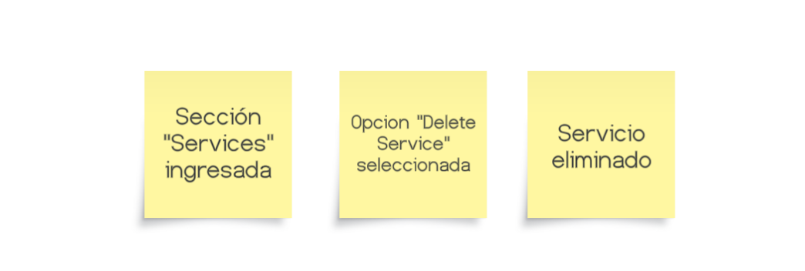
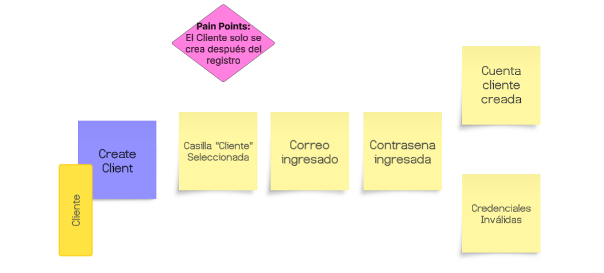
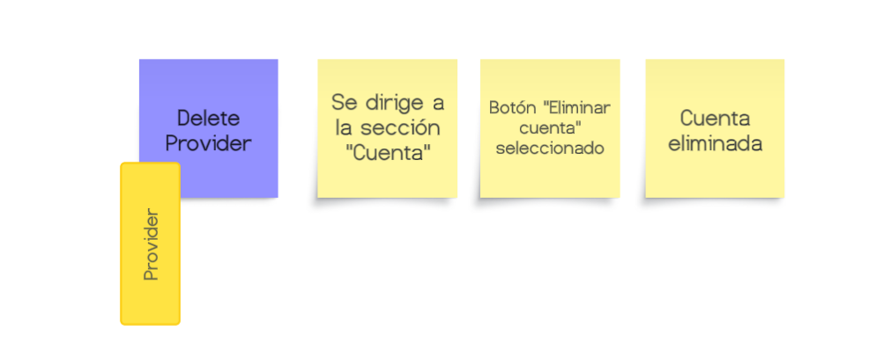
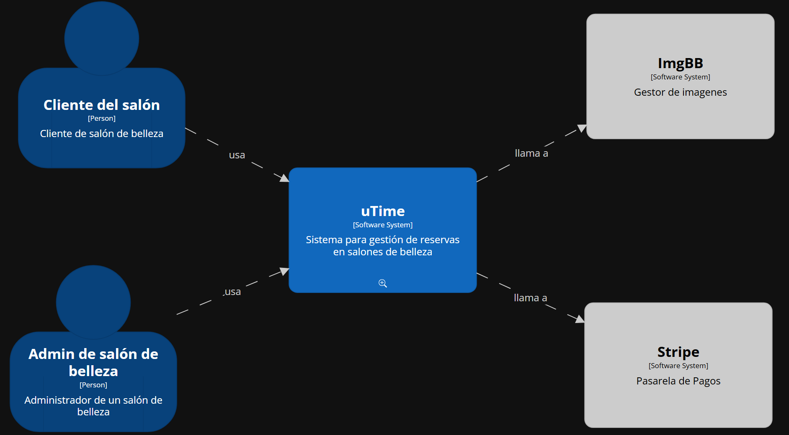

   

# 
Informe del Trabajo Final

    

   
Universidad Peruana de Ciencias Aplicadas

    

   

    

   
<b>Ingeniería de software</b>

    

   
<b>1ACC0238 Aplicaciones para Dispositivos Móviles</b>

    

   
<b>Sección:</b> 1807

    

   
<b>Profesor:</b>Mayta Guillermo, Jorge Luis

    

   
<b>Nombre del StartUp:</b> PaxTech

    

   
<b>Nombre del Producto:</b> uTime

   

    

   

   <table style="margin-left: auto; margin-right: auto;">
   <tr>
   <th>Nombre</th>
   <th>Código</th>
   </tr>
   <tr>
   <td>Choquehuanca Nuñez, Luciana Carolina</td>
   <td>U202319431</td>
   </tr>
   <tr>
   <td>Qqueso Rodriguez, Britney Delhy</td>
   <td>U20211G671</td>
   </tr>
   <tr>
   <td>Rivera Sosa, Eduardo Gael</td>
   <td>U202312222</td>
   </tr>
   <tr>
   <td>Roman Cruz, Natalia Bertha</td>
   <td>U202310148</td>
   </tr>
   <tr>
   <td>Yum Gonzales, Jorge Suin</td>
   <td>U202210838</td>
   </tr>
   </table>
   

    

   
<b>Ciclo 2025-20</b>

    

 
 
 

# Registro de Versiones del Informe

| Version | Fecha      | Autor                            | Descripción de modificación                                                                            |
|---------|------------|----------------------------------|--------------------------------------------------------------------------------------------------------|
| 1.0     | 01/07/2025 | Choquehuanca, Qqueso, Rivera, Roman, Yum  |                                                                                                        |
| 1.1     | 03/07/2025 | Choquehuanca, Qqueso, Rivera, Roman, Yum  |                                                                                                        |
| 1.2     | 05/07/2025 | Choquehuanca, Qqueso, Rivera, Roman, Yum  |                                                                                                        |
| 1.3     | 07/07/2025 | Choquehuanca, Qqueso, Rivera, Roman, Yum  |                                                                                                        |
| 1.4     | 08/07/2025 | Choquehuanca, Qqueso, Rivera, Roman, Yum  |                                                                                                        |
| 1.5     | 09/07/2025 | Choquehuanca, Qqueso, Rivera, Roman, Yum  |                                                                                                        |
| 1.6     | 11/07/2025 | Choquehuanca, Qqueso, Rivera, Roman, Yum  |                                                                                                        |
| 1.7     | 13/07/2025 | Choquehuanca, Qqueso, Rivera, Roman, Yum  |                                                                                                        |
| 1.8     | 16/07/2025 | Choquehuanca, Qqueso, Rivera, Roman, Yum  |                                                                                                        |
| 1.9     | 17/07/2025 | Choquehuanca, Qqueso, Rivera, Roman, Yum  |                                                                                                        |
| 1.10    | 19/07/2025 | Choquehuanca, Qqueso, Rivera, Roman, Yum  |                                                                                                        |
| 1.11    | 22/07/2025 | Choquehuanca, Qqueso, Rivera, Roman, Yum  |                                                                                                        |
| 1.12    | 23/07/2025 | Choquehuanca, Qqueso, Rivera, Roman, Yum  |                                                                                                        |

 
 
 

# Project Report Collaboration Insights

URL del repositorio para el proyecto: 

**TB1**

Para el desarrollo del informe perteneciente a la entrega del TB1, se dividió la implementación de secciones de la siguiente forma para cada integrante del equipo:

| Integrantes     | Tareas Asignadas                                                                                                                                                                  |
|-----------------|-----------------------------------------------------------------------------------------------------------------------------------------------------------------------------------|
| Luciana Choquehuanca  |              |
| Britney Qqueso        |              |
| Gael Rivera           |              |
| Natalia Roman         |              |
| Jorge Yum             |              |

El proceso de colaboración en el informe se realizó mediante commits constantes al repositorio de la organización PaxTech.

**Github Collaboration Insights**

Github también presenta un timeline de las ramas principales y los procesos de merge a los que se han sometido. Todas las
ramas se crearon tomando en cuenta el diseño de GitFlow para una buena organización cuando se usa un software de control
de versiones.

Los integrantes son:

- Luciana Choquehuanca () 
- Britney Qqueso ()
- Gael Rivera (gael-rs)
- Natalia Roman  ()
- Jorge Yum (myussu)

Se explican las ramas más prominentes:

**main:** Es representada por el color negro. Se trata de la rama principal del proyecto y se actualiza para cada entregable. 
**develop:** Es representada por el color azul. Se trata de la rama principal para el proceso del desarrollo del proyecto. 
**feature/feature-description-name:** Es una rama creada para trabajar en una nueva funcionalidad o tarea específica. Se basa en develop y, una vez terminada la tarea, se fusiona nuevamente con develop para integrar los cambios al proyecto principal.

**Capturas de la participación en el informe:**

- Choquehuanca Nuñez, Luciana Carolina

- Qqueso Rodriguez, Britney Delhy

- Rivera Sosa, Eduardo Gael

- Roman Cruz, Natalia Bertha

- Yum Gonzales, Jorge Suin

 

# Contenido

1. [Capítulo I: Presentación](#capítulo-i-presentación) 
1.1. [Startup Profile](#11-startup-profile) 
1.1.1. [Descripción de la Startup](#111-descripción-de-la-startup) 
1.1.2. [Perfiles de integrantes del equipo](#112-perfiles-de-integrantes-del-equipo) 
1.2. [Solution Profile](#12-solution-profile) 
1.2.1. [Antecedentes y problemática](#121-antecedentes-y-problemática) 
1.2.2. [Lean UX Process](#122-lean-ux-process) 
1.2.2.1. [Lean UX Problem Statements](#1221-lean-ux-problem-statements) 
1.2.2.2. [Lean UX Assumptions](#1222-lean-ux-assumptions) 
1.2.2.3. [Lean UX Hypothesis Statements](#1222-lean-ux-assumptions) 
1.2.2.4. [Lean UX Canvas](#1224-lean-ux-canvas) 
1.3. [Segmentos objetivo](#13-segmentos-objetivo) 
2. [Capítulo II: Requirements Elicitation & Analysis](#capítulo-iii-requirements-specification) 
2.1. [Competidores](#21-competidores) 
2.1.1. [Análisis competitivo](#211-análisis-competitivo) 
2.1.2. [Estrategias y tácticas frente a competidores](#212-estrategias-y-tácticas-frente-a-competidores) 
2.2. [Entrevistas](#22-entrevistas) 
2.2.1. [Diseño de entrevistas](#221-diseño-de-entrevistas) 
2.2.2. [Registro de entrevistas](#222-registro-de-entrevistas) 
2.2.3. [Análisis de entrevistas](#223-análisis-de-entrevistas) 
2.3. [Needfinding](#23-needfinding) 
2.3.1. [User Personas](#231-user-personas) 
2.3.2. [User Task Matrix](#232-user-task-matrix) 
2.3.3. [User Journey Mapping](#233-user-journey-mapping) 
2.3.4. [Empathy Mapping](#234-empathy-mapping) 
2.3.5. [As-is Scenario Mapping](#235-as-is-scenario-mapping) 
2.4. [Ubiquitous Language](#24-ubiquitous-language) 
3. [Capítulo III: Requirements specification](#capítulo-iii-requirements-specification) 
3.1. [To-Be Scenario Mapping](#31-to-be-scenario-mapping) 
3.2. [User Stories](#32-user-stories) 
3.3. [Impact Mapping](#33-impact-mapping) 
3.4. [Product Backlog](#34-product-backlog) 
4. [Capítulo IV: Solution Software Design](#capítulo-iv-solution-software-design) 
4.1. [Strategic-Level Domain-Driven Design](#41-strategic-level-domain-driven-design) 
4.1.1. [EventStorming](#411-eventstorming) 
4.1.1.1. [Candidate Context Discovery](#4111-candidate-context-discovery) 
4.1.1.2. [Domain Message Flows Modeling](#4112-domain-message-flows-modeling) 
4.1.1.3. [Bounded Context Canvases](#4113-bounded-context-canvases) 
4.1.2. [Context Mapping](#412-context-mapping) 
4.1.3. [Software Architecture](#413-software-architecture) 
4.1.3.1. [Software Architecture Context Level Diagrams](#4131-software-architecture-context-level-diagrams) 
4.1.3.2. [Software Architecture Container Level Diagrams](#4132-software-architecture-container-level-diagrams) 
4.1.3.3. [Software Architecture Deployment Diagrams](#4133-software-architecture-deployment-diagrams) 
4.2. [Tactical-Level Domain-Driven Design](#42-tactical-level-domain-driven-design) 
4.2.X. [Bounded Context: <Bounded Context Name>](#42x-bounded-context) 
4.2.X.1. [Domain Layer](#42x1-domain-layer) 
4.2.X.2. [Interface Layer](#42x2-interface-layer) 
4.2.X.3. [Application Layer](#42x3-application-layer) 
4.2.X.4. [Infrastructure Layer](#42x4-infrastructure-layer) 
4.2.X.5. [Bounded Context Software Architecture Component Level Diagrams](#42x5-bounded-context-software-architecture-component-level-diagrams) 
4.2.X.6. [Bounded Context Software Architecture Code Level Diagrams](#42x6-bounded-context-software-architecture-code-level-diagrams) 
4.2.X.6.1. [Bounded Context Domain Layer Class Diagrams](#42x61-bounded-context-domain-layer-class-diagrams) 
4.2.X.6.2. [Bounded Context Database Design Diagram](#42x62-bounded-context-database-design-diagram) 
5. [Capítulo V: Solution UI/UX Design](#capítulo-v-solution-uiux-design) 
5.1. [Product design](#51-product-design) 
5.1.1. [Style Guidelines](#511-style-guidelines) 
5.1.1.1. [General Style Guidelines](#5111-general-style-guidelines) 
5.1.2. [Information Architecture](#512-information-architecture) 
5.1.2.1. [Organization Systems](#5121-organization-systems) 
5.1.2.2. [Labelling Systems](#5122-labelling-systems) 
5.1.2.3. [SEO Tags and Meta Tags](#5123-seo-tags-and-meta-tags) 
5.1.2.4. [Searching Systems](#5124-searching-systems) 
5.1.2.5. [Navigation Systems](#5125-navigation-systems) 
5.1.3. [Landing Page UI Design](#513-landing-page-ui-design) 
5.1.3.1. [Landing Page Wireframe](#5131-landing-page-wireframe) 
5.1.3.2. [Landing Page Mock-up](#5132-landing-page-mock-up) 
5.1.4. [Mobile Applications UX/UI Design](#514-mobile-applications-uxui-design) 
5.1.4.1. [Mobile Applications Wireframes](#5141-mobile-applications-wireframes) 
5.1.4.2. [Mobile Applications Wireflow Diagrams](#5142-mobile-applications-wireflow-diagrams) 
5.1.4.3. [Mobile Applications Mock-ups](#5143-mobile-applications-mock-ups) 
5.1.4.4. [Mobile Applications User Flow Diagrams](#5144-mobile-applications-user-flow-diagrams) 
5.1.4.5. [Mobile Applications Prototyping](#5145-mobile-applications-prototyping) 
6. [Capítulo VI: Product Implementation, Validation & Deployment](#capítulo-vi-product-implementation-validation--deployment) 
6.1. [Software Configuration Management](#61-software-configuration-management) 
6.1.1. [Software Development Environment Configuration](#611-software-development-environment-configuration) 
6.1.2. [Source Code Management](#612-source-code-management) 
6.1.3. [Source Code Style Guide & Conventions](#613-source-code-style-guide--conventions) 
6.1.4. [Software Deployment Configuration](#614-software-deployment-configuration) 
6.2. [Landing Page & Mobile Application Implementation](#62-landing-page--mobile-application-implementation) 
6.2.X. [Sprint n](#62x-sprint-n) 
6.2.X.1. [Sprint Planning n](#62x1-sprint-planning-n) 
6.2.X.2. [Sprint Backlog n](#62x2-sprint-backlog-n) 
6.2.X.3. [Development Evidence for Sprint Review](#62x3-development-evidence-for-sprint-review) 
6.2.X.4. [Testing Suite Evidence for Sprint Review](#62x4-testing-suite-evidence-for-sprint-review) 
6.2.X.5. [Execution Evidence for Sprint Review](#62x6-services-documentation-evidence-for-sprint-review) 
6.2.X.6. [Services Documentation Evidence for Sprint Review](#62x6-services-documentation-evidence-for-sprint-review) 
6.2.X.7. [Software Deployment Evidence for Sprint Review](#62x7-software-deployment-evidence-for-sprint-review) 
6.2.X.8. [Team Collaboration Insights during Sprint](#62x8-team-collaboration-insights-during-sprint) 
6.3. [Validation Interviews](#63-validation-interviews) 
6.3.1. [Diseño de Entrevistas](#221-diseño-de-entrevistas) 
6.3.2. [Registro de Entrevistas](#222-registro-de-entrevistas) 
6.3.3. [Evaluaciones según heurísticas](#633-evaluaciones-según-heurísticas) 
6.4. [Video About-the-Product](#64-video-about-the-product) 
7. [Conclusiones](#conclusiones) 
7.1 [Conclusiones y recomendaciones](#conclusiones-y-recomendaciones) 
7.2 [Video About-the-team](#video-about-the-team) 
8. [Bibliografía](#bibliografía) 
9. [Anexos](#anexos) 

 

# Student Outcomes
   **Student Outcome ABET 7**

| Criterio específico                                                  | Acciones realizadas                                                                                                                                                                                                                                                                                                                                                                                                                                                                                                                                                                                                                                                                                                                                                                                                                                                                                                                                                                                                                                                                                                                                                                                                                                                                                                                                                                                                                                                                                                                                                                                                                                                                                                                                                                                                                                                                                                                                                                                                                                                                                                                                                                                                                                                                                                                                                                                                                                                                                                                                                                                                                                                                                                                                                                                                                                                                                                                                                                                                                                                                                                                                                                                                                                                                                                                                                                                                                                                                                                                                                                                                                                                                                                                                                                                                                                                                                                                                                                                                                                                                                                                                                                                                                                                                                                                                                                                                                                                                                                                                                                                                                                                                                                                                                                                                                                                                                                                                                                                                                                                                                                                                                                                                                                                                                                                                                                                                                                                                                                                                                                                                                                                                                                                                                                                                                                                                                                                                                                                                               | Conclusiones                                                                                                                                                                                                                                                                                                                                                                                                                                                                                                                                                                                      |
|----------------------------------------------------------------------|-----------------------------------------------------------------------------------------------------------------------------------------------------------------------------------------------------------------------------------------------------------------------------------------------------------------------------------------------------------------------------------------------------------------------------------------------------------------------------------------------------------------------------------------------------------------------------------------------------------------------------------------------------------------------------------------------------------------------------------------------------------------------------------------------------------------------------------------------------------------------------------------------------------------------------------------------------------------------------------------------------------------------------------------------------------------------------------------------------------------------------------------------------------------------------------------------------------------------------------------------------------------------------------------------------------------------------------------------------------------------------------------------------------------------------------------------------------------------------------------------------------------------------------------------------------------------------------------------------------------------------------------------------------------------------------------------------------------------------------------------------------------------------------------------------------------------------------------------------------------------------------------------------------------------------------------------------------------------------------------------------------------------------------------------------------------------------------------------------------------------------------------------------------------------------------------------------------------------------------------------------------------------------------------------------------------------------------------------------------------------------------------------------------------------------------------------------------------------------------------------------------------------------------------------------------------------------------------------------------------------------------------------------------------------------------------------------------------------------------------------------------------------------------------------------------------------------------------------------------------------------------------------------------------------------------------------------------------------------------------------------------------------------------------------------------------------------------------------------------------------------------------------------------------------------------------------------------------------------------------------------------------------------------------------------------------------------------------------------------------------------------------------------------------------------------------------------------------------------------------------------------------------------------------------------------------------------------------------------------------------------------------------------------------------------------------------------------------------------------------------------------------------------------------------------------------------------------------------------------------------------------------------------------------------------------------------------------------------------------------------------------------------------------------------------------------------------------------------------------------------------------------------------------------------------------------------------------------------------------------------------------------------------------------------------------------------------------------------------------------------------------------------------------------------------------------------------------------------------------------------------------------------------------------------------------------------------------------------------------------------------------------------------------------------------------------------------------------------------------------------------------------------------------------------------------------------------------------------------------------------------------------------------------------------------------------------------------------------------------------------------------------------------------------------------------------------------------------------------------------------------------------------------------------------------------------------------------------------------------------------------------------------------------------------------------------------------------------------------------------------------------------------------------------------------------------------------------------------------------------------------------------------------------------------------------------------------------------------------------------------------------------------------------------------------------------------------------------------------------------------------------------------------------------------------------------------------------------------------------------------------------------------------------------------------------------------------------------------------------------------------------------------------------|---------------------------------------------------------------------------------------------------------------------------------------------------------------------------------------------------------------------------------------------------------------------------------------------------------------------------------------------------------------------------------------------------------------------------------------------------------------------------------------------------------------------------------------------------------------------------------------------------| 
| 7.c1. Actualiza conceptos y conocimientos necesarios para su desarrollo profesional y en especial para su proyecto en soluciones de ingeniería de software  |  #| #
|7.c2. Reconoce la necesidad del aprendizaje permanente para el desempeño profesional y el desarrollo de proyectos en soluciones de tecnologías de ingeniería de software. |              #                                                                                                                                         |  #| 

 

# Objetivos SMART

# Capítulo I: Presentación

## 1.1. Startup Profile

### 1.1.1. Descripción de la Startup

PaxTech es una startup tecnológica fundada por estudiantes de la Universidad Peruana de Ciencias Aplicadas, dedicada al desarrollo de soluciones digitales innovadoras para el sector de la belleza y el bienestar. Nos especializamos en crear herramientas que ayuden a estilistas, barberos, maquilladores y otros profesionales independientes a mejorar la eficiencia de sus servicios y optimizar la experiencia del cliente mediante tecnología accesible y escalable.

Como empresa, buscamos aportar valor al rubro mediante aplicaciones móviles modernas que automaticen tareas cotidianas, mejoren la organización y fortalezcan la relación con los clientes. Nuestro portafolio de soluciones incluye productos diseñados específicamente para las necesidades del sector, como la gestión de citas en tiempo real, control de servicios, fidelización de clientes y más.

Misión: Desarrollar y ofrecer soluciones tecnológicas de calidad que resuelvan los desafíos operativos del sector de la belleza y el bienestar, potenciando el crecimiento de profesionales independientes, salones de belleza, barberías y otros negocios del sector mediante innovación, automatización y accesibilidad digital.

Visión: Consolidarnos como la startup tecnológica de referencia en Latinoamérica para el sector de la belleza, siendo reconocidos por ofrecer productos digitales innovadores que transforman la manera en que se gestionan los servicios, se atiende a los clientes y se impulsa el desarrollo profesional.

### 1.1.2. Perfiles de integrantes del equipo

| **Perfil**                                                                                                                                                                                                                                                                                                                                                                                                                                                                                                          | **Foto**                                                                       |
|---------------------------------------------------------------------------------------------------------------------------------------------------------------------------------------------------------------------------------------------------------------------------------------------------------------------------------------------------------------------------------------------------------------------------------------------------------------------------------------------------------------------|--------------------------------------------------------------------------------|
| **Natalia Bertha Roman Cruz** Mi nombre es Natalia Roman. Soy estudiante de la carrera Ingeniería de Software y tengo 19 años. Me considero una persona dedicada y organizada, que se esfuerza por alcanzar sus logros. Dentro de este proyecto, me interesa poder aportar en gran parte en la codificación de las ideas planteadas. Espero que el equipo logre su objetivo y aprendamos lo más posible en el proceso |   |
| **Britney Delhy Qqueso Rodriguez**  Soy estudiante de la carrera de Ingeniería de Software en la Universidad Peruana de Ciencias Aplicadas (UPC). Me considero una persona autodidacta, dedicada, creativa y responsable. Me comprometo a contribuir al equipo con mis conocimientos y habilidades, apoyar en lo que sea necesario y aprender en el proceso. |   |
| **Jorge Suin Yum Gonzales**  Soy estudiante del 6° ciclo con 20 años. Tengo experiencia con diferentes lenguajes de programación y desarrollo de aplicaciones web en diversos frameworks ambos en frontend y backend. Soy una persona responsable y puntual, cualidades que aplico al trabajar de manera colaborativa con los integrantes de nuestro equipo. |   |
| **Eduardo Gael Rivera Sosa**  Mi nombre es Gael Rivera, soy estudiante de Ingeniería de Software. Me considero una persona responsable, competitiva y dedicada, con habilidades que me permiten comunicarme y trabajar en equipo de manera efectiva. Siempre estoy dispuesto a asumir nuevos desafíos y encontrar soluciones colaborativas. |    
| **Luciana Carolina Choquehuanca Núñez**  Mi nombre es Luciana Carolina, estudiante de la carrera de Ingeniería de Software, actualmente cursando el sexto ciclo. Me considero una persona proactiva, que busca mejorar día a día sus habilidades en el campo de la programación. Me gusta arriesgarme a probar nuevas cosas y valoro el trabajo colaborativo como una herramienta clave para el crecimiento personal y profesional. |  |

## 1.2. Solution Profile

uTime es una solución integral diseñada para optimizar la gestión de citas en el sector de la belleza mediante una plataforma digital conectada en tiempo real con clientes y profesionales. Esta innovadora herramienta permite a los estilistas gestionar su disponibilidad de manera eficiente, reducir cancelaciones y olvidos, y atraer nuevos clientes sin depender exclusivamente del boca a boca o la comunicación manual y desde su dispositivo móvil.

### 1.2.1. Antecedentes y problemática

Según Lean Construction México, la técnica de las 5W's y 2H's facilita la creación y desarrollo de un plan de acción o estrategia detallada (Alvarez, 2020). A raíz de esto, resultará útil para nuestro contexto dado que nos permitirá entender y analizar a mayor profundidad las necesidades de los usuarios. Por ende, se recopiló información mediante esta técnica, la cual se presentará a continuación.

**What (Qué)**

##### ¿Cuál es el problema?

El problema principal es la falta de una herramienta eficiente para gestionar citas en tiempo real para estilistas y otros profesionales de la belleza desde un dispositivo móvil. La mayoría de ellos aún dependen de WhatsApp, redes sociales o llamadas telefónicas, lo que genera desorden en la agenda, cancelaciones inesperadas y pérdida de tiempo administrativo. Según un informe de Araya et al. (2025), el 70% de las pymes en América Latina maneja el uso de datos y analítica en un nivel básico. Es decir, los profesionales independientes en América Latina prefieren gestionar sus citas manualmente, lo que puede derivar en errores, pérdidas económicas y dificultades para expandir su clientela.

##### ¿Cuál es la relación con la persona en cuestión?

uTime busca resolver este problema proporcionando aplicaciones móviles que permitan a los estilistas gestionar su disponibilidad, recibir pagos y fidelizar clientes. Al facilitar la organización y automatizar procesos clave, se mejora la eficiencia operativa y la experiencia del cliente. Según un estudio de Telefónica (2022), las pequeñas empresas que implementan soluciones digitales para la gestión de clientes aumentan su productividad hasta en un 25%.

**Who (Quién)**

##### ¿Quiénes están involucrados?

Los principales involucrados son los estilistas y profesionales de la belleza, ya sea barberos, maquilladores, manicuristas, etc., que están en búsqueda de una aplicación móvil que les permite automatizar y digitalizar la gestión de citas. Asimismo, están los clientes, que son las personas que buscan servicios de belleza y bienestar.

##### ¿A quiénes le sucede el problema?

El problema afecta a todos los usuarios involucrados. En América Latina, se estima que más del 60% de los profesionales de este sector son trabajadores autónomos (Expo Belleza Fest, 2016). Por ende, los profesionales independientes del sector de la belleza trabajan sin el respaldo de un sistema de gestión digital, por lo que, se ven perjudicados al no poder separar sus agendas de manera eficaz y simplificada. Esto también afecta a los clientes, ya que, la desorganización o la demora para verificar la disponibilidad de los estilistas puede ser un aspecto desalentador.

**Where (Dónde)**

##### ¿En dónde ocurre el problema?

El problema ocurre en áreas urbanas del Perú donde estilistas y barberos aun gestionan su tiempo de manera informal como de manera física, mensajes de texto o redes sociales generando una desorden y posibles errores debido a la cantidad de entradas.

##### ¿En dónde nos enfocaremos?

Nos enfocaremos en zonas urbanas del Perú con alta concentración de estilistas y barberos, especialmente en aquellas ciudades donde existe un acceso razonable a tecnología digital y conectividad, y donde los usuarios potenciales cuentan con los conocimientos básicos y los dispositivos móviles necesarios para utilizar una aplicación web.

**When (Cuándo)**

##### ¿Cuándo sucede el problema?

Actualmente, esto ocurre cada vez que un cliente de nuestro segmento requiere de una cita, y la hora y datos de la misma son guardados de forma manual o informalmente.

##### ¿Cuándo utiliza el cliente el producto?

Nuestros segmentos utilizarían el producto en el caso de la recepción de un deseo de cita, con la cual, en primer lugar, se revisará si el tiempo en el que se desea la cita y el estilista que se desea contratar están disponibles. En el caso de que así sea, se registra en el calendario digital.

**Why (Por qué)**

##### ¿Cuál es la causa del problema?

Existen varias causas al problema. En primer lugar las personas, que optan registrar de manera manual o informal las citas que reciben, sería debido a la baja alfabetización digital, confianza a sus métodos actuales o la falta de una opción que encaje con sus necesidades.
El problema también está en la falta de opciones de calendario digital en tiempo real para nuestro segmento. En el presente aplicaciones como google calendar o zoho ofrecen un servicio parecido, sin embargo, debido a su complejidad que es causado por ambos, falta y exceso de características que no se centran a estilistas y barberos, no las hacen opciones atractivas, lo que causa que el usuario opte por escribir manualmente solamente la información necesaria.

**How (Cómo)**

##### ¿En qué condiciones los clientes usan nuestro producto?

A través de cualquier dispositivo móvil con conexión a internet y con la tecnología suficiente, nuestras aplicaciones proporcionarán de manera simple y concisa las herramientas necesarias para la gestion de las citas de los clientes y activación de las notificaciones.

**How much (Cuánto)**

##### Estadísticas que sustentan la problemática.

Según Ochoa (2021), en una encuesta realizada en un salón de belleza llamado “Mónica Garcés”, el 80% de encuestados argumenta que no recibe una atención adecuada respecto a la reservación de citas a un salón de belleza. Asimismo, el 20% desconoce dicho proceso. Por lo general, se suelen comunicar mediante vía telefónica con la dueña del local, y no se logra llevar un control o manejo adecuado de horarios.

De acuerdo a los salones de belleza que operan en Tegucigalpa, el 53,3% de las mujeres esperan ser atendidas por orden de llegada en salones de belleza. Sin embargo, en su mayoría estos servicios no cuentan con un servicio via web que les permita administrar sus servicios de forma eficiente.

Según el salón de belleza "Giselle Spa" de La Molina (2021), se realizo una encuesta a 205 cliente respecto a la calidad de servicio que ofrece el salon de belleza se identifico que el 53,4% admiten que dicha calidad se manifiesta de forma regular, debido al poco interés que se percibe respecto a los cronogramas, comunicación activa y organización laboral.

### 1.2.2. Lean UX Process

El enfoque de Lean UX se basa en la colaboración para crear productos de alta calidad, priorizando la optimización de la experiencia del usuario y la satisfacción del cliente sobre la perfección del diseño. Esta metodología permite obtener mejores resultados al integrar una comprensión profunda de la visión del negocio, lo que brinda flexibilidad en la combinación de ideas y eficiencia en la entrega de soluciones (Lean UX y Lean Startup: potencia experiencia y diseño de producto, 2023).

#### 1.2.2.1. Lean UX Problem Statements

Nuestra aplicación móvil, uTime, está diseñada para optimizar la gestión de citas en el sector de la belleza, permitiendo a los profesionales independientes y negocios administrar su disponibilidad, atraer nuevos clientes y mejorar la experiencia del usuario a través de la digitalización de sus servicios. Hemos detectado que, los profesionales de la belleza enfrentan dificultades para gestionar sus citas de manera eficiente, ya que dependen de llamadas, mensajes de WhatsApp y redes sociales, lo que genera desorden, pérdida de tiempo y cancelaciones de última hora. Además, la falta de una aplicación centralizada limita su crecimiento, ya que dependen principalmente del boca a boca para atraer nuevos clientes. Por otro lado, los clientes que buscan servicios de belleza suelen experimentar frustración al coordinar citas manualmente, ya que muchas veces enfrentan tiempos de espera prolongados, falta de información clara sobre la disponibilidad de los estilistas y dificultad para realizar pagos digitales o acceder a promociones personalizadas. ¿Cómo podemos ofrecer una solución digital integral que permita a los profesionales de la belleza gestionar su agenda de manera eficiente, atraer nuevos clientes y mejorar la experiencia de reserva para los usuarios finales?

#### 1.2.2.2. Lean UX Assumptions
##### 1.2.2.2.1. Features

Gestión de citas en línea (reservas, cancelaciones y reprogramaciones).
- Recordatorios automáticos por notificaciones y mensajes.
- Perfil profesional para estilistas y salones, con portafolio de trabajos.
- Sistema de reseñas y valoraciones.
- Integración con pagos digitales.
- Sistema de promociones y fidelización (descuentos, membresías, paquetes de servicios).
- Agenda inteligente con gestión de horarios y disponibilidad en tiempo real.

##### 1.2.2.2.2. Business Outcomes
- Aumento en la adopción de la aplicación móvil por parte de estilistas y salones de belleza. Esperamos que un número creciente de profesionales del sector adopte uTime como su herramienta principal para la gestión de citas y la promoción de sus servicios.
- Mayor retención de clientes gracias a la automatización de citas y promociones personalizadas. uTime incrementará la recurrencia de las reservas de los clientes y la lealtad de estos mismos hacia los profesionales dentro de la aplicación móvil.
- Incremento de ingresos a través de suscripciones premium y comisiones por transacciones. Con el crecimiento de la base de usuarios, uTime espera un aumento en los ingresos recurrentes por planes premium, así como un mayor volumen de transacciones procesadas, fortaleciendo la rentabilidad del negocio.
- Crecimiento de la comunidad activa. A través de alianzas estratégicas con academias de belleza, influencers del sector y marcas de productos cosméticos, construiremos una comunidad sólida y lograremos posicionar a uTime como la solución tecnológica más confiable y utilizada por estilistas y clientes.

##### 1.2.2.2.3. User Benefits
Para los profesionales de la belleza:

- Ahorro de tiempo al automatizar la gestión de citas.
- Mayor exposición y captación de clientes a través de la aplicación.
- Reducción de cancelaciones gracias a los recordatorios automáticos.
- Mayor seguridad en los pagos con integración de billeteras digitales o pasarela de pago.
- Crecimiento profesional con la acumulación de reseñas y un perfil atractivo. Para los clientes:
- Facilidad para encontrar y reservar servicios de belleza sin llamadas o esperas
- Mayor confianza al ver reseñas y valoraciones antes de reservar.
- Seguridad en pagos digitales y opción de pagar en el momento.
- Acceso a promociones exclusivas y recompensas por lealtad.
- Creemos que los salones de belleza y barberías necesitan una herramienta digital para gestionar citas y atraer más clientes sin depender de redes sociales o el boca a boca.
- Pensamos que los clientes buscan una manera más confiable y sencilla de encontrar servicios de belleza sin llamar o visitar múltiples lugares.
- Asumimos que la automatización de citas y pagos reducirá la tasa de cancelaciones.
- Estimamos que los estilistas estarían dispuestos a pagar por una suscripción premium si el servicio mejora su visibilidad y rentabilidad.
- Creemos que la seguridad en los pagos es un factor clave para la adopción del producto.
- Pensamos que las alianzas con marcas de belleza y salones ayudará a escalar el negocio.
- Esperamos que la integración con redes sociales aumente la captación de clientes y la visibilidad de los estilistas.

1. ¿Quién es el usuario?

   - Los usuarios de uTime son salones de belleza que deseen integrar nuestro producto. Asimismo, aquellos clientes que buscan servicios de peluquería, maquillaje y cuidado personal.

2. ¿Dónde encaja nuestro producto en su trabajo o vida?

   - Nuestro producto, uTime, se integra en la vida diaria de los usuarios al proporcionarles un medio de gestión de citas, procurando simplificar el proceso y optimizar el manejo de la disponibilidad de los salones de belleza.

3. ¿Qué problemas tiene nuestro producto y cómo se puede resolver?

   - uTime enfrenta desafíos como la baja adopción por falta de confianza en la tecnología, dificultades en la personalización del sistema y preocupaciones sobre la seguridad de los pagos realizados en línea. Para resolver estos problemas, se podrían implementar tutoriales y soporte técnico personalizado, así como pruebas exhaustivas y actualizaciones constantes para corroborar la eficacia del producto. Asimismo, ofrecer opciones de pago flexible y garantía de seguridad en las transacciones. Estas acciones ayudarán a mejorar la experiencia del usuario y a aumentar la confianza en la plataforma.

4. ¿Cuándo y cómo es usado nuestro producto?

   - uTime es utilizado por los usuarios en diversos momentos del día, dentro de la jornada laboral de los estilistas, dado que en cualquier momento del día los clientes pueden explorar opciones y agendar servicios. Los usuarios podrán acceder a uTime a través de la aplicación móvil, permitiendo a los estilistas administrar su negocio en cualquier lugar y a los clientes agendar sus citas cuando deseen.

5. ¿Qué características son importantes? 

   - Las características importantes son:
      - **Gestión de citas en tiempo real:** Permite a los estilistas administrar sus horarios de manera eficiente, evitando sobrecargas y asegurando disponibilidad precisa para los clientes. La interfaz intuitiva facilita la reserva y modificación de citas en pocos taps.
      - **Sistema de pagos integrados y seguros:** Los clientes pueden pagar sus citas dentro de la aplicación móvil con tarjeta de crédito, débito o billeteras digitales, asegurando una óptima experiencia.
      - **Perfiles detallados de estilistas:** Cada salón cuenta con un perfil detallado que muestra la experiencia, especialidad, precios y disponibilidad de los estilistas. Los clientes pueden ver fotos de trabajos anteriores, leer reseñas y comparar opciones antes de reservar.
      - **Reseñas y calificaciones verificadas:** Para promover la confianza entre los usuarios, los clientes solo pueden dejar reseñas después de haber completado una cita. Esto permitirá garantizar la autenticidad de las opiniones y permite que los estilistas con buen desempeño destaquen.
      - **Herramientas de marketing digital:** Los estilistas pueden conectar sus perfiles de Instagram y TikTok para mostrar su trabajo y atraer más clientes. También se incluyen opciones para compartir reseñas y promociones en redes sociales directamente desde la aplicación móvil.
      - **Notificaciones y recordatorios automáticos:** Los usuarios reciben alertas de sus citas para reducir cancelaciones y olvidos. Además, los estilistas pueden enviar recordatorios personalizados y mensajes promocionales para fidelizar a sus clientes.

6. ¿Cómo debe verse nuestro producto y cómo debe comportarse?

   - El producto uTime debe cumplir ciertos aspectos de diseño y funcionalidad para convertirse en un proyecto exitoso, de una manera que refleje su enfoque en el sector de la belleza, optimización del tiempo, y la innovación tecnológica. En cuanto a su apariencia se señala lo siguiente:
     - **Interfaz visualmente atractiva:** uTime debe contar con un diseño limpio y minimalista que facilite la navegación tanto para clientes como para estilistas. La combinación de colores debe transmitir confianza y elegancia, con una paleta que refleje profesionalismo y bienestar. 
     - **Diseño adaptable y responsivo:** Debe garantizar una experiencia consistente en cualquier smartphone o tableta. La interfaz debe ser clara y optimizada para facilitar la reserva de citas con pocos taps. 
   - En cuanto al comportamiento, uTime debe ser rápido, receptivo y confiable. Debido a esto, debe cumplir con los siguientes requisitos: 
     - **<u>Interacción fluida y rápida:</u>** uTime debe ser altamente responsiva, garantizando tiempos de carga mínimos y transiciones suaves entre secciones. Esto evitará la disconformidad y frustraciones del cliente, mejorando así su experiencia en la plataforma. 
     - **<u>Exploración intuitiva y eficiente:</u>** Los clientes deben poder encontrar estilistas fácilmente mediante filtros avanzados como ubicación, especialidad, precios y reseñas. La interfaz debe permitir búsquedas rápidas y precisas. 
     - **<u>Seguridad y confianza en transacciones:</u>** Los pagos dentro de la aplicación móvil deben ser seguros y confiables, con múltiples opciones de pago. Además, la política de cancelación y reembolso debe estar clara para evitar inconvenientes. 
     - **<u>Sistema de notificaciones inteligentes:</u>** Debe enviar recordatorios automáticos de citas, confirmaciones de pago, mensajes promocionales y alertas sobre cambios en la disponibilidad de los estilistas. Las notificaciones deben ser relevantes y evitar el spam.

#### 1.2.2.3. Lean UX Hypothesis Statements
- Creemos que, al ofrecer una plataforma de gestión de citas fácil de usar y accesible desde cualquier smartphone o tableta, los estilistas podrán optimizar la organización de sus agendas y minimizar cancelaciones o sobrecargas de trabajo. Sabremos que hemos tenido éxito cuando al menos el 80% de los estilistas activos utilicen el sistema de reservas en línea regularmente.
- Creemos que, al implementar recordatorios automáticos para clientes y estilistas, reduciremos significativamente la cantidad de citas canceladas o reprogramadas en el último minuto. Sabremos que hemos tenido éxito cuando la tasa de cancelaciones tardías disminuya en al menos un 40% dentro de los primeros tres meses de uso.
- Creemos que, al permitir a los clientes seleccionar su estilista preferido, ver disponibilidad en tiempo real y reservar con facilidad, aumentaremos la satisfacción y fidelización. Sabremos que hemos tenido éxito cuando al menos el 70% de los clientes regresen a agendar una nueva cita dentro de los primeros dos meses después de su primera reserva.
- Creemos que, al integrar un sistema de reseñas y calificaciones para estilistas, se generará confianza en nuevos clientes y aumentará la retención de clientes recurrentes. Sabremos que hemos tenido éxito cuando al menos el 75% de los clientes califiquen su experiencia después de una cita.
- Creemos que, al permitir la personalización de servicios y precios dentro de la aplicación móvil, los estilistas podrán ofrecer paquetes más atractivos y competitivos. Sabremos que hemos tenido éxito cuando al menos el 50% de los estilistas utilicen funciones de personalización dentro del primer mes de uso.
- Creemos que, al incluir un módulo de promociones y descuentos, los estilistas podrán aumentar la captación de nuevos clientes y fidelizar a los actuales. Sabremos que hemos tenido éxito cuando el número de reservas aumente en un 30% en comparación con el período previo a la implementación de esta funcionalidad.

#### 1.2.2.4. Lean UX Canvas

## 1.3. Segmentos objetivo

# Capítulo II: Requirements Elicitation & Analysis

## 2.1. Competidores

### 2.1.1. Análisis competitivo

El análisis competitivo es una herramienta clave para la toma de decisiones estratégicas, ya que permite identificar oportunidades, amenazas y desarrollar ventajas competitivas sostenibles en el mercado. Su importancia radica en ayudar a las empresas a adaptarse a un entorno dinámico y a tomar decisiones fundamentadas. A continuación, se presenta la aplicación de esta herramienta en el desarrollo del proyecto y el análisis de los competidores:

<table>
  <tr>
    <th colspan="6">Competitive Analysis Landscape</th>
  </tr>
  <tr>
    <td colspan="1" align="center" rowspan="2">¿Por qué llevar a cabo este análisis?</td>
    <td colspan="5" align="center">¿Cómo identificar a nuestros principales competidores?</td>
  </tr>
  <tr>
    <td colspan="5"  align="center">Gracias al análisis de la competencia en el mercado, es posible entender el entorno en el que nuestro producto operará. Esto permite identificar a los competidores directos e indirectos y desarrollar estrategias basadas en la información obtenida sobre su posicionamiento actual.</td>
  </tr>
  <tr>
    <th colspan="2" align="center">Nombre y logo</th>
    <td colspan="1" align="center">
    
<b>uTime</b>

    
    </td>
    <td colspan="1" align="center">
    
<b>Salon Pro</b>

    
    </td>
    <td colspan="1" align="center">
    
<b>Beauty Salon</b>

    
    </td>
    <td colspan="1" align="center">
    
<b>Calendly</b>

    
    </td>
  </tr>
  <tr>
    <th colspan="1" rowspan="2" align="center">Perfil</th>
    <td colspan="1" align="center" >Overview</td>
    <td colspan="1">Plataforma de gestión de citas en tiempo real, altamente personalizable, con marketplace y pagos en línea.</td>
    <td colspan="1">Software para gestión de citas en salones con recordatorios y pagos integrados.</td>
    <td colspan="1">Aplicación móvil para reservas en salones de belleza con sistema de recomendaciones.</td>
    <td colspan="1">Plataforma de programación de reuniones con integración a calendarios digitales.</td>
  </tr>
  <tr>
    <td colspan="1" align="center">Ventaja competitiva ¿Qué valor ofrece a los clientes?</td>
    <td colspan="1">
    <ul>
    <li>Alta personalización en precios, tiempos y servicios.</li>
    <li>Marketplace para generar ingresos adicionales.</li>
    <li>Asesoramiento exclusivo en el plan premium.</li>
    <li>Calendario en tiempo real, optimizado para equipos con múltiples trabajadores.</li>
    </ul>
    </td>
    <td colspan="1">
    <ul>
    <li>Automatización de citas con recordatorios.</li>
    <li>Integración con pagos para facilitar transacciones.</li>
    <li>Interfaz sencilla y amigable para salones de belleza.</li>
    </ul>
    </td>
    <td colspan="1">
    <ul>
    <li>Sistema de recomendaciones basado en preferencias del usuario.</li>
    <li>Experiencia optimizada en móvil.</li>
    <li>Ofertas y promociones exclusivas dentro de la app.</li>
    </ul>
    </td>
    <td colspan="1">
    <ul>
    <li>Integración con herramientas empresariales (Google Calendar, Outlook, Zoom).</li>
    <li>Automatización de programación para equipos y clientes.</li>
    <li>Fácil uso y amplia adopción en el mercado corporativo.</li>
    </ul>
    </td>
  </tr>
  <tr>
    <th colspan="1" align="center" rowspan="2">Perfil de marketing</th>
    <td colspan="1" align="center">Mercado objetivo</td>
    <td colspan="1">
    <ul>
    <li>Peluquerías y barberías.</li>
    <li>Clientes que buscan reservar servicios de belleza.</li>
    </ul>
    </td>
    <td colspan="1">
    <ul>
    <li>Salones de belleza y spas.</li>
    <li>Negocios que quieren digitalizar sus citas.</li>
    </ul>
    </td>
    <td colspan="1">
    <ul>
    <li>Clientes que buscan servicios de belleza.</li>
    <li>Salones de belleza y spas.</li>
    </ul>
    </td>
    <td colspan="1">
    <ul>
    <li>Empresas y freelancers que necesitan agendar reuniones.</li>
    </ul>
    </td>
  </tr>
  <tr>
    <td colspan="1" align="center">Estrategias de marketing</td>
    <td colspan="1">
    <ul>
    <li>Modelo freemium con 10 reservas mensuales gratis.</li>
    <li>Marketplace para generar ingresos extra.</li>
    <li>Publicidad en redes sociales.</li>
    </ul>
    </td>
    <td colspan="1">
    <ul>
    <li>Publicidad dirigida en redes sociales.</li>
    <li>Ofertas promocionales y descuentos.</li>
    <li>Integración con herramientas de gestión empresarial.</li>
    </ul>
    </td>
    <td colspan="1">
    <ul>
    <li>Fuerte presencia en App Store y Google Play.</li>
    <li>Alianzas con salones para promociones.</li>
    </ul>
    </td>
    <td colspan="1">
    <ul>
    <li>SEO y marketing de contenido.</li>
    <li>Integración con múltiples herramientas de productividad.</li>
    </ul>
    </td>
  </tr>
  <tr>
    <th colspan="1" align="center" rowspan="3">Perfil del producto</th>
    <td colspan="1" align="center">Productos & Servicios</td>
    <td colspan="1">
    <ul>
    <li>Gestión de citas en tiempo real.</li>
    <li>Marketplace.</li>
    <li>Pagos en línea.</li>
    <li>Asesoramiento en plan premium.</li>
    </ul>
    </td>
    <td colspan="1">
    <ul>
    <li>Software de gestión para salones.</li>
    <li>Recordatorios automáticos.</li>
    <li>Pagos integrados.</li>
    </ul>
    </td>
    <td colspan="1">
    <ul>
    <li>Aplicación para reservas.</li>
    <li>Sistema de recomendaciones.</li>
    <li>Promociones para usuarios.</li>
    </ul>
    </td>
    <td colspan="1">
    <ul>
    <li>Programación de reuniones.</li>
    <li>Integraciones con calendarios.</li>
    <li>Automatización de agendas.</li>
    </ul>
    </td>
  </tr>
  <tr>
    <td colspan="1" align="center">Precios y Costos</td>
    <td colspan="1">
    <ul>
    <li>Plan gratuito con 10 reservas/mes.</li>
    <li>Plan intermedio con más personalización.</li>
    <li>Plan premium con marketplace ilimitado y asesoramiento.</li>
    </ul>
    </td>
    <td colspan="1">
    <ul>
    <li>Suscripción mensual según el tamaño del negocio.</li>
    </ul>
    </td>
    <td colspan="1">
    <ul>
    <li>Comisiones por reservas.</li>
    <li>Posible suscripción premium.</li>
    </ul>
    </td>
    <td colspan="1">
    <ul>
    <li>Modelo freemium con suscripción mensual.</li>
    <li>Costos según el tamaño del equipo.</li>
    </ul>
    </td>
  </tr>
  <tr>
    <td colspan="1" align="center">Canales de distribución (Web y/o Móvil)</td>
    <td colspan="1">El servicio, de forma momentánea, se brindará en plataforma web</td>
    <td colspan="1">Dispone de plataforma web y aplicación móvil</td>
    <td colspan="1">Solo aplicación móvil</td>
    <td colspan="1">Plataforma web y aplicación móvil</td>
  </tr>
  <tr>
    <th colspan="1" align="center" rowspan="4">Análisis SWOT</th>
    <td colspan="1" align="center">Fortalezas</td>
    <td colspan="1">
    <ul>
    <li>Personalización avanzada.</li>
    <li>Diferenciación con marketplace.</li>
    <li>Modelo accesible y flexible.</li>
    </ul>
    </td>
    <td colspan="1">
    <ul>
    <li>Automatización de citas.</li>
    <li>Fácil de usar.</li>
    </ul>
    </td>
    <td colspan="1">
    <ul>
    <li>Interfaz atractiva.</li>
    <li>Buen enfoque en clientes finales.</li>
    </ul>
    </td>
    <td colspan="1">
    <ul>
    <li>Gran cantidad de integraciones.</li>
    <li>Posicionamiento sólido en el mercado.</li>
    </ul>
    </td>
  </tr>
  <tr>
    <td colspan="1" align="center">Debilidades</td>
    <td colspan="1">
    <ul>
    <li>Necesidad de atraer clientes masivos.</li>
    <li>Puede ser complejo para algunos usuarios.</li>
    </ul>
    </td>
    <td colspan="1">
    <ul>
    <li>Alta competencia.</li>
    <li>Funcionalidades limitadas.</li>
    </ul>
    </td>
    <td colspan="1">
    <li>Dependencia de afiliaciones con salones.</li>
    <li>Competencia con otras apps.</li>
    </td>
    <td colspan="1">
    <ul>
    <li>Costos elevados para algunas funciones.</li>
    </ul>
    </td>
  </tr>
  <tr>
    <td colspan="1" align="center">Oportunidades</td>
    <td colspan="1">
    <ul>
    <li>Expansión en Latinoamérica.</li>
    <li>Alianzas con marcas de belleza.</li>
    <li>Expansión del marketplace.</li>
    </ul>
    </td>
    <td colspan="1">
    <ul>
    <li>Crecimiento del sector digital.</li>
    <li>Mayor uso de pagos en línea.</li>
    </ul>
    </td>
    <td colspan="1">
    <ul>
    <li>Aumento de reservas digitales en belleza.</li>
    <li>Integración con plataformas de bienestar.</li>
    </ul>
    </td>
    <td colspan="1">
    <ul>
    <li>Crecimiento del trabajo remoto.</li>
    <li>Expansión en herramientas digitales.</li>
    </ul>
    </td>
  </tr>
  <tr>
    <td colspan="1" align="center">Amenazas</td>
    <td colspan="1">
    <ul>
    <li>Competencia con plataformas consolidadas.</li>
    <li>Costos de adquisición de clientes.</li>
    </ul>
    </td>
    <td colspan="1">
    <ul>
    <li>Opciones más económicas en el mercado.</li>
    <li>Cambios en tendencias de consumo.</li>
    </ul>
    </td>
    <td colspan="1">
    <ul>
    <li>Nuevos competidores en el sector.</li>
    <li>Alternativas con más funcionalidades.</li>
    </ul>
    </td>
    <td colspan="1">
    <ul>
    <li>Empresas más grandes en el sector.</li>
    <li>Alternativas gratuitas en crecimiento.</li>
    </ul>
    </td>
  </tr>
</table>

### 2.1.2. Estrategias y tácticas frente a competidores

A partir del análisis competitivo previamente realizado, se logró determinar con precisión las principales fortalezas, oportunidades, debilidades y amenazas de los competidores. Esta información es fundamental para diseñar estrategias y tácticas que permitan posicionarse de manera efectiva frente a la competencia, especialmente durante el ingreso del servicio al mercado. A continuación, se presentan las estrategias y tácticas definidas con el objetivo de lograr un lanzamiento exitoso y rentable.

#### Afrontando las fortalezas de nuestros competidores:

- Salon Pro cuenta con una interfaz sencilla y automatización de citas, lo que facilita la experiencia del usuario.
- Beauty Salon posee una fuerte presencia en dispositivos móviles y un sistema de recomendaciones personalizado.
- Calendly domina el mercado con su integración con herramientas empresariales y automatización avanzada.

#### Comprendemos que nuestras fortalezas son:

- Personalización avanzada de precios, tiempos y servicios para cada trabajador.
- Integración de un marketplace para generar ingresos adicionales.
- Asesoramiento premium para ayudar a los negocios a optimizar su uso de la plataforma.
- Plan gratuito accesible con 10 reservas mensuales

Entonces, podemos aplicar las siguientes estrategias y tácticas:

#### Estrategias

- Destacar la personalización de uTime como una ventaja clave en nuestra comunicación y campañas de marketing.
- Enfatizar el valor del marketplace como una fuente de ingresos adicional para las peluquerías.
- Promover el plan de asesoramiento como un servicio exclusivo que nuestros competidores no ofrecen.

#### Tácticas

- Campañas en redes sociales mostrando cómo se personaliza la plataforma para distintos negocios.
- Casos de éxito de pequeñas peluquerías que optimizaron sus citas y ventas con uTime.
- Videos explicativos sobre el uso del calendario por trabajador.

#### Afrontando las debilidades de nuestros competidores:

- Salon Pro tiene funcionalidades limitadas y enfrenta alta competencia.
- Beauty Salon depende de afiliaciones con salones y tiene competencia en el sector.
- Calendly tiene costos elevados para funciones avanzadas.

Requieren configuraciones técnicas complicadas en algunos casos

#### Comprendemos que nuestras debilidades son:

- Necesidad de atraer clientes masivos rápidamente.
- Puede ser complejo para usuarios sin experiencia en plataformas digitales.

Entonces, podemos aplicar las siguientes estrategias y tácticas:

#### Estrategias

- Implementar una estrategia de adquisición de clientes con modelos freemium y pruebas gratuitas.
- Diseñar una interfaz intuitiva con tutoriales y soporte personalizado.

#### Tácticas

- Ofrecer un plan gratuito con funcionalidades limitadas para atraer usuarios y generar confianza en el producto.
- Incluir asesoría personalizada en el plan completo para ayudar a negocios grandes a configurar y personalizar la plataforma según sus necesidades, especialmente si no están familiarizados con herramientas tecnológicas.

#### Afrontando las oportunidades de nuestros competidores:

- Salon Pro y Beauty Salon se benefician del crecimiento del sector digital en el ámbito de la belleza.
- Calendly aprovecha el aumento del trabajo remoto y la digitalización de agendas.

#### Comprendemos que nuestras oportunidades son:

- Expansión del mercado digital en Latinoamérica.
- Alianzas estratégicas con marcas de belleza y distribuidores.

Entonces, podemos aplicar las siguientes estrategias y tácticas:

#### Estrategias

- Expandir la presencia de uTime en mercados emergentes y ofrecer soporte en múltiples idiomas.
- Establecer alianzas con proveedores de productos de belleza y herramientas de gestión empresarial.

#### Tácticas

- Lanzar campañas de publicidad específicas para nuevos mercados.
- Contactar con marcas y distribuidores para ofrecer descuentos exclusivos a usuarios de uTime.
- Desarrollar una función de recomendaciones de productos dentro del marketplace.

#### Afrontando las amenazas de nuestros competidores:

- Existen plataformas consolidadas con una base de clientes establecida.
- La adquisición de clientes puede ser costosa debido a la alta competencia.

#### Comprendemos que nuestras amenazas son:

- Posicionamiento de grandes marcas en el sector.
- Costos de adquisición de usuarios y retención de clientes.

Entonces, podemos aplicar las siguientes estrategias y tácticas:

#### Estrategias

- Diferenciar uTime con características únicas y servicios adicionales.
- Fidelizar clientes con programas de recompensas y beneficios exclusivos.

#### Tácticas

- Implementar un sistema de referidos con descuentos para clientes actuales y nuevos usuarios.
- Crear un programa de fidelización con beneficios progresivos según el tiempo de uso de la plataforma.

## 2.2. Entrevistas

### 2.2.1. Diseño de entrevistas

Preguntas para el segmento objetivo 01
* ¿Cuánto tiempo lleva en el rubro de la belleza/barbería y qué lo motivó a dedicarse a este negocio?
* ¿Cómo suelen agendar las citas sus clientes y qué método prefieren ellos? (WhatsApp, llamadas, redes sociales, otros).
* ¿Cuán flexible es su agenda diaria y qué tan difícil es manejar cambios de última hora en las reservas?
* ¿Usan algún sistema o aplicación para gestionar reservas y pagos? Si no, ¿cómo lo hacen actualmente?
* ¿Cuáles son los principales canales de comunicación que usan para confirmar o recordar citas?
* ¿Cuáles son los principales desafíos que enfrenta al gestionar las reservas y la relación con los clientes?
* ¿Con qué frecuencia enfrentan cancelaciones o clientes que no se presentan? ¿Cómo manejan estas situaciones?
* ¿Qué estrategias usan para que los clientes regresen a su negocio y qué tan efectivas han sido?
* ¿Qué tan abiertos están a implementar nuevas herramientas digitales que les ayuden a organizar mejor su negocio?
* ¿Qué mejoras le gustaría implementar en su negocio en el corto y mediano plazo?
* ¿Qué tan importante es para usted tener un control visual de la disponibilidad y ocupación de su equipo de trabajo?
* ¿Cómo maneja las situaciones de insatisfacción de los clientes y qué acciones toma para evitar que se repitan?

Preguntas para el segmento objetivo 02
* ¿Con qué frecuencia visitas un salón de belleza o barbería y qué servicios sueles solicitar?
* ¿Qué factores consideras más importantes al elegir un salón de belleza o barbería? (Ubicación, precio, reputación, servicio, etc.)
* ¿Sueles atenderte con el mismo estilista/barbero? ¿Por qué?
* ¿Cómo prefieres agendar tus citas? (WhatsApp, llamadas, página web, aplicación, presencialmente).
* ¿Qué tan importante es para ti que te atiendan a la hora exacta de tu cita? ¿Has tenido experiencias negativas con largas esperas?
* Si necesitas cancelar o reprogramar tu cita, ¿qué tan fácil o difícil suele ser el proceso?
* ¿Qué métodos de pago prefieres al momento de pagar por el servicio? (Efectivo, tarjeta, transferencias, apps de pago).
* ¿Cómo te gusta recibir recordatorios de tu cita o promociones? (Mensajes de WhatsApp, correos, redes sociales, llamadas).
* ¿Has utilizado alguna aplicación o plataforma para reservar citas en salones de belleza/barberías? ¿Cómo fue tu experiencia?
* ¿Qué aspecto te gustaría que mejoraran los salones de belleza/barberías para una mejor experiencia como cliente?
* ¿Qué tan importante es para ti que el salón o barbería tenga una presencia activa en redes sociales o en línea?
* ¿Cuánto valoras la opción de poder hacer pagos anticipados o de forma digital para evitar el manejo de efectivo?

### 2.2.2. Registro de entrevistas

### Segmento Objetivo 1 (Salones de Belleza y Barberías)

##### Datos del Entrevistado #1

- **Nombre completo:** Luis Fernando Farfán
- **Segmento Objetivo:** Barbero 
- **Edad:** 29 años
- **Distrito:** Chiclayo
- **Inicio de la entrevista:** 0:15 minutos
- **Duración:** 20:43 minutos
- **Screenshot del cuadro de video:** 

- **URL del video (Microsoft Stream):** *[Entrevista 01](https://upcedupe-my.sharepoint.com/:v:/g/personal/u20211g671_upc_edu_pe/ESFQacfmqZ5Nn2Bv1Xf07vUB0OTOAw-maSZzLjNobLiKMQ?nav=eyJyZWZlcnJhbEluZm8iOnsicmVmZXJyYWxBcHAiOiJPbmVEcml2ZUZvckJ1c2luZXNzIiwicmVmZXJyYWxBcHBQbGF0Zm9ybSI6IldlYiIsInJlZmVycmFsTW9kZSI6InZpZXciLCJyZWZlcnJhbFZpZXciOiJNeUZpbGVzTGlua0NvcHkifX0&e=fLXfTL)*

**Resumen:**
Luis Fernando Farfán es un barbero de Chiclayo que tiene 8 años de experiencia. Utiliza las redes sociales y WhatsApp para ambos el marketing de su negocio y la recepción de citas. Utiliza la agenda Fresha para registrar las citas y gestionar los horarios. Se enfrenta a desafíos como la comunicación sobre información del horario y especialmente se enfrenta a clientes que cancelan al último minuto, llegan tarde o no llegan en absoluto lo cual le causa una perdida de tiempo y clientes posibles. Le resulta de gran importancia saber en qué horarios se encuentran disponibles sus barberos para asignar a los clientes. Se enfoca que sus barberos y el mismo sean empáticos y carismáticos para que los clientes se sientan comodos y vuelvan a la barbería.

##### Datos del Entrevistado #2

- **Nombre completo:** Maria Ysabel Sosa Rodriguez
- **Segmento Objetivo:** Dueña de un Salón de belleza
- **Edad:** 45 años
- **Distrito:** San Juan de Lurigancho
- **Inicio de la entrevista:** 7:53 minutos
- **Duración:** 20:43 minutos
- **Screenshot del cuadro de video:** 

- **URL del video (Microsoft Stream):** *[Entrevista 02](https://upcedupe-my.sharepoint.com/:v:/g/personal/u20211g671_upc_edu_pe/ESFQacfmqZ5Nn2Bv1Xf07vUB0OTOAw-maSZzLjNobLiKMQ?nav=eyJyZWZlcnJhbEluZm8iOnsicmVmZXJyYWxBcHAiOiJPbmVEcml2ZUZvckJ1c2luZXNzIiwicmVmZXJyYWxBcHBQbGF0Zm9ybSI6IldlYiIsInJlZmVycmFsTW9kZSI6InZpZXciLCJyZWZlcnJhbFZpZXciOiJNeUZpbGVzTGlua0NvcHkifX0&e=fLXfTL)*

**Resumen:**
María Ysabel Sosa Rodríguez, de 45 años, es dueña de un salón de belleza y actualmente enfrenta retos en la gestión de sus citas. Durante la entrevista, expresó su interés en implementar un sistema automatizado para agendar citas, ya que considera que las cancelaciones de último momento resultan frustrantes y afectan su negocio. Además, destacó que los métodos tradicionales como llamadas o mensajes son poco prácticos, ya que demandan tiempo y a menudo generan incomodidad tanto para ella como para sus clientas. María Ysabel ve en la tecnología una oportunidad para optimizar este proceso y mejorar la eficiencia en la atención al cliente.

### Segmento Objetivo 2 (Clientes de servicios de belleza)

#### Datos del Entrevistado #1

- **Nombre completo:** Anedyib Villar Bisso
- **Segmento Objetivo:** Clientes de servicio de belleza
- **Edad:** 20 años
- **Distrito:** San Isidro
- **Screenshot del cuadro de video:** **
- **URL del video (Microsoft Stream):** *[Entrevista 01](https://upcedupe-my.sharepoint.com/:v:/g/personal/u20211g671_upc_edu_pe/ESFQacfmqZ5Nn2Bv1Xf07vUB0OTOAw-maSZzLjNobLiKMQ?nav=eyJyZWZlcnJhbEluZm8iOnsicmVmZXJyYWxBcHAiOiJPbmVEcml2ZUZvckJ1c2luZXNzIiwicmVmZXJyYWxBcHBQbGF0Zm9ybSI6IldlYiIsInJlZmVycmFsTW9kZSI6InZpZXciLCJyZWZlcnJhbFZpZXciOiJNeUZpbGVzTGlua0NvcHkifX0&e=fLXfTL)*
- **Inicio de la entrevista:** 12:20 minutos
- **Duración:** 20:43 minutos

**Resumen:** En esta entrevista con Anedyib, comentó que visita el salón dos veces al mes (manicure al inicio y recorte de puntas a fin de mes). Valora especialmente el buen trato con su estilista y la facilidad para agendar por WhatsApp, y suele atenderse siempre con la misma persona por la confianza construida. La puntualidad es crítica; relató una mala experiencia que le arruinó planes. Cancelar le resulta fácil, pero reprogramar es complicado por choques de horarios. Prefiere pagos digitales (tarjeta o Yape) y recordatorios tipo calendario. Ha intentado reservar en webs pero no pudo y terminó llamando, algo que le disgustó. Sugiere mejorar la comunicación proactiva desde la reserva hasta la llegada y ofrecer pagos anticipados y digitales.

#### Datos del Entrevistado #2

- **Nombre completo:** Emily Arroyo Gonzales
- **Segmento Objetivo:** Clientes de servicio de belleza
- **Edad:** 20
- **Distrito:** Chorrillos
- **Screenshot del cuadro de video:** **
- **URL del video (Microsoft Stream):** *[Entrevista 02](https://upcedupe-my.sharepoint.com/:v:/g/personal/u20211g671_upc_edu_pe/ESFQacfmqZ5Nn2Bv1Xf07vUB0OTOAw-maSZzLjNobLiKMQ?nav=eyJyZWZlcnJhbEluZm8iOnsicmVmZXJyYWxBcHAiOiJPbmVEcml2ZUZvckJ1c2luZXNzIiwicmVmZXJyYWxBcHBQbGF0Zm9ybSI6IldlYiIsInJlZmVycmFsTW9kZSI6InZpZXciLCJyZWZlcnJhbFZpZXciOiJNeUZpbGVzTGlua0NvcHkifX0&e=fLXfTL)*
- **Inicio de la entrevista:** 16:53 minutos
- **Duración:** 20:43 minutos

**Resumen:** En esta entrevista con Emily, indicó que acude por corte de cabello, a veces limpieza facial y manicure. Sus criterios clave son ubicación cercana, reputación, comentarios y calidad; está dispuesta a pagar más por un buen servicio. Generalmente se atiende con el mismo estilista porque conoce sus gustos. Prefiere agendar por WhatsApp por mayor comodidad; la puntualidad es muy importante, aunque tolera una breve espera. Cancelar y reprogramar le resulta fácil vía WhatsApp. Paga con Yape o tarjeta y prefiere recordatorios por WhatsApp. Propone mejorar la atención (amabilidad y escuchar lo solicitado). Considera importante la presencia en redes para ver trabajos, opiniones y promociones, y valora los pagos digitales por seguridad, comodidad y ahorro de tiempo. 

### 2.2.3. Análisis de entrevistas
**Análisis del Segmento Objetivo 01**

   - Características Objetivas:

      - Demografía y Experiencia:
         + Jóvenes emprendedores (24-28 años).
         + Con experiencia en el rubro (3-5 años).
         + Propietarios de salones de belleza en áreas urbanas (Chorrillos, Barranco, Surco).
      - Gestión del Negocio:
         + Agenda de citas gestionada manualmente (cuaderno).
         + Pagos en efectivo, transferencias y QR.
         + Comunicación con clientes vía llamadas y WhatsApp.
         + Sufren de cancelaciones de citas que afectan sus ingresos.
      - Estrategias de Fidelización:
         + Ofrecen promociones y obsequios.
         + Ofrecen promociones para primeras visitas.

   - Características Subjetivas:

      - Motivación y Pasión:
         + Pasión por el estilismo desde jóvenes.
         + Deseo de brindar una experiencia de calidad a sus clientes.
         + Búsqueda de la personalización en el servicio al cliente.
      - Desafíos y Necesidades:
         + Dificultad para gestionar citas, especialmente fuera de línea.
         + Problemas con cambios de citas de última hora.
         + Necesidad de optimizar la comunicación con los clientes.
         + Búsqueda de la gestión eficiente de sus negocios.
      - Visión a Futuro:
         + Deseo de aumentar la rentabilidad del negocio.
         + Planes de expansión (apertura de nuevas sucursales).
         + Crear historial de clientes.
         + Desarrollar campañas de fidelización.

- **Análisis del Segmento Objetivo 02**

   - Características Objetivas:

      - Demografía:
         + Jóvenes universitarias de 20 a 60 años.
         + Residentes en áreas urbanas (Cercado de Lima). (50% de las entrevistadas)
      - Comportamiento de Consumo:
         + Visitan salones de belleza aproximadamente una vez al mes. (100% de los entrevistados)
         + Servicios más frecuentes: manicura, corte de cabello, tratamientos capilares, depilación de cejas y mascarillas faciales.
      - Preferencias de Comunicación y Pago:
         + Prefieren agendar citas y recibir recordatorios/promociones vía WhatsApp y redes sociales. (100% de las entrevistadas)
         + Prefieren pagos con transferencias bancarias o aplicaciones de pago, evitando el efectivo. (100% de las entrevistadas)

   - Características Subjetivas:

      - Valores y Prioridades:
         + Priorizan la calidad del servicio y la reputación del salón. (100% de las entrevistadas)
         + La puntualidad es un factor crítico. (100% de las entrevistadas)
         + Confianza en el estilista: prefieren atenderse siempre con el mismo profesional. (100% de las entrevistadas)
         + La comodidad y la buena atención son puntos muy importantes para ellas. (100% de las entrevistadas)
      - Actitudes y Expectativas:
         + Actitud práctica y confiada.
         + Buscan procesos de reprogramación de citas sencillos. (100% de las entrevistadas)
         + Abiertas a utilizar aplicaciones o plataformas de reservas si mejoran la rapidez de respuesta. (50% de las entrevistadas)
      - Necesidades y Deseos:
         + Respuestas rápidas al agendar citas vía WhatsApp.
         + Mejora en la puntualidad y la atención al cliente.
         + Facilitar el uso de herramientas digitales.
## 2.3. Needfinding

### 2.3.1. User Personas

Segmento objetivo #1: Salones de belleza y barberías

Segmento objetivo #2: Clientes de servicios de belleza

### 2.3.2. User Task Matrix

*Tarea**                                             | **Frecuencia (Andrea)** | **Importancia (Andrea)** | **Frecuencia (Camila)** | **Importancia (Camila)** |
|-------------------------------------------------------|--------------------------|----------------------------|---------------------|----------------------|
| Revisar la disponibilidad de la agenda                | Alta                     | Alta                       | Alta                | Alta                 |
| Agendar citas                                         | Alta                     | Alta                       | Media               | Alta                 |
| Escoger tratamiento                                   | Nunca                    | Baja                       | Alta                | Alta                 |
| Responder llamadas de los clientes                    | Alta                     | Alta                       | Nunca               | Baja                 |
| Ajustarse al tiempo que dura el tratamiento           | Media                    | Alta                       | Media               | Media                |
| Alistar los utensilios de belleza de antemano         | Media                    | Media                      | Baja                | Baja                 |
| Ajustar agenda en fechas de alta demanda              | Baja                     | Alta                       | Baja                | Media                |
| Gestionar cancelaciones                               | Alta                     | Alta                       | Baja                | Baja                 |
| Revisar cambios en la agenda                          | Alta                     | Alta                       | Alta                | Alta                 |
| Priorizar citas según fidelidad                       | Media                    | Alta                       | Nunca               | Baja                 |
| Escoger un estilista en específico para la cita       | Media                    | Baja                       | Media               | Media                |
| Colocar precio a los tratamientos                     | Baja                     | Media                      | Baja                | Media                |
| Planificar citas por WhatsApp                         | Alta                     | Alta                       | Alta                | Alta                 |
| Gestionar horarios de los estilistas                  | Alta                     | Alta                       | Nunca               | Baja                 |
| Recordar a los clientes de sus citas                  | Alta                     | Alta                       | Nunca               | Media                |
| Llegar temprano al salón                              | Baja                     | Media                      | Alta                | Alta                 |
| Realizar el pago por el servicio                      | Alta                     | Alta                       | Alta                | Alta                 |
| Pagar por medios electrónicos                         | Baja                     | Baja                       | Alta                | Alta                 |

### 2.3.3. User Journey Mapping

Para el segmento de los salones estilistas o barberos se consideró el momento desde que el cliente se contacta con la recepcionista hasta que el cliente haya terminado su cita y haya salido de salón. En la otra mano, para el segmento de los clientes de los salones se consideró desde que descubren el salón de manera online o por otra persona hasta que haya atendido la cita deseada.

### 2.3.4. Empathy Mapping

Segmento objetivo #1: Salones de belleza y barberías

Segmento objetivo #2: Clientes de servicios de belleza

### 2.3.5. As-is Scenario Mapping

Segmento objetivo #1: Salones de belleza y barberías

Segmento objetivo #2: Clientes de servicios de belleza

## 2.4. Ubiquitous Language

| **Término del Lenguaje Ubicuo**    | **Clase**                                    | **Bounded Context** | **Definición**                                                                            |
| ---------------------------------- | -------------------------------------------- | ------------------- | ----------------------------------------------------------------------------------------- |
| **Reserva Agendada**               | `Reservations`                               | Reservations        | Una reserva confirmada vinculada a un `ClientId`, `TimeSlotId`, `ServiceId` y `WorkerId`. |
| **Horario Disponible**             | `TimeSlotId`                                 | Reservations        | Identificador de un bloque de tiempo libre, no asignado a ninguna `Reservation`.          |
| **Bloque de Tiempo**               | `TimeSlotId`                                 | Reservations        | Unidad estándar de tiempo usada para agendar reservas.                                    |
| **Cancelación de Reserva**         | `UpdateReservationCommand` (con cancelación) | Reservations        | Acción de actualizar o eliminar una reserva, liberando su `TimeSlotId`.                   |
| **Reprogramación de Reserva**      | `UpdateReservationCommand`                   | Reservations        | Comando para cambiar el `TimeSlotId` de una reserva ya existente.                         |
| **Servicio Seleccionado**          | `ServiceId`                                  | Reservations        | Identificador de servicio incluido en una reserva.                                        |
| **Cambio en la Agenda**            | `UpdateReservationCommand`                   | Reservations        | Cualquier alteración en los datos de una reserva existente.                               |
| **Trabajador**                     | `Workers`                                    | Workers             | Agregado que representa al profesional que realiza un servicio.                           |
| **Especialización del Trabajador** | `WorkerSpecialization`                       | Workers             | Valor que describe la especialidad del trabajador (ej. barbería, uñas).                   |
| **Servicio**                       | `Services`                                   | Services            | Agregado que representa un tratamiento o actividad ofrecida por un `Provider`.            |
| **Duración del Servicio**          | `Duration`                                   | Services            | Valor que indica el tiempo necesario para completar el servicio.                          |
| **Precio del Servicio**            | `Money` (compartido)                         | Services / Shared   | Valor objeto que representa el costo del servicio.                                        |
| **Proveedor**                      | `ProviderId`                                 | Profiles / Services | Identificador del prestador del servicio.                                                 |
| **Cliente**                        | `ClientId`                                   | Profiles            | Identificador del usuario que agenda y recibe el servicio.                                |
| **Reseña**                         | `Reviews`                                    | Reviews             | Agregado que contiene la valoración textual y numérica hecha por un `Client`.             |
| **Puntaje de Reseña**              | `Review.rating`                              | Reviews             | Valor numérico asociado a una reseña de servicio.                                         |

 

# Capítulo III: Requirements specification

## 3.1. To-Be Scenario Mapping

**Segmento objetivo #1:** Salones de belleza y barberías

**Segmento objetivo #2:** Clientes de servicios de belleza

## 3.2. User Stories

### 3.2.1 User Stories

| **Epic/User Story ID** | **Título**                                                 | **Descripción**                                                                                                                                                            | **Criterios de Aceptación**                                                                                                                                                                                                                                                                                                                                                                                                                                                                                                         | **Epic relacionada** |
|------------------------|------------------------------------------------------------|----------------------------------------------------------------------------------------------------------------------------------------------------------------------------|-------------------------------------------------------------------------------------------------------------------------------------------------------------------------------------------------------------------------------------------------------------------------------------------------------------------------------------------------------------------------------------------------------------------------------------------------------------------------------------------------------------------------------------|----------------------|
| EP01                   | **Gestión y visualización de citas**                       | **Como** cliente, **quiero** poder agendar, modificar y ver mis citas, **para** organizarme mejor y aprovechar los servicios ofrecidos.                                    | No Corresponde                                                                                                                                                                                                                                                                                                                                                                                                                                                                                                                      | No Corresponde       |
| US17                   | Selección de salón                                         | **Como** cliente, **quiero** buscar y seleccionar un salón de belleza/barbería, **para** elegir dónde agendar mi cita.                                                     | **Escenario 1: Búsqueda de salón disponible Given el cliente desea agendar una cita** **When** realiza la búsqueda de salones **Then** el sistema muestra los disponibles.  **Escenario 2: Selección exitosa del salón deseado** **Given** el cliente elige un salón **When** realiza la selección **Then** el sistema asocia ese salón a la futura cita.                                                                                                                                                   | EP09                 |
| US18                   | Creación de citas                                          | **Como** cliente, **quiero** poder agendar una cita según disponibilidad, **para** recibir el servicio deseado.                                                            | **Escenario 1: Registro correcto de cita nueva** **Given** el cliente desea un servicio **When** agenda una cita **Then** el sistema la registra correctamente.  **Escenario 2: Verificación de disponibilidad antes de agendar** **Given** el cliente selecciona una hora **When** el sistema valida la disponibilidad **Then** la cita es agendada si está libre.                                                                                                                                         | EP09                 |
| US19                   | Visualización de citas agendadas                           | **Como** cliente, **quiero** ver mis citas agendadas, **para** saber cuánto y dónde tengo una reserva.                                                                     | **Escenario 1: Consulta de citas futuras** **Given** el cliente tiene citas registradas **When** accede a su historial **Then** el sistema muestra las próximas citas.  **Escenario 2: Revisión de detalles de cita** **Given** una cita está programada **When** el cliente la consulta **Then** el sistema muestra fecha, hora y lugar.                                                                                                                                                                   | EP09                 |
| US20                   | Gestión de modificaciones y cancelaciones de citas         | **Como** cliente, **quiero** modificar o cancelar citas con anticipación, **para** reorganizar mis tiempos.                                                                | **Escenario 1: Modificación de cita antes de la fecha** **Given** el cliente necesita cambiar una cita **When** solicita el cambio **Then** el sistema permite editar la cita.  **Escenario 2: Cancelación anticipada de una cita** **Given** el cliente desea cancelar **When** solicita la cancelación **Then** el sistema elimina la cita correctamente.                                                                                                                                                 | EP09                 |
| US21                   | Historial de modificaciones de citas                       | **Como** cliente, **quiero** ver los cambios realizados a mis citas, **para** tener un seguimiento completo de mis actividades.                                            | **Escenario 1: Registro de cambios en una cita** **Given** el cliente modifica una cita **When** el cambio es confirmado **Then** el sistema guarda el cambio en el historial.  **Escenario 2: Consulta de historial de cambios** **Given** existen modificaciones previas **When** el cliente revisa el historial **Then** el sistema muestra las ediciones realizadas.                                                                                                                                    | EP09                 |
| EP02                   | **Gestión de negocio**                                     | **Como** dueño/administrador, **quiero** gestionar mis servicios, personal y cuentas, **para** optimizar la operación de mi negocio.                                       | No Corresponde                                                                                                                                                                                                                                                                                                                                                                                                                                                                                                                      | No Corresponde       |
| US22                   | Administración de servicios ofrecidos                      | **Como** dueño/administrador, **quiero** agregar, editar o eliminar servicios, **para** mantener mi catálogo actualizado.                                                  | **Escenario 1: Registro de nuevo servicio** **Given** el administrador desea añadir un servicio **When** completa los datos necesarios **Then** el sistema guarda el nuevo servicio.  **Escenario 2: Eliminación de servicio registrado** **Given** un servicio ya no está disponible **When** el administrador lo elimina **Then** el sistema lo retira del catálogo.                                                                                                                                      | EP10                 |
| US23                   | Gestión de trabajadores                                    | **Como** dueño/administrador, **quiero** añadir o quitar trabajadores, **para** organizar quién ofrece cada servicio.                                                      | **Escenario 1: Asignación de nuevo trabajador** **Given** el administrador incorpora personal **When** añade a un trabajador **Then** el sistema lo registra correctamente.  **Escenario 2: Eliminación de trabajador inactivo** **Given** un trabajador ya no colabora **When** el administrador lo elimina **Then** el sistema lo retira de la plantilla.                                                                                                                                                 | EP10                 |
| US24                   | Gestión de cuentas bancarias                               | **Como** dueño/administrador, **quiero** registrar, modificar o eliminar cuentas bancarias, **para** administrar correctamente los pagos recibidos.                        | **Escenario 1: Registro de cuenta bancaria válida** **Given** el administrador desea registrar una cuenta **When** completa los datos **Then** el sistema guarda la cuenta exitosamente.  **Escenario 2: Modificación de cuenta existente Given hay una cuenta registrada** **When** el administrador la edita **Then** el sistema actualiza la información.                                                                                                                                                | EP10                 |
| EP03                   | **Gestión de horarios**                                    | **Como** dueño/administrador, **quiero** gestionar el horario de mis trabajadores, **para** organizar si pueden o no realizar el servicio.                                 | No Corresponde                                                                                                                                                                                                                                                                                                                                                                                                                                                                                                                      | No Corresponde       |
| US09                   | Visualización de los horarios                              | **Como** dueño/administrador, **quiero** visualizar los horarios disponibles , **para** saber cuándo mis trabajadores puede aceptar citas.                                 | **Escenario 1: Visualización correcta de horarios disponibles** **Given** el administrador tiene horarios definidos **When** accede a la consulta de disponibilidad **Then** el sistema muestra los horarios de atención establecidos.  **Escenario 2: Visualización vacía sin horarios definidos** **Given** no se ha configurado ningún horario **When** el administrador consulta los horarios **Then** el sistema informa que no hay disponibilidad registrada.                                         | EP05                 |
| US10                   | Configuración de los horarios                              | **Como** dueño/administrador, **quiero** configurar los horarios de atención de mis trabajadores, **para** definir sus días y horas disponibles.                           | **Escenario 1: Configuración exitosa de horarios** **Given** el administrador ingresa intervalos válidos **When** define el horario de atención **Then** el sistema registra los nuevos horarios correctamente.  **Escenario 2: Fallo en la configuración por conflictos de horario** **Given** el administrador ingresa horarios que se superponen o son inválidos **When** intenta configurar la disponibilidad **Then** el sistema impide el registro e informa el conflicto.                            | EP05                 |
| EP04                   | **Gestión de subscripciones**                              | **Como** dueño/administrador, **quiero** conocer y contratar planes de suscripción, **para** acceder a beneficios adicionales de la plataforma.                            | No Corresponde                                                                                                                                                                                                                                                                                                                                                                                                                                                                                                                      | No Corresponde       |
| US11                   | Visualización de beneficios de suscripción                 | **Como** dueño/administrador, **quiero** ver qué beneficios incluye cada plan, **para** elegir el más adecuado para mí.                                                    | **Escenario 1: Consulta exitosa de beneficios** **Given** el administrador tiene una cuenta activa **When** consulta los beneficios de los planes **Then** el sistema muestra los beneficios disponibles en cada plan.  **Escenario 2: Validación de beneficios según plan** **Given** el administrador accede al sistema **When** verifica un plan específico **Then** el sistema muestra solo los beneficios que corresponden a ese plan.                                                                 | EP07                 |
| US12                   | Visualización de precios                                   | **Como** dueño/administrador, **quiero** ver los precios de cada plan, **para** tomar decisiones según mi presupuesto.                                                     | **Escenario 1: Visualización de precios de todos los planes** **Given** el administrador desea conocer los planes **When** accede a la información de precios **Then** el sistema muestra los costos de cada plan disponible.  **Escenario 2: Consulta de precio por plan específico** **Given** el administrador selecciona un plan **When** consulta su precio **Then** el sistema muestra el precio correspondiente a ese plan.                                                                          | EP07                 |
| US13                   | Estado y nivel de suscripción                              | **Como** dueño/administrador, **quiero** ver el estado de mi suscripción actual, **para** saber su está activa y cuándo expira.                                            | **Escenario 1: Verificación de suscripción activa** **Given** el administrador posee una suscripción **When** accede a su estado actual **Then** el sistema muestra si está activa y su nivel.  **Escenario 2: Visualización de fecha de expiración** **Given** la suscripción del administrador está activa **When** consulta la expiración **Then** el sistema muestra la fecha de vencimiento.                                                                                                           | EP07                 |
| US14                   | Contratación de plan de suscripción                        | **Como** dueño/administrador, **quiero** contratar un plan, **para** activar sus beneficios en mi cuenta.                                                                  | **Escenario 1: Activación de plan exitosamente** **Given** el administrador elige un plan **When** realiza la contratación **Then** el sistema activa la suscripción correctamente.  **Escenario 2: Asociación de beneficios al contratar** **Given** el plan es contratado When se confirma la contratación **Then** el sistema habilita los beneficios del plan.                                                                                                                                          | EP07                 |
| EP05                   | **Gestión de Pagos y Facturación**                         | **Como** usuario, **quiero** pagar y recibir facturas de manera clara y segura, **para** tener control sobre mis transacciones.                                            | No Corresponde                                                                                                                                                                                                                                                                                                                                                                                                                                                                                                                      | No Corresponde       |
| US15                   | Confirmación de pago                                       | **Como** usuario, **quiero** recibir una confirmación inmediata al completar un pago, **para** asegurarme de que la transacción fue exitosa.                               | **Escenario 1: Confirmación inmediata tras pago válido** **Given** el usuario realiza un pago **When** completa la transacción **Then** el sistema confirma que fue exitosa.  .**Escenario 2: Validación del estado del pago** **Given** el usuario ha pagado **When** consulta el estado **Then** el sistema indica que el pago fue procesado correctamente.                                                                                                                                               | EP08                 |
| US16                   | Renovación automática de suscripción                       | **Como** dueño/administrador, **quiero** que mi plan se renueve automáticamente, **para** no tener que pagar manualmente cada vez.                                         | **Escenario 1: Renovación automática sin errores** **Given** el administrador tiene renovación automática activa **When** llega la fecha programada **Then** el sistema renueva la suscripción automáticamente.  **Escenario 2: Confirmación de renovación exitosa** **Given** se ejecuta la renovación automática **When** el sistema la procesa **Then** se confirma al administrador que fue exitosa.                                                                                                    | EP08                 |
| EP06                   | **Registro de usuario**                                    | **Como** nuevo usuario, **quiero** registrarme fácilmente en la plataforma, **para** poder acceder a sus funcionalidades.                                                  | No Corresponde                                                                                                                                                                                                                                                                                                                                                                                                                                                                                                                      | No Corresponde       |
| US01                   | Registro de un cliente                                     | **Como** cliente, **quiero** registrarme proporcionando mis datos personales, **para** crear una cuenta.                                                                   | **Escenario 1: Registro exitoso de un cliente** **Given** el cliente proporciona datos personales válidos **When** solicita crear una cuenta **Then** el sistema crea una cuenta y confirma el registro.  **Escenario 2: Registro fallido por datos incompletos** **Given** el cliente no proporciona todos los datos requeridos **When** intenta registrarse **Then** el sistema impide el registro e informa la omisión.                                                                                  | EP01                 |
| US02                   | Registro de un salón de belleza/barbería                   | **Como** dueño/administrador, **quiero** poder registrar mi negocio, **para** gestionar mis servicios en la plataforma.                                                    | **Escenario 1: Registro exitoso de un negocio** **Given** el administrador proporciona información válida del negocio **When** solicita registrar su salón o barbería **Then** el sistema almacena los datos y confirma el registro del negocio.  **Escenario 2: Registro fallido por datos inválidos del negocio** **Given** el administrador ingresa información inválida o incompleta **When** intenta registrar el negocio **Then** el sistema rechaza el registro e informa el problema.               | EP01                 |
| EP07                   | **Inicio de sesión**                                       | **Como** usuario registrado, **quiero** iniciar sesión con mis credenciales, **para** acceder a mi cuenta de forma segura.                                                 | No Corresponde                                                                                                                                                                                                                                                                                                                                                                                                                                                                                                                      | No Corresponde       |
| US03                   | Inicio de sesión del usuario                               | **Como** usuario, **quiero** iniciar sesión con mi correo y contraseña, **para** acceder a mi cuenta.                                                                      | **Escenario 1: Inicio de sesión exitoso** **Given** el usuario tiene una cuenta registrada **When** proporciona credenciales correctas **Then** el sistema permite el acceso a la cuenta.  **Escenario 2: Fallo en inicio de sesión por credenciales incorrectas** **Given** el usuario proporciona credenciales inválidas **When** intenta iniciar sesión **Then** el sistema rechaza el acceso e informa el error.                                                                                        | EP02                 |
| US04                   | Recuperación de contraseña                                 | **Como** usuario, **quiero** recuperar el acceso a mi cuenta si olvido la contraseña, **para** poder usar la plataforma nuevamente.                                        | **Escenario 1: Solicitud exitosa de recuperación de contraseña** **Given** el usuario indica su información asociada a la cuenta **When** solicita recuperar su contraseña **Then** el sistema genera instrucciones de recuperación.  **Escenario 2: Solicitud fallida por información inválida** **Given** el usuario proporciona información no registrada **When** solicita recuperar su contraseña **Then** el sistema informa que no puede completar la solicitud.                                     | EP02                 |
| EP08                   | **Cierre de sesión y eliminación de la cuenta**            | **Como** usuario, **quiero** cerrar sesión o eliminar mi cuenta, **para** tener control sobre mi acceso y privacidad.                                                      | No Corresponde                                                                                                                                                                                                                                                                                                                                                                                                                                                                                                                      | No Corresponde       |
| US07                   | Cierre de sesión                                           | **Como** usuario, **quiero** poder cerrar sesión de forma segura, **para** proteger mis datos cuando no uso la app.                                                        | **Escenario 1: Cierre de sesión exitoso** **Given** el usuario tiene una sesión activa **When** solicita cerrar la sesión **Then** el sistema finaliza la sesión y revoca el acceso.  **Escenario 2: Cierre de sesión sin sesión activa** **Given** no hay una sesión iniciada **When** el usuario intenta cerrar sesión **Then** el sistema no realiza ninguna acción.                                                                                                                                     | EP04                 |
| US08                   | Eliminación de cuenta                                      | **Como** usuario, **quiero** eliminar mi cuenta y datos personales, **para** dejar de utilizar la plataforma si así lo deseo.                                              | **Escenario 1: Eliminación exitosa de cuenta** **Given** el usuario está autenticado **When** solicita eliminar su cuenta **Then** el sistema elimina la cuenta y los datos asociados.  **Escenario 2: Fallo en la eliminación de cuenta por falta de autenticación** **Given** el usuario no está autenticado **When** intenta eliminar su cuenta **Then** el sistema impide la eliminación e informa la necesidad de autenticarse.                                                                        | EP04                 |
| EP09                   | **Edición de perfil de usuario**                           | **Como** usuario, **quiero** editar los datos de mi perfil, **para** mantener mi información actualizada y personalizada según mi rol.                                     | No Corresponde                                                                                                                                                                                                                                                                                                                                                                                                                                                                                                                      | No Corresponde       |
| US05                   | Edición del perfil del cliente                             | **Como** cliente, **quiero** actualizar mi información personal, **para** mantener mis datos actualizados.                                                                 | **Escenario 1: Edición exitosa del perfil** **Given** el cliente accede a su información personal **When** actualiza sus datos correctamente **Then** el sistema guarda los cambios y confirma la actualización.  **Escenario 2: Fallo en edición por datos inválidos** **Given** el cliente proporciona datos incorrectos **When** intenta actualizar su perfil **Then** el sistema rechaza la edición e informa el motivo.                                                                                | EP03                 |
| US06                   | Personalización del perfil del salón de belleza/barbería   | **Como** dueño/administrador, **quiero** poder personalizar el perfil de mi salon de belleza/barbería con informacíón relevante y estética, **para** atraer a más cliente. | **Escenario 1: Personalización exitosa del perfil del negocio** **Given** el administrador accede a la configuración del negocio **When** modifica los datos con información válida **Then** el sistema actualiza el perfil del negocio.  **Escenario 2: Fallo en personalización por datos inválidos** **Given** el administrador proporciona información no aceptada **When** intenta modificar el perfil del negocio **Then** el sistema impide la actualización e informa el error.                     | EP03                 |
| EP10                   | **Gestión de notificaciones**                              | **Como** usuario, **quiero** recibir notificaciones personalizadas sobre mis citas, pagos y promociones, **para** estar siempre informado.                                 | No Corresponde                                                                                                                                                                                                                                                                                                                                                                                                                                                                                                                      | No Corresponde       |
| US25                   | Recepción de notificaciones del estado de la cita          | **Como** cliente, **quiero** recibir notificaciones sobre confirmación, cancelación o modificación de citas, **para** estar al tanto de mis reservas.                      | **Escenario 1: Notificación por confirmación de cita** **Given** el cliente agenda una cita **When** esta es confirmada **Then** el sistema envía una notificación.  **Escenario 2: Aviso por modificación de cita** **Given** una cita es modificada **When** se actualiza su estado **Then** el cliente recibe una notificación del cambio.                                                                                                                                                               | EP11                 |
| US26                   | Alertas por vencimiento o fallo de pago                    | **Como** usuario, **quiero** ser alertado si hay un problema con mi pago o si está por vencer mi suscripción, **para** tomar acciones a tiempo.                            | **Escenario 1: Alerta de vencimiento próximo** **Given** la suscripción está por expirar **When** se acerca la fecha límite **Then** el sistema alerta al usuario  **Escenario 2: Notificación por fallo en el pago** **Given** un pago no se concreta **When** el sistema detecta el error **Then** se notifica al usuario del problema.                                                                                                                                                                   | EP11                 |
| US27                   | Configuración de medios de notificación                    | **Como** usuario, **quiero** elegir si recibir notificaciones por correo, SMS o dentro de la plataforma, **para** tener un mejor control de mi información.                | **Escenario 1: Selección del medio de notificación preferido** **Given** el usuario quiere cambiar el medio de notificación **When** accede a su configuración **Then** el sistema permite elegir entre las opciones disponibles.  **Escenario 2: Confirmación de medio seleccionado** **Given** el usuario elige un medio **When** guarda los cambios **Then** el sistema respeta la nueva configuración.                                                                                                  | EP11                 |
| US28                   | Recepción de notificaciones sobre promociones y descuentos | **Como** cliente, **quiero** recibir promociones y descuentos que me interesen, **para** aprovechar ofertas relevantes.                                                    | **Escenario 1: Envío de promoción activa** **Given** hay una promoción vigente **When** el sistema identifica usuarios interesados **Then** se les envía la promoción correspondiente.  **Escenario 2: Recepción correcta de promoción configurada** **Given** el cliente acepta recibir promociones **When** se lanza una campaña **Then** recibe la notificación correctamente.                                                                                                                           | EP11                 |
| EP11                   | **Landing Page**                                           | **Como** visitante, **quiero** ver una página inicial atractiva con toda la información relevante, **para** decidir si deseo registrarme o contactar.                      | No Corresponde                                                                                                                                                                                                                                                                                                                                                                                                                                                                                                                      | No Corresponde       |                            
| US29                   | Visualización general de los servicios                     | **Como** visitante, **quiero** ver una vista general de los servicios ofrecidos, **para** entender qué tipo de atención puedo recibir.                                     | **Escenario 1: Muestra de catálogo de servicios disponibles** **Given** el visitante desea informarse **When** accede al listado de servicios **Then** el sistema muestra todos los servicios activos.  **Escenario 2: Visualización de detalles de servicio** **Given** el visitante elige un servicio **When** accede a la descripción **Then** el sistema muestra la información detallada.                                                                                                              | EP12                 |
| US30                   | Visualización de beneficios                                | **Como** visitante, **quiero** ver los beneficios de usar la plataforma, **para** motivarme a registrarme.                                                                 | **Escenario 1: Despliegue de beneficios por usar la plataforma** **Given** el visitante quiere conocer ventajas **When** accede a la sección correspondiente **Then** el sistema muestra los beneficios disponibles.  **Escenario 2: Validación de beneficios antes del registro** **Given** el visitante no está registrado **When** consulta los beneficios **Then** el sistema permite visualizar la información sin restricción.                                                                        | EP12                 |
| US31                   | Planes y precios                                           | **Como** visitante, **quiero** ver los planes de suscripción y sus precios, **para** saber si se ajustan a mis necesidades.                                                | **Escenario 1: Muestra general de planes y precios** **Given** el visitante desea comparar opciones **When** accede a la sección de planes **Then** el sistema muestra los precios y características.**Escenario 2: Consulta de detalle de un plan específico** **Given** el visitante selecciona un plan **When** solicita más información **Then** el sistema despliega los detalles y precio.                                                                                                                  | EP12                 |
| US32                   | Testimonios                                                | **Como** visitante, **quiero** leer testimonios de otros usuarios, **para** ganar confianza en la plataforma.                                                              | **Escenario 1: Visualización de testimonios disponibles** **Given** el visitante está explorando la plataforma **When** accede a testimonios **Then** el sistema muestra los comentarios de otros usuarios.  **Escenario 2: Validación de experiencia positiva por testimonios** **Given** los testimonios están activos **When** el visitante los revisa **Then** puede conocer opiniones reales de otros clientes.                                                                                        | EP12                 |
| US33                   | Call to action                                             | **Como** visitante, **quiero** encontrar botones de acción claros, **para** empezar a usar la plataforma fácilmente.                                                       | **Escenario 1: Visualización de opciones para iniciar uso** **Given** el visitante quiere comenzar **When** encuentra llamados a la acción **Then** el sistema los muestra de manera clara.  **Escenario 2: Seguimiento del flujo tras clic en llamado** **Given** el visitante acciona un botón **When** se registra la interacción **Then** el sistema lo redirige correctamente.                                                                                                                         | EP12                 |
| US34                   | Contacto o soporte                                         | **Como** visitante, **quiero** poder contactarme con el equipo o recibir soporte, **para** resolver dudas antes de registrarme.                                            | **Escenario 1: Acceso a canal de contacto** **Given** el visitante tiene una duda **When** busca ayuda **Then** el sistema le muestra opciones para contactarse.  **Escenario 2: Confirmación de recepción de mensaje de soporte** **Given** el visitante envía una consulta **When** el sistema la recibe **Then** emite una confirmación automática.                                                                                                                                                      | EP12                 |
| US35                   | Información sobre uTime                                    | **Como** visitante, **quiero** poder acceder una sección que explique quiénes son los creadores, **para** tener confianza en la plataforma y su propósito.                  | **Escenario 1: Mostrar información sobre la startup** **Given** que soy un visitante en la página principal **When** hago clic en el enlace "About US" us del menú de navegación **Then** se debe mostrar una sección con información sobre Pactech, incluyendo su misión, visión y propósito.  **Escenario 2: Visualizar los integrantes del equipo** **Given** que estoy en la sección "About Us" **When**visualizo la información de la empresa **Then** debo poder ver a los integrantes de Paxtech. | EP12                 |

### 3.2.2 Technical Stories

| **ID** | **Título**                                          | **Descripción**                                                                                                                                              | **Criterios de Aceptación**                                                                                                                                                                                                                                                                                                                                                                                                                                                                                               | **Epic Relacionado** |
|--------|-----------------------------------------------------|--------------------------------------------------------------------------------------------------------------------------------------------------------------|---------------------------------------------------------------------------------------------------------------------------------------------------------------------------------------------------------------------------------------------------------------------------------------------------------------------------------------------------------------------------------------------------------------------------------------------------------------------------------------------------------------------------|----------------------|
| TS01   | Encriptación de contraseñas                         | **Como** developer, **quiero** asegurar las contraseñas mediante hashing y salting, **para** proteger los datos de los usuarios.                             | **Escenario 1: Almacenamiento seguro al registrarse** **Given** un nuevo usuario se registra **When** se guarda su contraseña **Then** la contraseña debe almacenarse en formato hash con salt.  **Escenario 2: Comparación segura al hacer login** **Given** un usuario registrado intenta iniciar sesión **When** el sistema compara la contraseña ingresada con la almacenada **Then** debe usar el hash y salt para verificar la coincidencia.                                                | EP06                 |
| TS02   | Actualización en tiempo real de horarios y citas    | **Como** developer, **quiero** que los horarios y las citas se actualicen en tiempo real, **para** que los usuarios vean disponibilidad actualizada.         | **Escenario 1: Horario actualizado sin recargar** **Given** un horario es actualizado por el administrador **When** otro usuario está viendo los horarios **Then** los cambios se reflejan automáticamente.  **Escenario 2: Cita nueva visible en tiempo real** **Given** un cliente agenda una cita **When** la cita es confirmada **Then** el nuevo horario se muestra en tiempo real en el panel del salón.                                                                                    | EP05/EP06            |
| TS03   | Validaciones de formularios en la aplicación móvil y backend   | **Como** developer, **quiero** implementar validaciones robustas en formularios, **para** evitar datos erróneos o maliciosos.                                | **Escenario 1: Campo requerido vacío** **Given** el usuario deja el campo "correo electrónico" vacío **When** intenta enviar el formulario **Then** el sistema muestra un mensaje de error.  **Escenario 2: Formato incorrecto en campo de teléfono** **Given** el usuario escribe un teléfono no numérico **When** intenta enviar el formulario **Then** el sistema muestra un mensaje de validación.                                                                                            | Todas                |
| TS04   | Diseño adaptable y accesible                       | **Como** developer, **quiero** aplicar diseño adaptable y accesibilidad, **para** que la app funcione bien en distintos dispositivos y pueda ser usada por todos los usuarios.                      | **Escenario 1: Visualización en diferentes dispositivos móviles** **Given** el usuario accede desde un smartphone Android o iOS   **When** navega entre las pantallas principales. **Then**  los elementos se muestran correctamente adaptados al tamaño de pantalla.  **Escenario 2: Accesibilidad con lector de pantalla** **Given**  un usuario con discapacidad visual accede a la aplicación móvil   **When** utiliza TalkBack (Android) o VoiceOver (iOS)  **Then** los elementos clave tienen etiquetas accesibles y la navegación es clara.                                                                                                       | Todas                |
| TS05   | Crear endpoint para registro de usuario             | **Como** developer, **quiero** crear el endpoint POST /usuarios para registrar clientes y salones de belleza, **para** permitir su incorporación al sistema. | **Escenario 1: Registro exitoso de cliente** **Given** un cliente envía una solicitud POST con datos válidos **When** el endpoint procesa la petición **Then** se registra y devuelve un token de autenticación.  **Escenario 2: Datos incompletos en el registro** **Given** un usuario envía datos incompletos **When** el backend valida la solicitud **Then** devuelve un error 400 indicando campos faltantes.                                                                               | EP06                 |
| TS06   | Crear endpoint de login con JWT                     | **Como** developer, **quiero** crear el endpoint POST /login con generación de JWT, **para** autenticar a los usuarios del sistema.                          | **Escenario 1: Login exitoso** **Given** un usuario envía su correo y contraseña correctos **When** se autentica correctamente **Then** el sistema devuelve un JWT válido.  **Escenario 2: Login fallido** **Given** un usuario intenta iniciar sesión con datos erróneos **When** el sistema verifica las credenciales **Then** devuelve un error 401.                                                                                                                                           | EP07                 |
| TS07   | Crear endpoint para agendar citas                   | **Como** developer, **quiero** crear el endpoint POST /citas **para** que los usuarios puedan agendar una cita con un salón.                                 | **Escenario 1: Cita agendada correctamente** **Given** un cliente envía una solicitud con fecha y hora disponibles **When** la solicitud es válida **Then** la cita se crea y se confirma.  **Escenario 2: Horario no disponible** **Given** un cliente intenta agendar en un horario ocupado **When** envía la solicitud **Then** el sistema responde con un error indicando indisponibilidad.                                                                                                   | EP06                 |
| TS08   | Crear endpoint para gestionar horarios              | **Como** developer, **quiero** crear los endpoints GET /horarios y PUT /horarios, **para** visualizar y actualizar los horarios del salón.                   | **Escenario 1: Visualización de horarios** **Given** el administrador consulta el endpoint GET /horarios **When** hay horarios configurados **Then** el sistema devuelve la lista correctamente.  **Escenario 2: Actualización de horarios** **Given** el administrador quiere cambiar su horario **When** envía una solicitud PUT con los nuevos datos **Then** el sistema actualiza la información.                                                                                             | EP09                 |
| TS09   | Crear endpoint de pagos                             | **Como** developer, **quiero** crear el endpoint POST /pagos **para** procesar pagos usando la pasarela integrada.                                           | **Escenario 1: Pago procesado exitosamente** **Given** el usuario quiere pagar una suscripción **When** envía datos válidos a POST /pagos **Then** el sistema procesa el pago y registra la transacción.  **Escenario 2: Pago rechazado** **Given** el usuario envía un método de pago inválido **When** se procesa la solicitud **Then** el sistema devuelve un error con el motivo del fallo.                                                                                                   | EP05                 |
| TS10   | Crear endpoints para suscripciones                  | **Como** developer, **quiero** implementar GET /suscripciones, POST /suscripciones, y PUT /suscripciones **para** gestionar los planes de los usuarios.      | **Escenario 1: Consultar planes disponibles** **Given** un usuario accede a GET /suscripciones **When** el sistema recibe la solicitud **Then** devuelve una lista de planes y beneficios.  **Escenario 2: Cambio de plan** **Given** un usuario con plan activo quiere cambiar **When** envía una solicitud PUT con el nuevo plan **Then** el sistema actualiza la suscripción.                                                                                                                  | EP08                 |
| TS11   | Crear endpoint para recibir notificaciones          | **Como** developer, **quiero** crear el endpoint POST /notificaciones **para** recibir y registrar eventos que generen alertas al usuario.                   | **Escenario 1: Notificación por cita creada** **Given** un cliente agenda una cita **When** el evento se genera **Then** el sistema envía una notificación mediante POST /notificaciones.  **Escenario 2: Notificación por vencimiento de pago** **Given** una suscripción está por vencer **When** se detecta la proximidad de vencimiento **Then** se genera y envía una notificación automática.                                                                                               | EP10                 |
| TS12   | Crear endpoints para gestión de proveedores        | **Como** developer, **quiero** crear los endpoints GET /providers, GET /providers/{id}, y POST /providers, **para** manejar el registro y consulta de proveedores.   | **Escenario 1: Registro de proveedor** **Given** un proveedor envía una solicitud POST con datos válidos **When** se valida la solicitud **Then** se registra y devuelve una confirmación.  **Escenario 2: Visualización de todos los proveedores** **Given** un usuario consulta el listado **When** accede a GET /providers **Then** recibe una lista completa.  **Escenario 3: Consulta por ID** **Given** un proveedor registrado **When** accede a GET /providers/{id} **Then** recibe los datos correspondientes. | EP04                 |
| TS13   | Crear endpoints para perfil de proveedores         | **Como** developer, **quiero** implementar los endpoints GET /providerProfile/{id} y POST /providerProfile, **para** gestionar los perfiles de proveedores.           | **Escenario 1: Registro de perfil** **Given** un nuevo proveedor envía una solicitud POST con datos válidos **When** se valida y registra **Then** se crea su perfil.  **Escenario 2: Visualización de perfil por ID** **Given** un ID válido de proveedor **When** se accede a GET /providerProfile/{id} **Then** se devuelven sus datos.                                                                                                                                                                            | EP04                 |
| TS14   | Crear endpoints para trabajadores                  | **Como** developer, **quiero** implementar GET /workers, GET /workers/{id} y POST /workers, **para** gestionar los trabajadores del sistema.                         | **Escenario 1: Registro de trabajador** **Given** un salón registra un nuevo trabajador **When** envía datos válidos **Then** se guarda correctamente.  **Escenario 2: Listar trabajadores** **Given** un usuario accede al sistema **When** realiza una solicitud GET **Then** recibe todos los trabajadores.  **Escenario 3: Consultar por ID** **Given** un ID válido **When** accede a GET /workers/{id} **Then** recibe la información del trabajador.                                                                  | EP04                 |
| TS15   | Crear endpoints para clientes                      | **Como** developer, **quiero** crear los endpoints GET /clients, GET /clients/{id} y POST /clients, **para** gestionar a los clientes del sistema.                   | **Escenario 1: Registro de cliente** **Given** un cliente nuevo **When** envía una solicitud POST con datos válidos **Then** se registra correctamente.  **Escenario 2: Listado de clientes** **Given** un administrador accede a GET /clients **When** realiza la solicitud **Then** ve todos los clientes.  **Escenario 3: Consulta individual** **Given** un ID de cliente **When** accede a GET /clients/{id} **Then** recibe los datos correspondientes.                                                     | EP06                 |
| TS16   | Implementación de endpoints para gestión de reviews | **Como** developer, **quiero** implementar GET /reviews, GET /reviews/{id} y POST /reviews, **para** gestionar las reseñas de los clientes. | **Escenario 1: Listar todas las reviews** **Given** un usuario accede a GET /reviews **When** hay reseñas registradas **Then** el sistema devuelve la lista completa.  **Escenario 2: Registrar nueva review** **Given** un cliente envía una reseña válida **When** se realiza POST /reviews **Then** la reseña se almacena correctamente.  **Escenario 3: Consultar review por ID** **Given** un ID de reseña válido **When** se accede a GET /reviews/{id} **Then** el sistema devuelve los datos de la reseña. | EP11                 |
| TS17   | Crear endpoints para servicios ofrecidos           | **Como** developer, **quiero** implementar GET /services y POST /services, **para** registrar y consultar los servicios del salón.                                  | **Escenario 1: Registro de nuevo servicio** **Given** un salón desea ofrecer un nuevo servicio **When** envía una solicitud POST válida **Then** el servicio se registra.  **Escenario 2: Visualizar servicios** **Given** un cliente explora servicios **When** accede a GET /services **Then** se listan todos los servicios registrados.                                                                                                                                                                      | EP05                 |
| TS18   | Crear endpoints para gestión de usuarios           | **Como** developer, **quiero** implementar GET /users, GET /users/{id}, **para** consultar la información general de usuarios registrados.                          | **Escenario 1: Ver todos los usuarios** **Given** un administrador accede a GET /users **When** hay usuarios registrados **Then** se listan correctamente.  **Escenario 2: Ver usuario por ID** **Given** un ID válido **When** se accede a GET /users/{id} **Then** se muestran los datos del usuario.                                                                                                                                                                                        | EP06                 |

## 3.3. Impact Mapping

## 3.4. Product Backlog
   

| **# Orden** | **User Story ID** | **Titulo**                                               | **Descripción**                                                                                                                                                            | **Story Points** |
|-------------|-------------------|----------------------------------------------------------|----------------------------------------------------------------------------------------------------------------------------------------------------------------------------|------------------|
| #1          | US29              | Visualización general de los servicios                   | **Como** visitante, **quiero** ver una vista general de los servicios ofrecidos, **para** entender qué tipo de atención puedo recibir.                                     | 2                |
| #2          | US30              | Visualización de beneficios                              | **Como** visitante, **quiero** ver los beneficios de usar la plataforma, **para** motivarme a registrarme.                                                                 | 2                |
| #3          | US31              | Planes y precios                                         | **Como** visitante, **quiero** ver los planes de suscripción y sus precios, **para** saber si se ajustan a mis necesidades.                                                | 2                |
| #4          | US32              | Testimonios                                              | **Como** visitante, **quiero** leer testimonios de otros usuarios, **para** ganar confianza en la plataforma.                                                              | 1                |
| #5          | US33              | Call to action                                           | **Como** visitante, **quiero** encontrar botones de acción claros, **para** empezar a usar la plataforma fácilmente.                                                       | 1                |
| #6          | US34              | Contacto y Soporte                                       | **Como** visitante, **quiero** poder contactarme con el equipo o recibir soporte, **para** resolver dudas antes de registrarme.                                            | 2                |
| #7          | US35              | Información sobre uTime                                       | **Como** visitante, **quiero** poder acceder una sección que explique quiénes son los creadores, **para** tener confianza en la plataforma y su propósito.                                           | 2                |
| #8          | TS06              | Diseño adaptable y accesible                            | **Como** developer, **quiero** aplicar diseño adaptable y accesibilidad, **para** que la app funcione bien en distintos dispositivos y pueda ser usada por todos los usuarios.                                    | 3                |
| #9          | TS05              | Validaciones de formularios en frontend y backend        | **Como** developer, **quiero** implementar validaciones robustas en formularios, **para** evitar datos erróneos o maliciosos.                                              | 3                |
| #10         | US17              | Selección de salón                                       | **Como** cliente, **quiero** buscar y seleccionar un salón de belleza/barbería, **para** elegir dónde agendar mi cita.                                                     | 3                |
| #11         | TS09              | Crear endpoint para agendar citas                        | **Como** developer, **quiero** crear el endpoint POST /citas **para** que los usuarios puedan agendar una cita con un salón.                                               | 3                |
| #12         | US18              | Creación de citas                                        | **Como** cliente, **quiero** poder agendar una cita según disponibilidad, **para** recibir el servicio deseado.                                                            | 5                |
| #13         | TS04              | Actualización en tiempo real de horarios y citas         | **Como** developer, **quiero** que los horarios y las citas se actualicen en tiempo real, **para** que los usuarios vean disponibilidad actualizada.                       | 5                |
| #14         | US19              | Visualización de citas agendadas                         | **Como** cliente, **quiero** ver mis citas agendadas, **para** saber cuánto y dónde tengo una reserva.                                                                     | 2                |
| #15         | US20              | Modificación o cancelación de citas                      | **Como** cliente, **quiero** modificar o cancelar citas con anticipación, **para** reorganizar mis tiempos.                                                                | 3                |
| #16         | US21              | Historial de modificaciones de citas                     | **Como** cliente, **quiero** ver los cambios realizados a mis citas, **para** tener un seguimiento completo de mis actividades.                                            | 3                |
| #17         | US25              | Recepción de notificaciones del estado de la cita        | **Como** cliente, **quiero** recibir notificaciones sobre confirmación, cancelación o modificación de citas, **para** estar al tanto de mis reservas.                      | 2                |
| #18         | TS13              | Crear endpoint para recibir notificaciones               | **Como** developer, **quiero** crear el endpoint POST /notificaciones **para** recibir y registrar eventos que generen alertas al usuario.                                 | 3                |
| #19         | US27              | Configuración de medios de notificación                  | **Como** usuario, **quiero** elegir si recibir notificaciones por correo, SMS o dentro de la plataforma, **para** tener un mejor control de mi información.                | 3                |
| #20         | US28              | Notificaciones sobre promociones y descuentos            | **Como** cliente, **quiero** recibir promociones y descuentos que me interesen, **para** aprovechar ofertas relevantes.                                                    | 2                |
| #21         | TS10              | Crear endpoint para gestionar horarios                   | **Como** developer, **quiero** crear los endpoints GET /horarios y PUT /horarios, **para** visualizar y actualizar los horarios del salón.                                 | 3                |
| #22         | US22              | Administración de servicios ofrecidos                    | **Como** dueño/administrador, **quiero** agregar, editar o eliminar servicios, **para** mantener mi catálogo actualizado.                                                  | 3                |
| #23         | US23              | Gestión de trabajadores                                  | **Como** dueño/administrador, **quiero** añadir o quitar trabajadores, **para** organizar quién ofrece cada servicio.                                                      | 3                |
| #24         | US10              | Configuración de los horarios                            | **Como** dueño/administrador, **quiero** configurar los horarios de atención de mis trabajadores, **para** definir sus días y horas disponibles.                           | 3                |
| #25         | US09              | Visualización de los horarios                            | **Como** dueño/administrador, **quiero** visualizar los horarios disponibles , **para** saber cuándo mis trabajadores puede aceptar citas.                                 | 2                |
| #26         | TS11              | Crear endpoint de pagos                                  | **Como** developer, **quiero** crear el endpoint POST /pagos **para** procesar pagos usando la pasarela integrada.                                                         | 3                |
| #27         | TS01              | Integración con pasarela de pagos                        | **Como** developer, **quiero** integrar la plataforma con pasarelas de pago, **para** gestionar cobros de forma segura.                                                    | 5                |
| #28         | US24              | Gestión de cuentas bancarias                             | **Como** dueño/administrador, **quiero** registrar, modificar o eliminar cuentas bancarias, **para** administrar correctamente los pagos recibidos.                        | 3                |
| #29         | US14              | Contratación de plan de suscripción                      | **Como** dueño/administrador, **quiero** contratar un plan, **para** activar sus beneficios en mi cuenta.                                                                  | 2                |
| #30         | US11              | Visualización de beneficios de suscripción               | **Como** dueño/administrador, **quiero** ver qué beneficios incluye cada plan, **para** elegir el más adecuado para mí.                                                    | 2                |
| #31         | US12              | Visualización de precios                                 | **Como** dueño/administrador, **quiero** ver los precios de cada plan, **para** tomar decisiones según mi presupuesto.                                                     | 2                |
| #32         | US13              | Estado y nivel de suscripción                            | **Como** dueño/administrador, **quiero** ver el estado de mi suscripción actual, **para** saber su está activa y cuándo expira.                                            | 2                |
| #33         | TS12              | Crear endpoints para suscripciones                       | **Como** developer, **quiero** implementar GET /suscripciones, POST /suscripciones, y PUT /suscripciones **para** gestionar los planes de los usuarios.                    | 5                |
| #34         | US15              | Confirmación de pago                                     | **Como** usuario, **quiero** recibir una confirmación inmediata al completar un pago, **para** asegurarme de que la transacción fue exitosa.                               | 2                |
| #35         | US16              | Renovación automática de suscripción                     | **Como** dueño/administrador, **quiero** que mi plan se renueve automáticamente, **para** no tener que pagar manualmente cada vez.                                         | 3                |
| #36         | US26              | Alertas por fallo de pago o vencimiento                  | **Como** usuario, **quiero** ser alertado si hay un problema con mi pago o si está por vencer mi suscripción, **para** tomar acciones a tiempo.                            | 2                |
| #37         | US06              | Personalización del perfil del salón de belleza/barbería | **Como** dueño/administrador, **quiero** poder personalizar el perfil de mi salon de belleza/barbería con informacíón relevante y estética, **para** atraer a más cliente. | 3                |
| #38         | US05              | Edición del perfil del cliente                           | **Como** cliente, **quiero** actualizar mi información personal, **para** mantener mis datos actualizados.                                                                 | 2                |
| #39         | US08              | Eliminación de cuenta                                    | **Como** usuario, **quiero** eliminar mi cuenta y datos personales, **para** dejar de utilizar la plataforma si así lo deseo.                                              | 2                |
| #40         | US07              | Cierre de sesión                                         | **Como** usuario, **quiero** poder cerrar sesión de forma segura, **para** proteger mis datos cuando no uso la app.                                                        | 1                |
| #41         | TS07              | Crear endpoint para registro de usuario                  | **Como** developer, **quiero** crear el endpoint POST /usuarios para registrar clientes y salones de belleza, **para** permitir su incorporación al sistema.               | 3                |
| #42         | US01              | Registro de un cliente                                   | **Como** cliente, **quiero** registrarme proporcionando mis datos personales, **para** crear una cuenta.                                                                   | 3                |
| #43         | US02              | Registro de un salón de belleza/barbería                 | **Como** dueño/administrador, **quiero** poder registrar mi negocio, **para** gestionar mis servicios en la plataforma.                                                    | 3                |
| #44         | TS08              | Crear endpoint de login con JWT                          | **Como** developer, **quiero** crear el endpoint POST /login con generación de JWT, **para** autenticar a los usuarios del sistema.                                        | 3                |
| #45         | US03              | Inicio de sesión del usuario                             | **Como** usuario, **quiero** iniciar sesión con mi correo y contraseña, **para** acceder a mi cuenta.                                                                      | 2                |
| #46         | US04              | Recuperación de contraseña                               | **Como** usuario, **quiero** recuperar el acceso a mi cuenta si olvido la contraseña, **para** poder usar la plataforma nuevamente.                                        | 3                |
| #47         | TS03              | Encriptación de contraseñas                              | **Como** developer, **quiero** asegurar las contraseñas mediante hashing y salting, **para** proteger los datos de los usuarios.                                           | 3                |
| #48         | TS02              | Implementación de autenticación con dos pasos (2FA)      | **Como** developer, **quiero** añadir autenticación de dos factores, **para** mejorar la seguridad del inicio de sesión de los usuarios.                                   | 5                |

# Capítulo IV: Solution Software Design
## 4.1. Strategic-Level Domain-Driven Design
### 4.1.1. EventStorming
#### 4.1.1.1. Candidate Context Discovery

A continuación, se detalla el proceso y evolución de nuestro event storming.

##### Step 1: Unstructured Exploration

Para comenzar, realizamos una lluvia de ideas para proponer e identificar en equipo los eventos que ocurrirían en nuestras aplicaciones, de forma de que no olvidemos ninguna de las opciones disponibles a utilizar para nuestros usuarios.
Ahora, presentamos los eventos que consideramos al realizar nuestra exploración inicial.

Aquí, se evidencia el mural con todos los eventos considerados después de evaluar las propuestas de la lluvia de ideas. Con estos será que seguiremos con los pasos siguientes.

##### Step 2: Timelines

Siguiendo con el segundo paso, organizamos los eventos en secuencias según el orden en el que deben ocurrir y considerando el resultado positivo o negativo de los mismos.
Así, a continuación se presentan las líneas temporales que logramos organizar.

En esta secuencia, podemos ver el camino que debe recorrer un nuevo usuario para registrarse como cliente. Para ello, debe comenzar por seleccionar la casilla cliente en el sign up, colocar su correo y una contraseña válida. Si los datos ingresados son válidos, se creará la cuenta del cliente, caso contrario, se mostrará un mensaje diciendo que las credenciales son inválidas.

En la siguiente secuencia, se muestra el camino que debe seguir un usuario para eliminar su cuenta. Para ello, debe comenzar por dirigirse a la pantalla cuenta, en donde deberá seleccionar la opción de eliminar cuenta para que su cuenta sea borrada definitivamente.

En esta secuencia, se muestra cómo el usuario de tipo cliente puede editar sus datos y configuración de notificaciones en su cuenta. Para ello, primero deberá dirigirse a la pantalla cuenta, en donde al ingresar un nuevo nombre, número de teléfono y/o activar o desactivar la opción de recibir notificaciones se editará su perfil. De ser todos los datos nuevos válidos, estos se mostrarán cambiados en pantalla y en la base de datos. Si existe algún error, se mostrará un mensaje de información inválida.

En la siguiente secuencia, se puede ver como un nuevo usuario puede crear una cuenta como usuario de tipo provider. Para ello, primero debe seleccionar la casilla provider en el sign up. Posteriormente, se pedirá que ingresen su correo y contraseña. De ser estos datos válidos, la cuenta provider será creada, caso contrario se mostrará un mensaje indicando que las credenciales son inválidas.

En esta secuencia, se puede ver el camino de un usuario de tipo provider para editar su cuenta. Para ello, puede ingresar una nueva foto de perfil y/o una nueva foto de banner. De ser estos archivos válidos, los datos serán cambiados en pantalla y en la base de datos, mientras que si hay algún error se mostrará un mensaje de información inválida.

En esta secuencia, se muestra el proceso de sign in que debe seguir un cliente. Para ingresar a su cuenta, debe ingresar correctamente su correo y contraseña registrados. Si se equivoca con alguno, se mostrará un mensaje de información inválida.

En la siguiente secuencia, se puede ver como un usuario puede cerrar su cuenta. Para ello, debe ingresar a la pantalla cuenta y seleccionar la opción de “Logout”. Después de ello, su sesión se encontrará cerrada y podrá volver a ingresar posteriormente.

En esta secuencia, se muestra el proceso que debe seguir un cliente para realizar una reserva. Primero, el cliente deberá ingresar a la pantalla de reservaciones. Luego, debe escoger el servicio que desea reservar y al trabajador que desea que se lo realice. Después, debe seleccionar un horario que esté disponible e ingresar la información de la tarjeta con la que pagará el servicio. Una vez procesado el pago satisfactoriamente, la reserva quedará guardada. Si el usuario selecciona un usuario no disponible para el trabajador que eligió, se mostrará un mensaje de error para que tome otro que sí esté disponible.

En esta secuencia, se muestra como un usuario del tipo provider puede registrar un nuevo usuario de su negocio. Para ello, primero debe dirigirse a la sección de trabajadores, y seleccionar la opción nuevo trabajador. Allí, se le pedirá que ingrese los datos de su trabajador y confirme su registro. Si todos los datos son válidos, el trabajador será guardado, caso contrario, se mostrará un mensaje indicando que la información no es válida.

Para la siguiente secuencia, se muestran los pasos a seguir para que un usuario de tipo provider elimine uno de sus trabajadores registrados. Para ello, solo deberá ingresar a la pantalla de trabajadores y seleccionar la opción eliminar junto al trabajador que desea quitar. Al hacer eso, también se borrará de la base de datos.

En la siguiente secuencia, se muestra como un provider puede actualizar la información de uno de sus trabajadores ya registrados. Para ello, deberá dirigirse a la pantalla de trabajadores y seleccionar la opción actualizar en un trabajador en específico. A continuación, debe ingresar los nuevos datos del trabajador. Si estos son válidos entonces serán guardados, caso contrario se mostrará un mensaje indicando que la información no es válida.

En esta secuencia, se muestra como un usuario de tipo cliente puede dejar una reseña en el perfil de un salón de belleza. Para esto, debe dirigirse al perfil del salón que ha seleccionado y escoger la opción nueva reseña. Aquí, ingresa su reseña. Si esta no incumple con los requisitos será registrada y mostrada, caso contrario se mostrará un mensaje de información no válida detectada.

En la siguiente secuencia, se puede observar el camino que debe seguir un usuario de tipo cliente para eliminar una de sus reseñas realizadas a un salón de belleza. Para lograrlo, debe dirigirse al perfil del salón en el que realizó la reseña y seleccionar la opción eliminar en su reseña.

En la secuencia siguiente, se puede observar como un usuario de tipo provider puede registrar un nuevo servicio para sí mismo. Para ello, debe dirigirse a la pantalla de servicios y seleccionar la opción nuevo servicio. Allí, se le pedirá que ingrese los datos del nuevo servicio a ofrecer. Si estos son válidos, entonces el servicio quedará creado y se guardará en la base de datos. Caso contrario, se mostrará un mensaje de información no válida detectada.

En esta secuencia, se muestra como un usuario de tipo provider puede eliminar uno de sus servicios ingresados. Para ello, solo necesita dirigirse a la sección de servicios y seleccionar la opción eliminar aquel que ya no desea ofrecer. Así, el servicio quedará eliminado y ya no se encontrará en la base de datos.

En la siguiente secuencia, podemos ver como un usuario de tipo provider edita los datos de uno de los servicios que ofrece. Para ello, debe ingresar a la pantalla de servicios y seleccionar la opción actualizar en el servicios que desea editar. Así, podrá ingresar los nuevos datos y al hacerlo correctamente los datos se actualizarán, caso contrario se mostrará un mensaje indicando que la información es inválida.

##### Step 3: Pain Points

Para el siguiente paso, hemos identificado los puntos críticos en los que aún podríamos trabajar para mejorarlos dado que poseen cierto riesgo y/o complejidad. Para darle a estos puntos la atención que merecen y tenerlos en cuenta para futuras versiones los resaltamos con rombos rosados.
A continuación, mostramos las secuencias en las que hemos empleado pain points junto a la explicación de porqué decidimos incluirlos en dicho espacio.

Hemos incluido un pain point en la secuencia de creación de cliente dado que dentro de nuestra planeación primero se crea un usuario y posteriormente se crea el cliente en sí con sus atributos propios. Si bien estamos contemplando casos de error para evitar que se cree un usuario sin su respectivo cliente, este aún es un punto que se puede mejorar.

Como en el caso anterior, se crea un usuario antes de crear el provider en sí y relacionarlos, por lo que existe el mismo temor de que se cree un usuario sin su respectivo provider. Dado ello, incluimos el pain point para buscar mejorar este aspecto en una futura versión.

##### Step 4: Pivotal Points

En el cuarto paso, marcamos los pasos en los que suceden eventos significativos que marcan un cambio de estado dentro de nuestro sistema establecido. Para ello, a continuación mostramos las secuencias en las que incluímos pivotal points y la justificación de su uso.

Dentro de la secuencia de registro de provider se utiliza un pivotal point, dado que el crear una cuenta de provider habilita al usuario a usar ciertas funciones dirigidas únicamente para este segmento.

Así como en la secuencia anterior, al crear un usuario se le dan los permisos que abren las acciones que le corresponden dentro de la aplicación. En este, se crea un usuario de tipo cliente que podrá ingresar a las secciones que le corresponden.

##### Step 5: Commands

En el quinto paso, mostraremos los comandos que se están utilizando para representar cada acción que los usuarios podrán realizar dentro de las aplicaciones. Estos comandos se relacionan con los endpoints que se implementarán en el código y se alinean directamente con la secuencia que poseen. A continuación, se nombrarán los comandos utilizados para cada secuencia.

El comando sign up permite registrar a cualquier de los tipos de usuarios a la aplicación respectiva.

El comando sign in permite a ambos tipos de usuarios entrar a sus cuentas.

El comando logout permite a ambos tipos de usuarios cerrar sus sesiones en sus cuentas.

El comando create client permite a un usuario que desea ser de tipo cliente crear su perfil como tal.

El comando delete client permite a un usuario cliente eliminar su cuenta.

El comando update client permite a un usuario cliente editar la información de su perfil.

El comando create provider permite a un usuario que desea registrarse como provider crear su cuenta como tal.

El comando delete provider permite a un usuario provider eliminar su cuenta dentro de la aplicación.

El comando update provider permite a un provider editar la información de su perfil.

El comando create reservation permite a un cliente crear y guardar su reservación.

El comando create review permite a los clientes crear reseñas sobre los salones que visitan.

El comando delete review permite a los clientes borrar una review previamente ingresada sobre un salón.

El comando create service permite que los providers agreguen los servicios que ofrecen.

El comando erase service permite eliminar uno de los servicios ingresados por un provider.

El comando update service permite que un provider actualice la información sobre uno de sus servicios registrados.

El comando create worker permite que los providers registren a sus trabajadores.

El comando delete worker permite que los providers eliminen a algún trabajador que ingresaron previamente.

El comando delete worker permite que los providers actualicen la información de alguno de sus trabajadores registrados.

##### Step 6: Policies

En el sexto paso, se incluirán las políticas que estamos considerando dentro de nuestras aplicaciones. Estas describen las reglas de nuestro negocio, así como aclaran la necesidad de cierta información o validación previo un paso o acción.
A continuación, mostramos los policies que hemos considerado así como su respectiva explicación al ser incluídos.

Estas policies aclaran que no puede crearse una cuenta de usuario sin importar el tipo si es que ya existe un correo registrado como aquel que colocan al hacer sign up. En otras palabras, todo correo ingresado debe ser único.

Estos policies aclaran que para que se pueda registrar una reserva, el horario reservado del estilista debe estar libre en ese momento, así como se debe verificar que el pago haya sido realizado con éxito antes de guardar la reserva.

Este policy aclara que no pueden registrarse dos trabajadores con el mismo nombre dado que este debe ser algo único al momento de presentarlos de forma que se eviten confusiones para los usuarios.

Este policy menciona que dos servicios no pueden ser registrados con el mismo nombre exactamente. Esto, dado que causaría confusiones al momento en que el cliente escoge uno para realizar su reserva.

##### Step 7: Read Models

Para el séptimo paso, mostramos los read models que se están incluyendo. Estos representan aquellos momentos en que cierta información de la base de datos debe ser consultada o visitada.

Aquí, se debe verificar que los datos ingresados por el usuario son válidos para permitirle ingresar a la aplicación.

En esta parte, es necesario consultar los horarios en que el trabajador seleccionado ya se encuentra ocupado con una reserva para evitar que se reserve el mismo espacio de tiempo dos veces.

##### Step 8: External Systems

Ahora, se mostrarán los servicios externos que estamos utilizando dentro de la aplicación para asegurar un mejor funcionamiento de la misma.

Este servicio se utiliza para ayudarnos a almacenar las imágenes que los providers ingresen para mostrar en su perfil.

Aquí, utilizamos la API de Stripe para que el pago de los servicios sea realizado con tarjeta o aplicativo a través de este servicio.

##### Step 9 & 10: Aggregates & Bounded Contexts

Para los dos últimos pasos, hemos agregado los aggregates y terminado de definir los bounded contexts. A continuación, se mostrará cada Bounded context y se finalizará mostrando el resultado total. Para una mejor vista, se puede ingresar al siguiente enlace: 
[https://lucid.app/lucidspark/c6b278dc-6a8f-45dd-9c1b-f0455160b1f2/edit?viewport_loc=5984%2C-9745%2C7122%2C8308%2C0_0&invitationId=inv_48046525-d121-4810-94d7-65cc13a2dc23](https://lucid.app/lucidspark/c6b278dc-6a8f-45dd-9c1b-f0455160b1f2/edit?viewport_loc=5984%2C-9745%2C7122%2C8308%2C0_0&invitationId=inv_48046525-d121-4810-94d7-65cc13a2dc23)

**Bounded Context Iam**
Contiene el aggregate Users

**Bounded Context Profiles**
Contiene los aggregates Clients y Providers

**Bounded Context Reservations**
Contiene el aggregate Reservations

**Bounded Context Reviews**
Contiene el aggregate Reviews

**Bounded Context Workers**
Contiene el aggregate Workers

**Bounded Context Services**
Contiene el aggregate Services

**Vista general de los Bounded Contexts resultantes conectados**

---

#### 4.1.1.2. Domain Message Flows Modeling

#### 4.1.1.3. Bounded Context Canvases

### 4.1.2. Context Mapping

El Context Mapping en DDD representa, de forma explícita, cómo interactúan los bounded contexts entre sí y con sistemas o equipos externos. Este mapa permite identificar direcciones de influencia (upstream/downstream), contratos de integración, riesgos de propagación de modelos y niveles de acoplamiento aceptados. Con base en ello, se decide dónde estandarizar, dónde traducir (proteger) y dónde preservar la independencia para que cada contexto pueda evolucionar de manera segura y predecible.

**Context Map Patterns**

**Open Host Service (OHS)**

Un contexto upstream publica capacidades mediante un contrato claro y estable (API/endpoints/eventos), de modo que múltiples consumidores downstream puedan integrarse sin conocer su modelo interno. Favorece el reúso y reduce integraciones ad-hoc.
En nuestro proyecto, el bounded context IAM expone verificación de identidad y emisión/validación de tokens y claims, consumidos por Profiles, Reservations, Reviews y Services.

**Conformist (CF)**

El downstream adopta el modelo del upstream sin traducción. Se gana rapidez de integración, pero se asumen sus decisiones de diseño y semántica.
En este proyecto, Reservations se alinea al modelo de cobro y webhooks de Stripe, empleando sus estados y eventos nativos para el procesamiento de pagos.

**Customer/Supplier (C/S)**

Relación proveedor–cliente entre contextos, el supplier (upstream) prioriza parte de su backlog según las necesidades del customer (downstream), para habilitar sus objetivos.
En nuestro proyecto, Reservations actúa como customer de Workers para consultar disponibilidad y bloquear TimeSlots; influye en mejoras orientadas a evitar overbooking.

**Partnership (P)**

Relación simétrica de interdependencia, los contextos coordinan diseño y releases para evitar bloqueos recíprocos y asegurar coherencia funcional.
En este proyecto, Profiles y Services coordinan cambios de catálogo y datos del proveedor (nombre comercial, descripciones, imágenes) para publicar actualizaciones en el mismo ciclo.

### 4.1.3. Software Architecture

La arquitectura de software de uTime se presenta utilizando el modelo C4, el cual permite visualizar la solución desde diferentes niveles de abstracción. 

A continuación se detallan los diagramas de contexto, contenedores, componentes y despliegue que definen la estructura del sistema de reservas universitarias.

#### 4.1.3.1. Software Architecture Context Level Diagrams

El diagrama de contexto presenta una visión de alto nivel del sistema uTime, mostrando cómo interactúa con los diferentes actores y sistemas externos. Este diagrama establece los límites del sistema y define las relaciones principales con usuarios y servicios externos.

   

#### 4.1.3.2. Software Architecture Container Level Diagrams

El diagrama de contenedores descompone el sistema uTime en sus principales componentes tecnológicos y aplicaciones. Este diagrama muestra la arquitectura interna del sistema, incluyendo la lanfing page,  aplicaciones móviles, bases de datos y APIs, así como la forma en que estos contenedores se comunican entre sí para proporcionar la funcionalidad completa.

   

#### 4.1.3.3. Software Architecture Component Level Diagrams

Los diagramas de componentes detallan la estructura interna de cada contenedor del sistema uTime, mostrando los elementos arquitectónicos clave como controladores, servicios de comando, servicios de consulta y repositorios. A continuación se presentan los diagramas organizados por contexto funcional, ilustrando cómo se distribuyen las responsabilidades dentro de cada módulo del sistema.

**Profiles Context**

   

**Reservations Context**

   

**Reviews Context**

   

**Workers Context**

   

**Services Context**

   

**IAM Context**

   

#### 4.1.3.4. Software Architecture Deployment Diagrams

El diagrama de despliegue muestra la distribución física del sistema uTime en la infraestructura de Azure, ilustrando cómo los componentes del software se despliegan sobre los servicios en la nube. Este diagrama visualiza la arquitectura donde las aplicaciones cliente (navegadores web y aplicación móvil nativa) interactúan con el backend hospedado en Azure App Service, incluyendo la Landing Page, la API REST y la base de datos SQL gestionada.

   

**Explicación del diagrama de despliegue:**

El sistema uTime se despliega utilizando una arquitectura de tres capas en Azure App Service:

- **Dispositivos cliente**: Los usuarios acceden al sistema a través de navegadores web (PC y móvil) que se conectan a la Landing Page, y mediante la aplicación móvil nativa que se comunica directamente con la API REST.

- **Azure App Service**: Hospeda tres componentes principales:
  - **Landing Page**: Página web accesible desde navegadores
  - **Web service (API REST App)**: Servicio backend que maneja la lógica de negocio
  - **SQL Database server**: Base de datos gestionada para el almacenamiento de datos

- **Comunicación**: La aplicación móvil nativa se comunica directamente con la API REST mediante peticiones HTTP, mientras que los navegadores web acceden a la Landing Page, la cual a su vez puede consumir servicios de la API REST internamente.

## 4.2. Tactical-Level Domain-Driven Design
### 4.2.X. Bounded Context: <Bounded Context Name>
#### 4.2.X.1. Domain Layer
#### 4.2.X.2. Interface Layer
#### 4.2.X.3. Application Layer
#### 4.2.X.4. Infrastructure Layer
#### 4.2.X.5. Bounded Context Software Architecture Component Level Diagrams
#### 4.2.X.6. Bounded Context Software Architecture Code Level Diagrams
##### 4.2.X.6.1. Bounded Context Domain Layer Class Diagrams
##### 4.2.X.6.2. Bounded Context Database Design Diagram

### 4.2.1. Bounded Context: Profiles
### 4.2.1.1. Domain Layer  

#### Aggregates  

**Client**  
Representa el perfil de un cliente que utiliza la plataforma para reservar servicios. Está vinculado a un usuario de IAM y almacena su nombre completo.  
- **Atributos**  
  - `id: UUID`  
  - `fullName: FullName`  
  - `user: User` *(referencia a IAM)*  
  - `createdAt: LocalDateTime`  
  - `updatedAt: LocalDateTime`  
- **Funciones**  
  - `Client(CreateClientCommand command, User user)`  
  - `getUser(): User`  
  - `getFirstName(): String`  
  - `getLastName(): String`  
  - `getFullName(): String`  

---

**Provider**  
Representa el perfil de un proveedor que ofrece servicios en la plataforma. Está vinculado a un usuario de IAM y contiene el nombre de la empresa.  
- **Atributos**  
  - `id: UUID`  
  - `companyName: CompanyName`  
  - `user: User` *(referencia a IAM)*  
  - `createdAt: LocalDateTime`  
  - `updatedAt: LocalDateTime`  
- **Funciones**  
  - `Provider(CreateProviderCommand command, User user)`  
  - `getCompanyName(): String`  

---

#### Value Objects  

**FullName**  
Encapsula el nombre y apellido de un cliente, garantizando consistencia y reglas de validación.  
- **Atributos**  
  - `firstName: String`  
  - `lastName: String`  
- **Funciones**  
  - `FullName(firstName: String, lastName: String)`  
  - `getFirstName(): String`  
  - `getLastName(): String`  
  - `getFullName(): String`  

---

**CompanyName**  
Representa el nombre de la empresa de un proveedor, asegurando que no sea vacío y cumpla con las reglas del dominio.  
- **Atributos**  
  - `value: String`  
- **Funciones**  
  - `CompanyName(value: String)`  
  - `getValue(): String`  

---

### 4.2.1.2. Interface Layer  

**ClientsController**  
Expone operaciones HTTP para gestionar perfiles de clientes en la plataforma.  
- **Funciones**  
  - `createClient(CreateClientCommand)`  
  - `getClientById(UUID)`  
  - `updateClient(...)`  
  - `deleteClient(UUID)`  

**ProvidersController**  
Expone operaciones HTTP para gestionar perfiles de proveedores.  
- **Funciones**  
  - `createProvider(CreateProviderCommand)`  
  - `getProviderById(UUID)`  
  - `updateProvider(UpdateProviderCommand)`  
  - `deleteProvider(UUID)`  

---

### 4.2.1.3. Application Layer  

**CreateClientCommand**  
Ordena la creación de un perfil de cliente a partir de un usuario de IAM.  
- **Atributos:** `firstName: String`, `lastName: String`, `userId: UUID`  

**CreateProviderCommand**  
Ordena la creación de un perfil de proveedor asociado a un usuario de IAM.  
- **Atributos:** `companyName: String`, `userId: UUID`  

**UpdateProviderCommand**  
Permite modificar datos del perfil de un proveedor existente.  
- **Atributos:** `providerId: UUID`, `companyName: String?`  

**DeleteClientCommand**  
Ordena la eliminación lógica de un perfil de cliente.  
- **Atributos:** `clientId: UUID`  

**DeleteProviderCommand**  
Ordena la eliminación lógica de un perfil de proveedor.  
- **Atributos:** `providerId: UUID`  

---

### 4.2.1.4. Infrastructure Layer  

**ClientRepository**  
Accede a la persistencia de los perfiles de clientes, implementando la interfaz de repositorio del dominio.  
- **Funciones**  
  - `findById(UUID): Optional<Client>`  
  - `findByUserId(UUID): Optional<Client>`  
  - `save(Client): Client`  
  - `delete(Client): void`  

**ProviderRepository**  
Accede a la persistencia de los perfiles de proveedores, implementando la interfaz de repositorio del dominio.  
- **Funciones**  
  - `findById(UUID): Optional<Provider>`  
  - `findByUserId(UUID): Optional<Provider>`  
  - `save(Provider): Provider`  
  - `delete(Provider): void`  

#### 4.2.1.5. Bounded Context Software Architecture Component Level Diagrams

   

#### 4.2.1.6. Bounded Context Software Architecture Code Level Diagrams

##### 4.2.1.6.1. Bounded Context Domain Layer Class Diagrams

##### 4.2.1.6.2. Bounded Context Database Design Diagram

### 4.2.2. Bounded Context: Reservations
#### 4.2.2.1. Domain Layer

#### Aggregates  

**Reservation**  
Representa la reservación que ha realizado un usuario cliente en un horario, espacio y con un trabajador en específico.  
- **Atributos**  
   - `id: UUID`
   - `client_id: Long`
   - `service_id: Long`
   - `provider_id: Long`
   - `payment_id: Long`
   - `time_slot_id: Long`
   - `worker_id: Long`
- **Funciones**  
   - `Reservation(CreateReservationCommand command)`
   - `getClientId(): Long`
   - `getProviderId(): Long`
   - `getPaymentId(): Long`
   - `getTimeSlotId(): Long`
   - `getWorkerId(): Long`

---

#### Entities  

**Payment**  
Representa el estado y moneda del pago que debe realizarse por un servicio solicitado.  
- **Atributos**  
   - `money: Money`
   - `status: Boolean`
- **Funciones**  
   - `Payment(CreatePaymentCommand command)`
 
**TmeSlot**  
Representa el tiempo de reserva que es está programando de forma que este no pueda ser ocupado por otro cleinte ocasionando un cruce.  
- **Atributos**  
   - `startTime: LocalDateTime`
   - `endTime: LocalDateTime`
   - `status: Boolean`
   - `type: TimeSlotType`
- **Funciones**  
   - `TimeSlot(CreateTimeSlotCommand command)`
   - `getStartTime(): LocalDateTime`
   - `getEndTime(): LocalDateTime`
   - `isStatus(): Boolean`
   - `getType(): String`
   - `markUnavailable(): void`
   - `markAvailable(): void`

---

#### Value Objects  

**Money**  
Encapsula el monto y moneda en la que se realiza el pago de una reserva incluyendo las validaciones necesarias para evitar el ingreso de montos inválidos.  
- **Atributos**  
   - `amount: Float`
   - `currency: String`
- **Funciones**  
   - `Money(float amount, String currency)`
 
**TimeSlotType**  
Encapsula el tipo de tiempo designado para una reserva.  
- **Atributos**  
   - `type: String`
- **Funciones**  
   - `TimeSlotType(String type)`
 
---

#### 4.2.2.2. Interface Layer  

**ReservationsController**  
Expone las operacions HTTP para gestionar las reservaciones de los clientes.  
- **Funciones**  
   - `createReservation(CreateReservationCommand)`
   - `getAllReservations(GetAllReservationsQuery)`
   - `getReservationById(GetReservationByIdQuery)`
 
**PaymentsController**  
Expone las operaciones HTTP para gestionar los pagos de las reservaciones.  
- **Funciones**  
   - `createPayment(CreatePaymentCommand)`
   - `getPaymentById(GetPaymentByIdQuery)`
   - `getAllPayments(GetAllPaymentsQuery)`
 
**TimeSlotsController**  
Expone las operaciones HTTP para gestionar los tiempos que ocupa cada reserva.  
- **Funciones**  
   - `createTimeSlot(CreateTimeSlotCommand)`
   - `getTimeSlotById(GetTimeSlotByIdQuery)`
   - `getAllTimeSlots(GetAllTimeSlotsQuery)`

---

#### 4.2.2.3. Application Layer  

**CreateReservationCommand**  
Ordena la creación de una reservación considerando que los elementos bajo los que se está creando se encuentren disponibles.  
- **Atributos:** `clientId: Long`, `providerId: Long`, `paymentId: Long`, `timeSlotId: Long`, `workerId: Long`

**CreatePaymentCommand**   
Ordena la creación de un pago considerando el monto, la moneda y el estado del mismo.  
- **Atributos:** `amount: float`, `currency: String`, `status: boolean`

**CreateTimeSlotCommand**  
Ordena la creación de un intervalo de tiempo para una reserva considerando su inicio, fin, estado y tipo.  
- **Atributos:** `startTime: LocalDateTime`, `endTime: LocalDateTime`, `status: boolean`, `type: String`

**GetAllPaymentsQuery**  
Devuelve todos los pagos que han sido ingresados.

**GetAllReservationsQuery**  
Devuelve todas las reservaciones que se han realizado.

**GetAllTimeSlotsQuery**  
Devuelve todos los intervalos de tiempo correspondientes a reservaciones que se han realizado.

**GetPaymentByIdQuery**  
Devuelve un pago previamente ingresado considerando su id.
- **Atributos:** `id: Long`

**GetReservationByIdQuery**  
Devuelve una reserva que fue creada anteriormente considerando su id.
- **Atributos:** `id: Long`

**GetTimeSlotByIdQuery**  
Devuelve un intervalo de tiempo de una reserva previamente registrada considerando su id.
- **Atributos:** `id: Long`

---

#### 4.2.2.4. Infrastructure Layer

**ReservationRepository**  
Accede a la persistencia de las reservas, implementando la interfaz de repositorio del dominio.   
- **Funciones**
   - `findById(UUID): Optional<Reservation>`
   - `save(Reservation): Reservation`  
   - `delete(Reservation): void`
 
**PaymentRepository**  
Accede a la persistencia de los pagos, implementando la interfaz de repositorio del dominio.  
- **Funciones**  
   - `findById(UUID): Optional<Payment>`
   - `save(Payment): Payment`  
   - `delete(Payment): void`
 
**TimeSlotRepository**  
Accede a la persistencia de los intervalos de tiempo, implementando la interfaz de repositorio del dominio.  
- **Funciones**  
   - `findById(UUID): Optional<TimeSlot>`
   - `save(TimeSlot): TimeSlot`  
   - `delete(TimeSlot): void`

---

#### 4.2.2.5. Bounded Context Software Architecture Component Level Diagrams

#### 4.2.2.6. Bounded Context Software Architecture Code Level Diagrams
##### 4.2.2.6.1. Bounded Context Domain Layer Class Diagrams

##### 4.2.2.6.2. Bounded Context Database Design Diagram

### 4.2.3 Bounded Context: IAM

#### 4.3.4.1. Domain

**Aggregates**

**User**

Representa el usuarios que se generá al crear una cuenta y luego se le asigna si será **Cliente** o **Provider**.

- **Atributos**
   - `id: UUID`
   - `email: String`
   - `password: String`
- **Funciones**
   - `User(String email, String password)`

#### 4.3.4.2. Interface Layer

**UsersController**
Expone las operaciones HTTP para gestionar informacion los usuarios.

- **Funciones**
   - `getAllUsers(GetAllUsersQuery)`
   - `getUserById(GetUserByIdQuery)`

**AuthenticationController**
Expone las operaciones HTTP para gestionar las cuentas de los usuarios.

- **Funciones**
   - `signIn(SignInCommand)` 
   - `signUp(SignUpCommand)`

#### 4.3.4.3. Application Layer

**SignInCommand**
Ordena la creación de un usuario considerando que los elementos bajo los que se está creando se encuentren disponibles.

- Atributos: `email: String`, `password:String`

**SignUpCommand**

Ordena la información de un usuario considerando que los elementos bajo los que se está creando se encuentren en la Base de Datos.

- Atributos: `email: String`, `password:String`

**GetAllUsersQuery**

Devuelve todo los usuarios que se registraron.

**GetUserByIdQuery**

Devuelve un usuario previamente registrado considerando su `id`.

**GetUserByEmailQuery**

Devuelve un usuario previamente registrado considerando su `email`.

**Timestamp**

Maneja la gestión de marcas de tiempo para eventos y auditoría del sistema.

- **Funciones**:
  - `getCurrentTimestamp()`: Obtiene la marca de tiempo actual del sistema
  - `formatTimestamp(Timestamp timestamp)`: Formatea timestamps para diferentes contextos

**ApplicationReadyEvent**

Gestiona eventos de inicialización y configuración cuando la aplicación está lista para recibir peticiones.

- **Funciones**:
  - `onApplicationReady()`: Se ejecuta cuando la aplicación ha terminado de inicializarse
  - `initializeDefaultData()`: Inicializa datos por defecto del sistema si es necesario

#### 4.3.4.4. Infrastructure Layer

**Authorization**

Maneja la configuración de seguridad y autenticación del sistema.

- **WebSecurityConfiguration**: Configuración de seguridad web para definir políticas de acceso y autenticación
- **EmailPasswordAuthenticationTokenBuilder**: Constructor de tokens de autenticación basados en email y contraseña
- **UserDetailsImpl**: Implementación de detalles de usuario para el framework de seguridad
- **BearerAuthorizationRequestFilter**: Filtro que intercepta peticiones y procesa tokens bearer para autorización
- **UnauthorizedRequestHandlerEntryPoint**: Punto de entrada para manejar peticiones no autorizadas
- **UserDetailsServiceImp**: Servicio que carga datos específicos del usuario para autenticación

**Hashing**

Gestiona el cifrado y hashing de contraseñas utilizando BCrypt.

- **HashingServiceImpl**: Implementación general del servicio de hashing
- **BCryptHashingService**: Servicio específico de hashing usando algoritmo BCrypt para cifrar contraseñas

**Persistence**

Maneja la persistencia de datos de usuarios en la base de datos.

- **UserRepository**: Repositorio JPA para operaciones CRUD de usuarios en la base de datos

**Tokens**

Gestiona la creación y validación de tokens JWT para autenticación.

- **TokenServiceImpl**: Implementación general del servicio de tokens
- **BearerTokenService**: Servicio específico para manejo de tokens bearer JWT

#### 4.3.4.5. Bounded Context Software Architecture Component Level Diagrams

   

#### 4.3.4.6. Bounded Context Software Architecture Code Level Diagrams

Los diagramas de código muestran la implementación detallada de los componentes del bounded context IAM, incluyendo las clases, interfaces y sus relaciones a nivel de código fuente.

#### 4.3.4.6.1. Bounded Context Domain Layer Class Diagrams

El diagrama de clases del dominio IAM presenta la estructura interna de las entidades, servicios y repositorios que componen la capa de dominio, mostrando las relaciones entre los diferentes componentes y sus responsabilidades específicas en el manejo de autenticación y autorización.

   

*Para visualizar mejor ingresar a este Link:* [Class Diagram IAM](https://www.plantuml.com/plantuml/png/hPLHJzim4CVVyocoxc6j6D8OgeIg2L7IP4GgjAJjfZrDNd8j5euJRATJGFtk8oQuEOUeFAmF8V7zphux_dU-a8e8LQJC-P30cd9m_PjbkFprsvjDPv7xqJy9Xe5lZDxiPXdDfbC_UWM283ZrlnXWuKS_GiytrbD_60oDDVBdiqMud4Nx_S-2eN_MsF_wUdmpQMn-vfyOw-tARtYU1b-3YUFa9Bud6t1xaombbBjJKeBeuJIU7FVv5pCYfRkI8Ag5-dViqcJahbRXfB44AQ5iv2wKe7pJMC-9b7ypaRHCHthRFlBxtC87cjyvkqRK8LSWrYI6Ed2xnEtWfPTn9JB6K1v7xWRKc35Dz1yA4EN8_RvVkgrM1XYl39Tbc1XylzJ0T_hP269Sg3lWYiP4qOntH2FfXeUy7sTfIdXL0VtjlNmEB72LOt2L8n1NR9pdh3wxhbbzi25gPzd3UgenamYEgM7j5i518UpC6pxBfFL_pp9FN83glqT1zb37sDdRuh3CjXYCVsVVxBfsyAliy2OuyVTdjW2nfN6L6fuqTd9Bce9K9Crh2zAzLmW1N1ccFnZj7InydOcKD53r-jPm6RnV1WtnHa2Iqjy2LwqOCsvpLOZRZ2OMI3bLb33w21DOauAf2L6anUxUd3jhGQGIHQmA0HsDL7Lw9kYZZkDGoN_2dmN4XQ2gz3A-ffj2Q3yBqsAOrvh6esIPtGE_B2XBG5XUbP0ce0XbCanpPbalWGWGADe87WgGAg1CjJVZf4OXgRahmXC6mkTAbFECSjLzVYt1vp0wLNf5v1tbcqCLgp6pOJilJvIvmbZdeNCGaae5F8PU-wPzUYEX2F9CKfM9igL0IRRGBvwPaIO7Bt_itg0yqVV7woZenkeXW6_8RdpCMANYAPNgMuMSlsCqQFKS70oQiYjkAwa9xNldani1q-AITpINZdqP7n-VjuPg1uH7guFR0DFubZgCcal6SP2d1dIv3OMNxT2H1SMBB6Z48wDZQSmOtcmcssnwVM-u09uKAVi7)

#### 4.3.4.6.2. Bounded Context Database Design Diagram

El diagrama de base de datos del bounded context IAM muestra la estructura de las tablas, sus atributos y las restricciones de integridad referencial que garantizan la consistencia de los datos de autenticación y autorización.

   

### 4.2.4. Bounded Context: Workers 

#### 4.2.4.1. Domain Layer 

#### Aggregates  

**Worker**
Representa a la persona que presta servicios en el salón y cuya información operativa se gestiona en este contexto.

- **Atributos**
    - `id: UUID`
    - `name: WorkerName`
    - `specialization: WorkerSpecialization`
    - `photoUrl: WorkerPhotoUrl.`
- **Funciones**
    - `Worker(CreateWorkerCommand)`
    - `getName(): String`
    - `getSpecialization(): String`
    - `getPhotoUrl(): String.`

#### Value Objects

**WorkerName**
Encapsula el nombre del trabajador.
- **Atributos** 
    - `name: String`

**WorkerSpecialization**
Representa la especialidad declarada por el trabajador.
- **Atributos** 
    - `specialization: String`

**WorkerPhotoUrl**
Contiene la URL de la fotografía del trabajador.
- **Atributos** 
    - `photo_url: String`

#### 4.2.4.2. Interface Layer 

**WorkerController**
Expone operaciones HTTP para administrar trabajadores.

- **Funciones**

    - `createWorker() → ResponseEntity<WorkerResource>`
    - `updateWorker() → ResponseEntity<WorkerResource>`
    - `getWorkersWithParameters() → ResponseEntity<?>`
    - `getWorkerById() → ResponseEntity<WorkerResource>`
    - `getAllWorkers() → ResponseEntity<List<WorkerResource>>.`

- **Recursos y ensambladores**

    - `WorkerResource (record).`
    - `WorkerResourceFromEntityAssembler`
    - `CreateWorkerCommandFromResourceAssembler`
    - `UpdateWorkerCommandFromResourceAssembler`

#### 4.2.4.3. Application Layer 
**CreateWorkerCommand**
Ordena la creación de un trabajador asociado a un proveedor.
- **Atributos** 
    - `providerId: Long`
    - `fullName: String` 
    - `specialization: String`
    - `photoUrl: String`

**UpdateWorkerCommand**
Permite modificar datos del trabajador existente.
- **Atributos** 
    - `workerId: UUID`
    - `fullName: String`
    - `specialization: String`
    - `photoUrl: String`
    - `active: Boolean`

**DefineWeeklyScheduleCommand**
Ordena la definición o reemplazo del horario semanal del trabajador.
- **Atributos** 
    - `workerId: UUID `
    - `shifts: List<ShiftDTO>`

**RegisterUnavailabilityCommand**
Ordena el registro de una indisponibilidad del trabajador.
- **Atributos**
    - `workerId: UUID`
    - `start: LocalDateTime`
    - `end: LocalDateTime`
    - `reason: String`

**RemoveUnavailabilityCommand**
Ordena la eliminación de una indisponibilidad registrada.
- **Atributos**
    - `workerId: UUID`
    - `unavailabilityId: UUID`

#### 4.2.4.4. Infrastructure Layer
**WorkerRepository**
Accede a la persistencia del agregado Worker, implementando la interfaz de repositorio del dominio (misma estructura y estilo que en Profiles).

- **Funciones**
    - `findById(UUID): Optional<Worker>`
    - `save(Worker): Worker`
    - `delete(Worker): void`

**ShiftRepository**
Accede a la persistencia de los turnos (Shift), siguiendo el patrón de repositorios utilizado en los demás bounded contexts.
- **Funciones**
    - `findById(UUID): Optional<Shift>`
    - `save(Shift): Shift`
    - `delete(Shift): void`

#### 4.2.4.5. Bounded Context Software Architecture Component Level Diagrams

#### 4.2.4.6. Bounded Context Software Architecture Code Level Diagrams

##### 4.2.4.6.1. Bounded Context Domain Layer Class Diagrams

##### 4.2.4.6.2. Bounded Context Database Design Diagram

### 4.2.5. Bounded Context: Reviews  

### 4.2.5.1. Domain Layer  

#### Aggregates  

**Review**  
Representa una reseña/review de un cliente sobre un proveedor de servicios. Está vinculada a un usuario de IAM y almacena su contenido completo.  
- **Atributos**  
  - `id: UUID`  
  - `fullname: String` *(referencia a IAM)*  
  - `user: User` *(referencia a IAM)*  
  - `createdAt: LocalDateTime`  
  - `updatedAt: LocalDateTime`  
- **Funciones**  
  - `Review(CreateReviewCommand command, User user)`  
  - `getUser(): User`  
  - `getFirstName(): String`  
  - `getLastName(): String`  
  - `getFullName(): String`  

**Provider**  
Representa el perfil de un proveedor que ofrece servicios en la plataforma. Está vinculado a un usuario de IAM y contiene el nombre de la empresa.  
- **Atributos**  
  - `id: UUID`  
  - `companyName: CompanyName`  
  - `user: User` *(referencia a IAM)*  
  - `createdAt: LocalDateTime`  
  - `updatedAt: LocalDateTime`  
- **Funciones**  
  - `Provider(CreateProviderCommand command, User user)`  
  - `getCompanyName(): String`  

#### Value Objects  

**FullName**  
Encapsula el nombre y apellido de un cliente, garantizando consistencia y reglas de validación.  
- **Atributos**  
  - `firstName: String`  
  - `lastName: String`  
- **Funciones**  
  - `FullName(firstName: String, lastName: String)`  
  - `getFirstName(): String`  
  - `getLastName(): String`  
  - `getFullName(): String`  

**CompanyName**  
Representa el nombre de la empresa de un proveedor, asegurando que no sea vacío y cumpla con las reglas del dominio.  
- **Atributos**  
  - `value: String`  
- **Funciones**  
  - `CompanyName(value: String)`  
  - `getValue(): String`  

---

### 4.2.5.2. Interface Layer  

**ReviewsController**  
Expone operaciones HTTP para gestionar reseñas de clientes en la plataforma.  
- **Funciones**  
  - `createReview(CreateReviewCommand)`  
  - `getReviewById(UUID)`  
  - `updateReview(UpdateReviewCommand)`  
  - `deleteReview(UUID)`  

**ProvidersController**  
Expone operaciones HTTP para gestionar perfiles de proveedores.  
- **Funciones**  
  - `createProvider(CreateProviderCommand)`  
  - `getProviderById(UUID)`  
  - `updateProvider(UpdateProviderCommand)`  
  - `deleteProvider(UUID)`

---

### 4.2.5.3. Application Layer  

**CreateReviewCommand**  
Ordena la creación de una reseña asociada a un cliente y un proveedor.  
- **Atributos:** `firstName: String`, `lastName: String`, `userId: UUID`, `content: String`  

**UpdateReviewCommand**  
Permite modificar el contenido de una reseña existente.  
- **Atributos:** `reviewId: UUID`, `content: String?`  

**DeleteReviewCommand**  
Ordena la eliminación lógica de una reseña.  
- **Atributos:** `reviewId: UUID`  

**CreateProviderCommand**  
Ordena la creación de un perfil de proveedor asociado a un usuario de IAM.  
- **Atributos:** `companyName: String`, `userId: UUID`  

**UpdateProviderCommand**  
Permite modificar datos del perfil de un proveedor existente.  
- **Atributos:** `providerId: UUID`, `companyName: String?`  

**DeleteProviderCommand**  
Ordena la eliminación lógica de un perfil de proveedor.  
- **Atributos:** `providerId: UUID`

---

### 4.2.5.4. Infrastructure Layer  

**ReviewRepository**  
Accede a la persistencia de las reseñas/reviews, implementando la interfaz de repositorio del dominio.  
- **Funciones**  
  - `findById(UUID): Optional<Review>`  
  - `findByUserId(UUID): Optional<Review>`  
  - `save(Review): Review`  
  - `delete(Review): void`  

**ProviderRepository**  
Accede a la persistencia de los perfiles de proveedores, implementando la interfaz de repositorio del dominio.  
- **Funciones**  
  - `findById(UUID): Optional<Provider>`  
  - `findByUserId(UUID): Optional<Provider>`  
  - `save(Provider): Provider`  
  - `delete(Provider): void`

### 4.2.6. Reviews Context

#### 4.2.6.1. Domain Layer - Reviews

**Aggregates**  
**Review**  
Representa una reseña hecha por un cliente hacia un servicio.  
**Atributos:**  
- id: Long  
- serviceId: ServiceId  
- clientId: ClientId  
- rating: Rating  
- comment: Comment  
- createdAt: Date  

**Funciones:**  
- Review(CreateReviewCommand command)  
- update(UpdateReviewCommand command)  
- getServiceId(): ServiceId  
- getClientId(): ClientId  
- getRating(): Rating  
- getComment(): Comment  
- getCreatedAt(): Date  

**Value Objects**  
- **Rating**  
  Representa la calificación del servicio (escala del 1 al 5).  
  - Atributos: value: Int  
  - Funciones: Rating(value: Int), getValue(): Int  

- **Comment**  
  Contiene el texto de la reseña del cliente.  
  - Atributos: value: String  
  - Funciones: Comment(value: String), getValue(): String  

- **ServiceId**  
  Identificador único del servicio al que pertenece la reseña.  
  - Atributos: id: Long  
  - Funciones: ServiceId(value: Long), getValue(): Long  

- **ClientId**  
  Identificador único del cliente que emite la reseña.  
  - Atributos: id: Long  
  - Funciones: ClientId(value: Long), getValue(): Long

---

#### 4.2.6.2. Interface Layer

**Controllers**  
**ReviewController**  
Expone operaciones HTTP para gestionar las reseñas de los servicios.  
**Funciones:**  
- createReview(CreateReviewCommand)  
- updateReview(UpdateReviewCommand)  
- getReviewsByServiceId(Long)  
- getReviewsByClientId(Long)  
- getReviewById(Long)  

**Assemblers**  
- **ReviewResourceFromEntityAssembler**  
  Convierte entidades de dominio en recursos expuestos por la API.  
  - Funciones: toResource(Review)  

- **CreateReviewCommandFromResourceAssembler**  
  Convierte recursos HTTP en comandos de creación.  
  - Funciones: toCommandFromResource(CreateReviewResource)  

- **UpdateReviewCommandFromResourceAssembler**  
  Convierte recursos HTTP en comandos de actualización.  
  - Funciones: toCommandFromResource(UpdateReviewResource)  

**Resources**  
- CreateReviewResource  
- UpdateReviewResource  
- ReviewResource

---

#### 4.2.6.3. Application Layer

**Commands**  
- **CreateReviewCommand**  
  Ordena la creación de una nueva reseña.  
  - Atributos: serviceId: Long, clientId: Long, rating: Int, comment: String  

- **UpdateReviewCommand**  
  Permite modificar los datos de una reseña existente.  
  - Atributos: reviewId: Long, rating: Int?, comment: String?  

**Queries**  
- **GetReviewsByServiceIdQuery**  
  Permite obtener todas las reseñas asociadas a un servicio.  

- **GetReviewsByClientIdQuery**  
  Permite obtener todas las reseñas hechas por un cliente.  

- **GetReviewByIdQuery**  
  Permite obtener una reseña específica por ID.  

**Services**  
- **ReviewCommandService**  
  Define operaciones de creación y actualización.  
  - Funciones: createReview(CreateReviewCommand), updateReview(UpdateReviewCommand)  

- **ReviewQueryService**  
  Define operaciones de consulta.  
  - Funciones: getReviewsByServiceId(Long), getReviewsByClientId(Long), getReviewById(Long)
 
---

#### 4.2.6.4. Infrastructure Layer

**Repositories**  
**ReviewRepository**  
Accede a la persistencia de las reseñas.  
**Funciones:**  
- findById(Long): Optional<Review>  
- findByServiceId(Long): List<Review>  
- findByClientId(Long): List<Review>  
- save(Review): Review  
- delete(Review): void  

# Capítulo V: Solution UI/UX Design
## 5.1. Product design
### 5.1.1. Style Guidelines
#### 5.1.1.1. General Style Guidelines
### 5.1.2. Information Architecture
#### 5.1.2.1. Organization Systems
#### 5.1.2.2. Labelling Systems
#### 5.1.2.3. SEO Tags and Meta Tags
#### 5.1.2.4. Searching Systems
#### 5.1.2.5. Navigation Systems

# Capítulo V: Solution UI/UX Design
## 5.1. Product design
### 5.1.1. Style Guidelines
#### 5.1.1.1. General Style Guidelines
### 5.1.2. Information Architecture
#### 5.1.2.1. Organization Systems
#### 5.1.2.2. Labelling Systems
#### 5.1.2.3. SEO Tags and Meta Tags
#### 5.1.2.4. Searching Systems
#### 5.1.2.5. Navigation Systems
### 5.1.3. Landing Page UI Design
#### 5.1.3.1. Landing Page Wireframe
#### 5.1.3.2. Landing Page Mock-up
### 5.1.4. Mobile Applications UX/UI Design
#### 5.1.4.1. Mobile Applications Wireframes
#### 5.1.4.2. Mobile Applications Wireflow Diagrams
#### 5.1.4.3. Mobile Applications Mock-ups
#### 5.1.4.4. Mobile Applications User Flow Diagrams
#### 5.1.4.5. Mobile Applications Prototyping

# Capítulo VI: Product Implementation, Validation & Deployment
## 6.1. Software Configuration Management
### 6.1.1. Software Development Environment Configuration
### 6.1.2. Source Code Management
### 6.1.3. Source Code Style Guide & Conventions
### 6.1.4. Software Deployment Configuration
## 6.2. Landing Page & Mobile Application Implementation
### 6.2.X. Sprint n
#### 6.2.X.1. Sprint Planning n
#### 6.2.X.2. Sprint Backlog n
#### 6.2.X.3. Development Evidence for Sprint Review
#### 6.2.X.4. Testing Suite Evidence for Sprint Review
#### 6.2.X.5. Execution Evidence for Sprint Review
#### 6.2.X.6. Services Documentation Evidence for Sprint Review
#### 6.2.X.7. Software Deployment Evidence for Sprint Review
#### 6.2.X.8. Team Collaboration Insights during Sprint
#### 6.3. Validation Interviews
#### 6.3.1. Diseño de Entrevistas
#### 6.3.2. Registro de Entrevistas
#### 6.3.3. Evaluaciones según heurísticas
## 6.4. Video About-the-Product

# Conclusiones
## Conclusiones y recomendaciones.
## Video About-the-team

# Bibliografía
# Anexos
